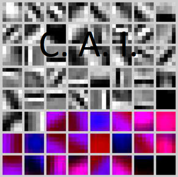
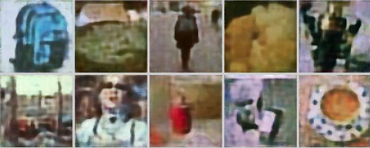

# CAI NEURAL API [](https://github.com/joaopauloschuler/neural-api/releases)[](https://zenodo.org/badge/latestdoi/210370571)

CAI NEURAL API is a pascal based neural network API optimized for AVX, AVX2 and AVX512 instruction sets plus
OpenCL capable devices including AMD, Intel and NVIDIA. This API has been tested under Windows and Linux.

This project is a subproject from a bigger and older project called [CAI](https://sourceforge.net/projects/cai/) and is sister to Keras based [K-CAI NEURAL API](https://github.com/joaopauloschuler/k-neural-api).

## Why Pascal?
* Compiled pascal code is super fast! This API can outperform some major APIs in some architectures.
* Pascal is easy to learn and easy to make a readable and understandable source code. You'll be able to make super fast **native** code and at the same time have a readable code.

## Prerequisites
You'll need [Lazarus](https://www.lazarus-ide.org/) development environment. If you have an OpenCL capable device, you'll need its OpenCL drivers. Many examples use the [CIFAR-10](https://www.cs.toronto.edu/~kriz/cifar.html) dataset. You'll also find examples for the [CIFAR-100](https://www.cs.toronto.edu/~kriz/cifar.html), [MNIST](http://yann.lecun.com/exdb/mnist/), [Fashion MNIST](https://www.kaggle.com/zalando-research/fashionmnist) and the [Places365-Standard Small images 256x256](http://places2.csail.mit.edu/download.html) dataset.

## Will It Work with Delphi?
This project is [Lazarus](https://www.lazarus-ide.org/) based. That said, as of release [v0.98](https://github.com/joaopauloschuler/neural-api/releases/tag/v0.98), a number of units do compile with Delphi and you can create and run neural networks with Delphi. You'll be able to compile these units with Delphi: neuralvolume, neuralnetwork, neuralab, neuralabfun, neuralbit, neuralbyteprediction, neuralcache, neuraldatasets, neuralgeneric, neuralplanbuilder, Neural OpenCL, Neural Threading and neuralfit. 

## Installation
Clone this project, add the [**neural**](https://github.com/joaopauloschuler/neural-api/tree/master/neural) folder to your [Lazarus](https://www.lazarus-ide.org/) unit search path and you'll be ready to go!
 
## Documentation
The documentation is composed by:
* Easy Examples.
* Simple Image Classification Examples.
* Youtube Videos.
* Advanced Examples.

In this readme file, you’ll find information about: 
* Data structures (Volumes).
* Available neural network layers.
* Dataset support.
* Training (fitting) your neural network.
* Parallel computing.
* Other scientific publications from the same author.

### Easy Examples First Please!
Some recommended introductory source code examples are:
* [Training a neural network to learn the hypotenuse function](https://github.com/joaopauloschuler/neural-api/tree/master/examples/Hypotenuse)
* [Training a neural network to learn the hypotenuse function with FitLoading](https://github.com/joaopauloschuler/neural-api/tree/master/examples/HypotenuseFitLoading)
* [Training a neural network to learn boolean functions AND, OR and XOR with neuralfit unit](https://github.com/joaopauloschuler/neural-api/tree/master/examples/XorAndOr)
* [Training a neural network to learn boolean functions AND, OR and XOR without neuralfit unit](https://sourceforge.net/p/cai/svncode/HEAD/tree/trunk/lazarus/experiments/supersimple/supersimple.lpr)

### Simple Image Classification Examples

#### How Does the Code Look like for an Image Classification (CIFAR-10) Example?
This is an example for image classification:
```
NN := TNNet.Create();
NN.AddLayer([
  TNNetInput.Create(32, 32, 3), //32x32x3 Input Image
  TNNetConvolutionReLU.Create({Features=}16, {FeatureSize=}5, {Padding=}0, {Stride=}1, {SuppressBias=}0),
  TNNetMaxPool.Create({Size=}2),
  TNNetConvolutionReLU.Create({Features=}32, {FeatureSize=}5, {Padding=}0, {Stride=}1, {SuppressBias=}0),
  TNNetMaxPool.Create({Size=}2),
  TNNetConvolutionReLU.Create({Features=}32, {FeatureSize=}5, {Padding=}0, {Stride=}1, {SuppressBias=}0),
  TNNetFullConnectReLU.Create({Neurons=}32),
  TNNetFullConnectLinear.Create(NumClasses),
  TNNetSoftMax.Create()
]);

CreateCifar10Volumes(ImgTrainingVolumes, ImgValidationVolumes, ImgTestVolumes);

WriteLn('Neural Network will minimize error with:');
WriteLn(' Layers: ', NN.CountLayers());
WriteLn(' Neurons:', NN.CountNeurons());
WriteLn(' Weights:', NN.CountWeights());

NeuralFit := TNeuralImageFit.Create;
NeuralFit.InitialLearningRate := fLearningRate;
NeuralFit.Inertia := fInertia;
NeuralFit.Fit(NN, ImgTrainingVolumes, ImgValidationVolumes, ImgTestVolumes, NumClasses, {batchsize}128, {epochs}100);
 ```

These examples train a neural network to classify images in classes such as: image has a cat, image has a dog, image has an airplane...
* [Simple CIFAR-10 Image Classifier](https://github.com/joaopauloschuler/neural-api/tree/master/examples/SimpleImageClassifier)  [](https://colab.research.google.com/github/joaopauloschuler/neural-api/blob/master/examples/SimpleImageClassifier/SimpleImageClassifierCPU.ipynb)
* [Simple CIFAR-10 Image Classifier with OpenCL](https://github.com/joaopauloschuler/neural-api/tree/master/examples/SimpleImageClassifierGPU)  [](https://colab.research.google.com/github/joaopauloschuler/neural-api/blob/master/examples/SimpleImageClassifierGPU/SimpleImageClassifierGPU.ipynb)
* [Many neural network architectures for CIFAR-10 image classification](https://sourceforge.net/p/cai/svncode/HEAD/tree/trunk/lazarus/experiments/testcnnalgo/testcnnalgo.lpr)
* [MNIST](https://github.com/joaopauloschuler/neural-api/tree/master/examples/SimpleMNist), [Fashion MNIST](https://github.com/joaopauloschuler/neural-api/tree/master/examples/SimpleFashionMNIST) and [CIFAR-100](https://github.com/joaopauloschuler/neural-api/tree/master/examples/Cifar100CaiDenseNet)

### Youtube Videos
There are some available videos:
* [Increasing Image Resolution with Neural Networks](https://www.youtube.com/watch?v=jdFixaZ2P4w)
* [Ultra Fast Single Precision Floating Point Computing](https://www.youtube.com/watch?v=qGnfwpKUTIQ)
* [AVX and AVX2 Code Optimization](https://www.youtube.com/watch?v=Pnv174V_emw)

Some videos make referrence to **uvolume** unit. The current **neuralvolume** unit used to be called **uvolume**. This is why
it's mentioned.

### Advanced Examples
Although these examples require deeper understanding about neural networks, they are very interesting:
* [DenseNetBC L40](https://github.com/joaopauloschuler/neural-api/tree/master/examples/DenseNetBCL40)
* [ResNet-20](https://github.com/joaopauloschuler/neural-api/blob/master/examples/ResNet/ResNet20.lpr)
* [Separable Convolutions](https://github.com/joaopauloschuler/neural-api/tree/master/examples/SeparableConvolution) - MobileNet building block
* [Identity Shortcut Connection](https://github.com/joaopauloschuler/neural-api/tree/master/examples/IdentityShortcutConnection) - ResNet building block [](https://colab.research.google.com/github/joaopauloschuler/neural-api/blob/master/examples/IdentityShortcutConnection/IdentityShortcutConnection.ipynb)
* [Gradient Ascent](https://github.com/joaopauloschuler/neural-api/tree/master/examples/GradientAscent) - Visualizing patterns from inner neurons in image classification <p></img></p>
* [Artificial Art](https://github.com/joaopauloschuler/neural-api/tree/master/examples/VisualGAN) - Let a neural network produce art via a generative adversarial network <p></img></p>
* [Super Resolution](https://github.com/joaopauloschuler/neural-api/tree/master/examples/SuperResolution) - A neural network learns how to increase image resolution<p></img></p>
* [CIFAR-10 Resized](https://github.com/joaopauloschuler/neural-api/tree/master/examples/Cifar10Resize) - A program that resizes CIFAR-10 and CIFAR-100 images to 64x64 and 128x128 pixels.<p> </img></p><p> </img></p>
* [Autoencoder](https://github.com/joaopauloschuler/neural-api/tree/master/examples/VisualAutoencoder) - Shows an autoencoder built with hyperbolic tangents and trained with [Tiny ImageNet 200](https://tiny-imagenet.herokuapp.com/). <p></img></p>

There are also some [older code examples](https://sourceforge.net/p/cai/svncode/HEAD/tree/trunk/lazarus/experiments/) that you can look at.

## Volumes
Volumes behave like dynamically created arrays. They are the main array like structure used by this API. `TNNetVolume` class allows you to create volumes that can be accessed as 1D, 2D or 3D arrays and be operated with [Advanced Vector Extensions (AVX)](https://en.wikipedia.org/wiki/Advanced_Vector_Extensions) - [Single Instruction Multiple Data (SIMD)](https://en.wikipedia.org/wiki/Single_instruction,_multiple_data) instruction set. The usual way to create a volume is:
```
constructor Create(pSizeX, pSizeY, pDepth: integer; c: T = 0);
```
You can access the data as 1D or 3D with:
```
property Raw[x: integer]: T read GetRaw write SetRaw;
property Data[x, y, d: integer]: T read Get write Store; default;
```
Your code will look like this:
```
// Usage Examples
vInput := TNNetVolume.Create(32, 32, 3);
vInput[1, 1, 1] := 1;
vInput[2, 2, 2] := vInput[1, 1, 1] + 1;
vInput.Raw[10] := 5;

vInput.RandomizeGaussian();
WriteLn('Avg: ', vInput.GetAvg());
WriteLn('Variance: ', vInput.GetVariance());
WriteLn('Std Dev: ', vInput.GetStdDeviation());

WriteLn('Multiplying by 10');
vInput.Mul(10);
WriteLn('Avg: ', vInput.GetAvg());
WriteLn('Variance: ', vInput.GetVariance());
WriteLn('Std Dev: ', vInput.GetStdDeviation());
```
As examples, you can add, subtract, multiply and calculate dot products with:
```
procedure Add(Original: TNNetVolume); overload;
procedure Sub(Original: TNNetVolume); overload;
procedure Mul(Value: Single); overload;
function DotProduct(Original: TNNetVolume): TNeuralFloat; overload;
```
In the case that you need the raw position or raw pointer to an element of the volume, you can get with:
```
function GetRawPos(x, y, d: integer): integer; overload;
function GetRawPos(x, y: integer): integer; overload;
function GetRawPtr(x, y, d: integer): pointer; overload;
function GetRawPtr(x, y: integer): pointer; overload;
function GetRawPtr(x: integer): pointer; overload;
```
You can easily operate volumes with OpenCL via `TEasyOpenCLV`:
```
  TEasyOpenCLV = class (TEasyOpenCL)
    public
      function CreateBuffer(flags: cl_mem_flags; V: TNNetVolume): cl_mem; overload;
      function CreateInputBuffer(V: TNNetVolume): cl_mem; overload;
      function CreateHostInputBuffer(V: TNNetVolume): cl_mem; overload;
      function CreateOutputBuffer(V: TNNetVolume): cl_mem; overload;
      function CreateBuffer(V: TNNetVolume): cl_mem;  overload;

      function WriteBuffer(buffer: cl_mem; V: TNNetVolume; blocking: cl_bool = CL_FALSE): integer;
      function ReadBuffer(buffer: cl_mem; V: TNNetVolume; blocking: cl_bool = CL_TRUE): integer;

      function CreateAndWriteBuffer(V: TNNetVolume; var buffer: cl_mem): integer; overload;
      function CreateAndWriteBuffer(V: TNNetVolume): cl_mem; overload;
      function CreateWriteSetArgument(V: TNNetVolume; kernel:cl_kernel; arg_index: cl_uint): cl_mem;
      function CreateOutputSetArgument(V: TNNetVolume; kernel:cl_kernel; arg_index: cl_uint): cl_mem;
  end;
```
### Volume Pairs, Volume Lists and Volume Pair Lists
Volumes can be organized in pairs:
```
  /// Implements a pair of volumes
  TNNetVolumePair = class(TObject)
    protected
      FA: TNNetVolume;
      FB: TNNetVolume;
    public
      constructor Create(); overload;
      constructor Create(pA, pB: TNNetVolume); overload;
      constructor CreateCopying(pA, pB: TNNetVolume); overload;

      destructor Destroy(); override;

      property A:TNNetVolume read FA;
      property B:TNNetVolume read FB;
      property I:TNNetVolume read FA;
      property O:TNNetVolume read FB;
  end;
```
Depending on the problem that you are trying to solve, modelling the training with pairs or pair lists might be helpful. Typically, a pair will be (input, desired output).
This is how volume lists and volume pair lists have been implemented:
```
TNNetVolumeList = class (specialize TFPGObjectList<TNNetVolume>
TNNetVolumePairList = class (specialize TFPGObjectList<TNNetVolumePair>)
```
## Neural Network Layers
This API is really big. The following list gives a general idea about this API but it doesn't contain everything.

### Input Layer
* `TNNetInput` (input/output: 1D, 2D or 3D).

### Convolutional Layers
* `TNNetConvolution` (input/output: 1D, 2D or 3D - feature size: 1D or 2D). This layer has `tanh` as default activation function.
* `TNNetConvolutionReLU` (input/output: 1D, 2D or 3D - feature size: 1D or 2D).
* `TNNetConvolutionLinear` (input/output: 1D, 2D or 3D - feature size: 1D or 2D).
* `TNNetPointwiseConvReLU` (input/output: 1D, 2D or 3D).
* `TNNetPointwiseConvLinear` (input/output: 1D, 2D or 3D).
* `TNNetDepthwiseConv` (input/output: 1D, 2D or 3D). This layer has `tanh` as default activation function.
* `TNNetDepthwiseConvReLU` (input/output: 1D, 2D or 3D).
* `TNNetDepthwiseConvLinear` (input/output: 1D, 2D or 3D).
* `TNNet.AddSeparableConvReLU` (input/output: 1D, 2D or 3D). Adds a separable convolution.
* `TNNet.AddSeparableConvLinear` (input/output: 1D, 2D or 3D). Adds a separable convolution.
* `TNNet.AddConvOrSeparableConv` (input/output: 1D, 2D or 3D). Adds a convolution or a separable convolution with/without ReLU and normalization.
* `TNNet.AddGroupedConvolution` (input/output: 1D, 2D or 3D). Adds a grouped convolution. 

### Fully Connected (Dense) Layers
* `TNNetFullConnect` (input/output: 1D, 2D or 3D). This layer has `tanh` as default activation function.
* `TNNetFullConnectReLU` (input/output: 1D, 2D or 3D).
* `TNNetFullConnectLinear` (input/output: 1D, 2D or 3D).
* `TNNetFullConnectSigmoid` (input/output: 1D, 2D or 3D).
* `TNNet.AddGroupedFullConnect`: inspired on `TNNet.AddGroupedConvolution`, adds a grouped fully connected layer.

### Locally Connected Layers
* `TNNetLocalConnect` (input/output: 1D, 2D or 3D - feature size: 1D or 2D). This layer has `htan` as default activation function.
* `TNNetLocalConnectReLU` (input/output: 1D, 2D or 3D - feature size: 1D or 2D).

### Min / Max / Avg Pools
* `TNNetAvgPool` (input/output: 1D, 2D or 3D).
* `TNNetMaxPool` (input/output: 1D, 2D or 3D).
* `TNNetMinPool` (input/output: 1D, 2D or 3D).
* `TNNet.AddMinMaxPool` (input/output: 1D, 2D or 3D). Does both min and max pools and then concatenates results.
* `TNNet.AddAvgMaxPool` (input/output: 1D, 2D or 3D ). Does both average and max pools and then concatenates results.

### Min / Max / Avg layers that Operate an Entire Channel and Produce Only One Result per Channel
* `TNNetAvgChannel` (input: 2D or 3D - output: 1D). Calculates the channel average.
* `TNNetMaxChannel` (input: 2D or 3D - output: 1D). Calculates the channel max.
* `TNNetMinChannel` (input: 2D or 3D - output: 1D). Calculates the channel min.
* `TNNet.AddMinMaxChannel` (input/output: 1D, 2D or 3D). Does both min and max channel and then concatenates results.
* `TNNet.AddAvgMaxChannel` (input/output: 1D, 2D or 3D). Does both average and max channel and then concatenates results.

### Trainable Normalization Layers Allowing Faster Learning/Convergence
* `TNNetChannelZeroCenter` (input/output: 1D, 2D or 3D). Trainable zero centering.
* `TNNetMovingStdNormalization` (input/output: 1D, 2D or 3D). Trainable std. normalization.
* `TNNetChannelStdNormalization` (input/output: 1D, 2D or 3D). Trainable per channel std. normalization.
* `TNNet.AddMovingNorm` (input/output: 1D, 2D or 3D). Possible replacement for batch normalization.
* `TNNet.AddChannelMovingNorm` (input/output: 1D, 2D or 3D). Possible replacement for per batch normalization.

### Non Trainable and per Sample Normalization Layers
* `TNNetLayerMaxNormalization` (input/output: 1D, 2D or 3D).
* `TNNetLayerStdNormalization` (input/output: 1D, 2D or 3D).
* `TNNetLocalResponseNorm2D` (input/output: 2D or 3D).
* `TNNetLocalResponseNormDepth` (input/output: 2D or 3D).
* `TNNetRandomMulAdd` (input/output: 1D, 2D or 3D). Adds a random multiplication (scale) and a random bias (shift).
* `TNNetChannelRandomMulAdd` (input/output: 1D, 2D or 3D). Adds a random multiplication (scale) and random bias (shift) per channel.

### Concatenation, Summation and Reshaping Layers
* `TNNetConcat` (input/output: 1D, 2D or 3D). Allows concatenating previous layers into a single layer.
* `TNNetDeepConcat` (input/output: 1D, 2D or 3D). Concatenates previous layers into the depth axis. This is useful with DenseNet like architectures. Use `TNNetDeepConcat` instead of `TNNetConcat` if you need to add convolutions after concating layers.
* `TNNetIdentity` (input/output: 1D, 2D or 3D).
* `TNNetIdentityWithoutBackprop` (input/output: 1D, 2D or 3D). Allows the forward pass to proceed but prevents backpropagation.
* `TNNetReshape` (input/output: 1D, 2D or 3D).
* `TNNetSplitChannels` (input: 1D, 2D or 3D / output: 1D, 2D or 3D). Splits (or copies) channels from the input. This layer allows getting a subset of the input channels.
* `TNNetSplitChannelEvery` (input: 1D, 2D or 3D / output: 1D, 2D or 3D). Splits (or copies) channels from the input every few channels. As example, this layer allows getting  half (GetChannelEvery=2) or a third (GetChannelEvery=3) of the input channels.
* `TNNetSum` (input/output: 1D, 2D or 3D). Sums outputs from previous layers allowing ResNet style networks.

### Layers with Activation Functions and no Trainable Parameter
* `TNNetReLU` (input/output: 1D, 2D or 3D).
* `TNNetReLU6` (input/output: 1D, 2D or 3D).
* `TNNetReLUL` (input/output: 1D, 2D or 3D).
* `TNNetLeakyReLU` (input/output: 1D, 2D or 3D).
* `TNNetVeryLeakyReLU` (input/output: 1D, 2D or 3D).
* `TNNetReLUSqrt` (input/output: 1D, 2D or 3D).
* `TNNetSELU` (input/output: 1D, 2D or 3D).
* `TNNetSigmoid` (input/output: 1D, 2D or 3D).
* `TNNetSoftMax` (input/output: 1D, 2D or 3D).
* `TNNetSwish` (input/output: 1D, 2D or 3D).
* `TNNetSwish6` (input/output: 1D, 2D or 3D).
* `TNNetHyperbolicTangent` (input/output: 1D, 2D or 3D).
* `TNNetPower` (input/output: 1D, 2D or 3D).

### Trainable Bias (Shift) and Multiplication (Scaling) per Cell or Channel Allowing Faster Learning and Convergence
* `TNNetCellBias` (input/output: 1D, 2D or 3D).
* `TNNetCellMul` (input/output: 1D, 2D or 3D).
* `TNNetChannelBias` (input/output: 1D, 2D or 3D).
* `TNNetChannelMul` (input/output: 1D, 2D or 3D).

### Opposing Operations
* `TNNetDeLocalConnect` (input/output: 1D, 2D or 3D - feature size: 1D or 2D).
* `TNNetDeLocalConnectReLU` (input/output: 1D, 2D or 3D - feature size: 1D or 2D).
* `TNNetDeconvolution` (input/output: 1D, 2D or 3D - feature size: 1D or 2D).
* `TNNetDeconvolutionReLU` (input/output: 1D, 2D or 3D - feature size: 1D or 2D).
* `TNNetDeMaxPool` (input/output: 1D, 2D or 3D - max is done on a single layer).

### Weight Initializers
This API implements popular weight initialization methods including He (Kaiming) and Glorot/Bengio (Xavier):
* `InitUniform(Value: TNeuralFloat = 1)`.
* `InitLeCunUniform(Value: TNeuralFloat = 1)`.
* `InitHeUniform(Value: TNeuralFloat = 1)`.
* `InitHeUniformDepthwise(Value: TNeuralFloat = 1)`.
* `InitHeGaussian(Value: TNeuralFloat = 0.5)`.
* `InitHeGaussianDepthwise(Value: TNeuralFloat = 0.5)`.
* `InitGlorotBengioUniform(Value: TNeuralFloat = 1)`.
* `InitSELU(Value: TNeuralFloat = 1)`.

### Data Augmentation Methods Implemented at TVolume
* `procedure FlipX();`
* `procedure FlipY();`
* `procedure CopyCropping(Original: TVolume; StartX, StartY, pSizeX, pSizeY: integer);`
* `procedure CopyResizing(Original: TVolume; NewSizeX, NewSizeY: integer);`
* `procedure AddGaussianNoise(pMul: TNeuralFloat);`
* `procedure AddSaltAndPepper(pNum: integer; pSalt: integer = 2; pPepper: integer = -2);`

### Closest Layer Types to Other APIs (work in progress)

NEURAL                      | Keras                                 | PyTorch
--------------------------- | ------------------------------------- | -------------------------
`TNNetFullConnect`          | `layers.Dense(activation='tanh')`     | `nn.Linear nn.Tanh()`
`TNNetFullConnectReLU`      | `layers.Dense(activation='relu')`     | `nn.Linear nn.ReLU()`
`TNNetFullConnectLinear`    | `layers.Dense(activation=None)`       | `nn.Linear`
`TNNetFullConnectSigmoid`   | `layers.Dense(activation='sigmoid')`  | `nn.Linear nn.Sigmoid()`
`TNNetReLU`                 | `activations.relu`                    | `nn.ReLU()`
`TNNetLeakyReLU`            | `activations.relu(alpha=0.01)`        | `nn.LeakyReLU(0.01)`
`TNNetVeryLeakyReLU`        | `activations.relu(alpha=1/3)`         | `nn.LeakyReLU(1/3)`
`TNNetReLUSqrt`             |                                       |           
`TNNetSELU`                 | `activations.selu`                    | `nn.SELU`
`TNNetSigmoid`              | `activations.sigmoid`                 | `nn.Sigmoid`
`TNNetSoftMax`              | `activations.softmax`                 | `nn.Softmax`
`TNNetHyperbolicTangent`    | `activations.tanh`                    | `nn.Tanh`
`TNNetPower`                |                                       |           
`TNNetAvgPool`              | `layers.AveragePooling2D`             | `nn.AvgPool2d`
`TNNetMaxPool`              | `layers.MaxPool2D`                    | `nn.MaxPool2d`
`TNNetMaxPoolPortable`      | `layers.MaxPool2D`                    | `nn.MaxPool2d`
`TNNetMinPool`              |                                       |              
`TNNet.AddMinMaxPool`       |                                       |              
`TNNet.AddAvgMaxPool`       |                                       |              
`TNNetAvgChannel`           | `layers.GlobalAveragePooling2D`       | `nn.AvgPool2d`
`TNNetMaxChannel`           | `layers.GlobalMaxPool2D`              | `nn.MaxPool2d`
`TNNetMinChannel`           |                                       |           
`TNNet.AddMinMaxChannel`      |                                       |           
`TNNet.AddAvgMaxChannel`      | [cai.layers.GlobalAverageMaxPooling2D](https://github.com/joaopauloschuler/k-neural-api/blob/master/cai/layers.py) |  
`TNNetConcat`                 | `layers.Concatenate(axis=1)`          | `torch.cat`
`TNNetDeepConcat`             | `layers.Concatenate(axis=3)`          | `torch.cat`
`TNNetIdentity`               |                                       | `nn.Identity`
`TNNetIdentityWithoutBackprop`|                                       |             
`TNNetReshape`                | `layers.Reshape`                      | `torch.reshape`
`TNNetSplitChannels`          | [cai.layers.CopyChannels](https://github.com/joaopauloschuler/k-neural-api/blob/master/cai/layers.py) | 
`TNNetSplitChannelEvery`      |                                       |           
`TNNetSum`                    | `layers.Add`                          | `torch.add`
`TNNetCellMulByCell`          | `layers.Multiply`                     |           
`TNNetChannelMulByLayer`      | `layers.Multiply`                     |           


## Adding Layers
You can add layers one by one or you can add an array of layers in one go. Follows an example adding layers one by one:
```
NN.AddLayer(TNNetConvolutionReLU.Create({Features=}64, {FeatureSize=}5, {Padding=}2, {Stride=}1));
NN.AddLayer(TNNetMaxPool.Create(2));
```
The next example shows how to add an array of layers that is equivalent to the above example:
```
NN.AddLayer([
  TNNetConvolutionReLU.Create({Features=}64, {FeatureSize=}5, {Padding=}2, {Stride=}1),
  TNNetMaxPool.Create(2)
]);
```

## Multi-path Architectures Support
Since 2017, this API supports multi-paths architectures. You can create multi-paths with `AddLayerAfter` method. For concatenating (merging) paths, you can call either `TNNetConcat` or `TNNetDeepConcat`. Follows an example:
```
// Creates The Neural Network
NN := TNNet.Create();
 
// This network splits into 2 paths and then is later concatenated
InputLayer := NN.AddLayer(TNNetInput.Create(32, 32, 3));
 
// First branch starting from InputLayer (5x5 features)
NN.AddLayerAfter(TNNetConvolutionReLU.Create({Features=}16, {FeatureSize=}5, {Padding=}2, {Stride=}1), InputLayer);
NN.AddLayer(TNNetMaxPool.Create(2));
NN.AddLayer(TNNetConvolutionReLU.Create({Features=}64, {FeatureSize=}5, {Padding=}2, {Stride=}1));
NN.AddLayer(TNNetMaxPool.Create(2));
EndOfFirstPath := NN.AddLayer(TNNetConvolutionReLU.Create({Features=}64, {FeatureSize=}5, {Padding=}2, {Stride=}1));
 
// Another branch starting from InputLayer (3x3 features)
NN.AddLayerAfter(TNNetConvolutionReLU.Create({Features=}16, {FeatureSize=}3, {Padding=}1, {Stride=}1), InputLayer);
NN.AddLayer(TNNetMaxPool.Create(2));
NN.AddLayer(TNNetConvolutionReLU.Create({Features=}64, {FeatureSize=}3, {Padding=}1, {Stride=}1));
NN.AddLayer(TNNetMaxPool.Create(2));
EndOfSecondPath := NN.AddLayer(TNNetConvolutionReLU.Create({Features=}64, {FeatureSize=}3, {Padding=}1, {Stride=}1));
 
// Concats both branches into one branch.
NN.AddLayer(TNNetDeepConcat.Create([EndOfFirstPath, EndOfSecondPath]));
NN.AddLayer(TNNetConvolutionReLU.Create({Features=}64, {FeatureSize=}3, {Padding=}1, {Stride=}1));
NN.AddLayer(TNNetLayerFullConnectReLU.Create(64));
NN.AddLayer(TNNetLayerFullConnectReLU.Create(NumClasses));
```
These source code examples show `AddLayerAfter`:
* [DenseNetBC L40](https://github.com/joaopauloschuler/neural-api/tree/master/examples/DenseNetBCL40)
* [Identity Shortcut Connection](https://github.com/joaopauloschuler/neural-api/tree/master/examples/IdentityShortcutConnection) - ResNet building block [](https://colab.research.google.com/github/joaopauloschuler/neural-api/blob/master/examples/IdentityShortcutConnection/IdentityShortcutConnection.ipynb)

You can find more about multi-path architectures at:
* [Multi-path Convolutional Neural Networks for Complex Image Classification](https://arxiv.org/abs/1506.04701).
* [Dual Path Networks](https://arxiv.org/abs/1707.01629).

## Dataset Support
These datasets can be easily loaded:

### CIFAR-10
```
procedure CreateCifar10Volumes(out ImgTrainingVolumes, ImgValidationVolumes, ImgTestVolumes: TNNetVolumeList);
```
Source code example: [Simple CIFAR-10 Image Classifier](https://github.com/joaopauloschuler/neural-api/tree/master/examples/SimpleImageClassifier)

### CIFAR-100
```
procedure CreateCifar100Volumes(out ImgTrainingVolumes, ImgValidationVolumes, ImgTestVolumes: TNNetVolumeList);
```
Source code example: [CAI Optimized DenseNet CIFAR-100 Image Classifier](https://github.com/joaopauloschuler/neural-api/tree/master/examples/Cifar100CaiDenseNet)

### MNIST and Fashion MNIST
```
procedure CreateMNISTVolumes(out ImgTrainingVolumes, ImgValidationVolumes,
  ImgTestVolumes: TNNetVolumeList;
  TrainFileName, TestFileName: string;
  Verbose:boolean = true;
  IsFashion:boolean = false);
  ```
Source code examples: 
* [Simple MNIST Image Classifier](https://github.com/joaopauloschuler/neural-api/tree/master/examples/SimpleMNist)
* [Simple Fashion MNIST Image Classifier](https://github.com/joaopauloschuler/neural-api/tree/master/examples/SimpleFashionMNIST)

### One Class per Folder with Image Classification
In the case that your dataset has one class per folder, you can call **CreateVolumesFromImagesFromFolder** for loading your data into RAM:
```
// change ProportionToLoad to a smaller number if you don't have enough RAM.
ProportionToLoad := 1;
WriteLn('Loading ', Round(ProportionToLoad*100), '% of the Plant leave disease dataset into memory.');
CreateVolumesFromImagesFromFolder
(
  ImgTrainingVolumes, ImgValidationVolumes, ImgTestVolumes,
  {FolderName=}'plant', {pImageSubFolder=}'',
  {color_encoding=}csRGB{RGB},
  {TrainingProp=}0.9*ProportionToLoad,
  {ValidationProp=}0.05*ProportionToLoad,
  {TestProp=}0.05*ProportionToLoad,
  {NewSizeX=}128, {NewSizeY=}128
);
```
The example above shows how to load the dataset with 90% loaded into training and 5% loaded for each validation and testing. Images are being resized to 128x128.

Source code examples: 
* [Simple Plant Leaf Disease Image Classifier for the PlantVillage Dataset](https://github.com/joaopauloschuler/neural-api/tree/master/examples/SimplePlantLeafDisease)
* [Tiny ImageNet 200](https://github.com/joaopauloschuler/neural-api/blob/master/examples/SimpleTinyImageNet)

#### Is your Dataset too Big for RAM? You should use TNeuralImageLoadingFit.
In the case that your image classification dataset is too big to be stored in RAM, you can follow this example:
```
    FTrainingFileNames, FValidationFileNames, FTestFileNames: TFileNameList;
...
    ProportionToLoad := 1;
    CreateFileNameListsFromImagesFromFolder(
      FTrainingFileNames, FValidationFileNames, FTestFileNames,
      {FolderName=}'places_folder/train', {pImageSubFolder=}'',
      {TrainingProp=}0.9*ProportionToLoad,
      {ValidationProp=}0.05*ProportionToLoad,
      {TestProp=}0.05*ProportionToLoad
    );
```
Then, you can call a fitting method made specific for this:
```
NeuralFit := TNeuralImageLoadingFit.Create;
...
NeuralFit.FitLoading({NeuralNetworkModel}NN, {ImageSizeX}256, {ImageSizeY}256, FTrainingFileNames, FValidationFileNames, FTestFileNames, {BatchSize}256, {Epochs}100);
```
`TNeuralImageLoadingFit.FitLoading` has been tested with [Places365-Standard Small images 256x256 with easy directory structure](http://places2.csail.mit.edu/download.html).
You can follow this example:
* [Simple Plant Leaf Disease Image Classifier with Few RAM](https://github.com/joaopauloschuler/neural-api/blob/master/examples/SimplePlantLeafDisease/SimplePlantLeafDiseaseLoadingAPI.pas)
### Loading and Saving Images with Volumes
When loading an image from a file, the easiest and fastest method is calling `LoadImageFromFileIntoVolume(ImageFileName:string; V:TNNetVolume)`. When loading from an **TFPMemoryImage**, you can load with `LoadImageIntoVolume(M: TFPMemoryImage; Vol:TNNetVolume)`. For saving an image, the fastest method is `SaveImageFromVolumeIntoFile(V: TNNetVolume; ImageFileName: string)`.

## Fitting your Neural Network
The easiest way to train your neural network is utilizing unit `neuralfit.pas`. Inside this unit, you’ll find the class `TNeuralImageFit` that is used by many examples.
### Image Classification
`TNeuralImageFit` has been designed for image classification tasks and can be called as follows:
```
procedure Fit(pNN: TNNet;
  pImgVolumes, pImgValidationVolumes, pImgTestVolumes: TNNetVolumeList;
  pNumClasses, pBatchSize, Epochs: integer);
```
Each volume should be provided with property `tag` that contains the corresponding class. `TNeuralImageFit` internally implements data augmentation techniques: flipping, making gray, cropping and resizing. These techniques can be controlled with:
```
property HasImgCrop: boolean read FHasImgCrop write FHasImgCrop;
property HasMakeGray: boolean read FHasMakeGray write FHasMakeGray;
property HasFlipX: boolean read FHasFlipX write FHasFlipX;
property HasFlipY: boolean read FHasFlipY write FHasFlipY;
property MaxCropSize: integer read FMaxCropSize write FMaxCropSize; 
```
Once you have a trained neural network, you can use an advanced classification procedure that will average the classification probability of the input image with its flipped and cropped versions. This process frequently gives a higher classification accuracy at the expense of internally running the very same neural network a number of times. This is how you can classify images:
```
procedure ClassifyImage(pNN: TNNet; pImgInput, pOutput: TNNetVolume);
```
In the case that you would like to look into `TNeuralImageFit` in more detail, the [Simple CIFAR-10 Image Classifier](https://github.com/joaopauloschuler/neural-api/tree/master/examples/SimpleImageClassifier) example is a good starting point.

### Training with Volume Pair Lists - TNeuralFit
In the case that your training, validation and testing data can be defined as volume pairs from input volume to output volume, the easiest way to train your neural network will be calling `TNeuralFit`. This class has the following fitting method:
```
procedure Fit(pNN: TNNet;
  pTrainingVolumes, pValidationVolumes, pTestVolumes: TNNetVolumePairList;
  pBatchSize, Epochs: integer);
```
Both [AND, OR and XOR with neuralfit unit](https://github.com/joaopauloschuler/neural-api/tree/master/examples/XorAndOr) and [hypotenuse function](https://github.com/joaopauloschuler/neural-api/tree/master/examples/Hypotenuse) examples load volume pair lists for training.
### Training with Volume Pairs - TNeuralDataLoadingFit
The `TNeuralFit` implementation has a limitation: your dataset needs to be placed into RAM. In the case that your dataset is too large for RAM, you can call `TNeuralDataLoadingFit`:
```
TNNetGetPairFn = function(Idx: integer; ThreadId: integer): TNNetVolumePair of object;
TNNetGet2VolumesProc = procedure(Idx: integer; ThreadId: integer; pInput, pOutput: TNNetVolume) of object;
  
TNeuralDataLoadingFit = class(TNeuralFitBase)
...
    procedure FitLoading(pNN: TNNet;
      TrainingCnt, ValidationCnt, TestCnt, pBatchSize, Epochs: integer;
      pGetTrainingPair, pGetValidationPair, pGetTestPair: TNNetGetPairFn); overload;
    procedure FitLoading(pNN: TNNet;
      TrainingCnt, ValidationCnt, TestCnt, pBatchSize, Epochs: integer;
      pGetTrainingProc, pGetValidationProc, pGetTestProc: TNNetGet2VolumesProc); overload;
```
 The [Hypotenuse with FitLoading](https://github.com/joaopauloschuler/neural-api/tree/master/examples/HypotenuseFitLoading) example uses `TNeuralDataLoadingFit` so it creates training pairs on the fly.
### TNeuralFitBase
`TNeuralImageFit` and `TNeuralDataLoadingFit` both descend from `TNeuralFitBase`. From `TNeuralFitBase`, you can define training properties:
```
property Inertia: single read FInertia write FInertia;
property InitialEpoch: integer read FInitialEpoch write FInitialEpoch;
property InitialLearningRate: single read FInitialLearningRate write FInitialLearningRate;
property LearningRateDecay: single read FLearningRateDecay write FLearningRateDecay;
property CyclicalLearningRateLen: integer read FCyclicalLearningRateLen write FCyclicalLearningRateLen;
property Momentum: single read FInertia write FInertia;
property L2Decay: single read FL2Decay write FL2Decay;
property FileNameBase: string read FFileNameBase write FFileNameBase;
```
You can also collect current statistics:
```
property CurrentEpoch: integer read FCurrentEpoch;
property CurrentStep: integer read FCurrentStep;
property CurrentLearningRate: single read FCurrentLearningRate;
property TestAccuracy: TNeuralFloat read FTestAccuracy;
property TrainingAccuracy: TNeuralFloat read FTrainingAccuracy;
property Running: boolean read FRunning;
```
Some events are available:
```
property OnStart: TNotifyEvent read FOnStart write FOnStart;
property OnAfterStep: TNotifyEvent read FOnAfterStep write FOnAfterStep;
property OnAfterEpoch: TNotifyEvent read FOnAfterEpoch write FOnAfterEpoch;
```
You can define your own learning rate schedule:
```
property CustomLearningRateScheduleFn: TCustomLearningRateScheduleFn read FCustomLearningRateScheduleFn write FCustomLearningRateScheduleFn;
property CustomLearningRateScheduleObjFn: TCustomLearningRateScheduleObjFn read FCustomLearningRateScheduleObjFn write FCustomLearningRateScheduleObjFn;
```
### Got Too Many Console Messages?
`TNeuralFitBase` descends from `TMObject` that allows you to code your own message treatment:
```
property MessageProc: TGetStrProc read FMessageProc write FMessageProc;
property ErrorProc: TGetStrProc read FErrorProc write FErrorProc;
```
On your own code, you could something is:
```
MyFit.MessageProc := {$IFDEF FPC}@{$ENDIF}Self.MessageProc;
MyFit.ErrorProc := {$IFDEF FPC}@{$ENDIF}Self.ErrorProc;
```
If you don’t need any message at all, you can hide messages by calling:
```
procedure HideMessages();
```
You can also disable fitting verbosity with:
```
property Verbose: boolean read FVerbose write FVerbose;
```
Your code will look like this:
```
NeuralFit := TNeuralImageFit.Create;
...
NeuralFit.Verbose := false;
NeuralFit.HideMessages();
```

## Parallel Computing - The neuralthread.pas
This API has easy to use, lightweight and platform independent parallel processing API methods.

As an example, assuming that you need to run a procedure 10 times in parallel, you can create 10 thread workers as follows:
```
FProcs := TNeuralThreadList.Create( 10 );
```

As an example, this is the procedure that we intend to run in parallel:
```
procedure MyClassName.RunNNThread(index, threadnum: integer);
begin
  WriteLn('This is thread ',index,' out of ',threadnum,' threads.');
end; 
```
Then, to run the procedure RunNNThread passed as parameter 10 times in parallel, do this:
```
FProcs.StartProc({$IFDEF FPC}@RunNNThread{$ELSE}RunNNThread{$ENDIF});
```
You can control the blocking mode (waiting threads to finish
before the program continues) as per declaration:
```
procedure StartProc(pProc: TNeuralProc; pBlock: boolean = true);
```

Or, if you prefer, you can specifically say when to wait for threads to finish
as per this example:
```
FProcs.StartProc({$IFDEF FPC}@RunNNThread{$ELSE}RunNNThread{$ENDIF}, false);
// insert your code here
FProcs.WaitForProc(); // waits until all threads are finished.
```
When you are done, you should call:
```
FProcs.Free; 
```

## Scientific Publications from the Author
In the case that you would like to know more about what the CAI's author is working at, here we go:
- [Grouped Pointwise Convolutions Reduce Parameters in Convolutional Neural Networks.](https://mendel-journal.org/index.php/mendel/article/view/169)
- [Color-aware two-branch DCNN for efficient plant disease classification.](https://www.researchgate.net/publication/361511874_Color-Aware_Two-Branch_DCNN_for_Efficient_Plant_Disease_Classification)
- [Grouped Pointwise Convolutions Significantly Reduces Parameters in EfficientNet.](https://www.researchgate.net/publication/355214501_Grouped_Pointwise_Convolutions_Significantly_Reduces_Parameters_in_EfficientNet)
- [Reliable Deep Learning Plant Leaf Disease Classification Based on Light-Chroma Separated Branches.](https://www.researchgate.net/publication/355215213_Reliable_Deep_Learning_Plant_Leaf_Disease_Classification_Based_on_Light-Chroma_Separated_Branches)
- [A Evolu&#231;&#227;o dos Algoritmos Mentais.](https://www.researchgate.net/publication/357204541_A_Evolucao_dos_Algoritmos_Mentais)
- [Da F&#237;sica &#224; Intelig&#234;ncia Extrassom&#225;tica.](http://schulers.com/jpss/estudos/schuler_inteligencia_artificial.pdf)
- [Intelig&#234;ncia Artificial Popperiana.](https://www.researchgate.net/publication/357164807_Inteligencia_Artificial_Popperiana)
- [Opera&#231;&#245;es L&#243;gicas Qu&#226;nticas e Colorabilidade de Grafos.](https://www.researchgate.net/publication/357205247_Operacoes_Logicas_Quanticas_e_Colorabilidade_de_Grafos)

## Contributing
Pull requests are welcome. Having requests accepted might be hard.

## Citing this API
You can cite this API in BibTeX format with:
```
@software{cai_neural_api_2021_5810077,
  author       = {Joao Paulo Schwarz Schuler},
  title        = {CAI NEURAL API},
  month        = dec,
  year         = 2021,
  publisher    = {Zenodo},
  version      = {v1.0.6},
  doi          = {10.5281/zenodo.5810077},
  url          = {https://doi.org/10.5281/zenodo.5810077}
}
```
