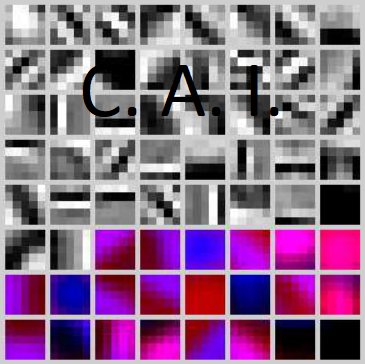
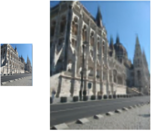
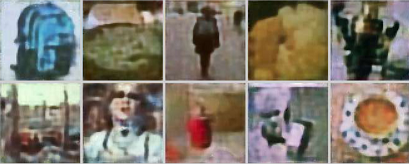

# CAI NEURAL API [](https://github.com/joaopauloschuler/neural-api/releases)[](https://zenodo.org/badge/latestdoi/210370571)

CAI NEURAL API is a pascal based deep learning neural network API optimized for AVX, AVX2 and AVX512 instruction sets plus
OpenCL capable devices including AMD, Intel and NVIDIA. This API has been tested under Windows and Linux.

This project is a subproject from a bigger and older project called [CAI](https://sourceforge.net/projects/cai/) and is sister to Keras based [K-CAI NEURAL API](https://github.com/joaopauloschuler/k-neural-api). You can find trained neural network models in the [pre-trained-neural-api-networks](https://github.com/joaopauloschuler/pre-trained-neural-api-networks/) repository.

## Intro Videos
[](https://youtu.be/aIy1S7clhQo) | [](https://youtu.be/q56NcgUiAAk) | [](https://youtu.be/PdNTgI_qSyo)
--------------------------- | ------------------------------------- | -------------------------
Basics of Neural Networks in Pascal - Loading and Saving | Neural Networks for Absolute Beginners! Learning a Simple Function | Coding a Neural Network in Pascal that Learns to Calculate the Hypotenuse

## Why Pascal?
* The Pascal computer language is easy to learn. Pascal allows developers to make a readable and understandable source code.
* You'll be able to make super-fast **native code** and at the same time have a readable code.
* This API can outperform some major APIs in some architectures.

## Prerequisites
You'll need [Lazarus](https://www.lazarus-ide.org/) development environment. If you have an OpenCL capable device, you'll need its OpenCL drivers. Many examples use the [CIFAR-10](https://www.cs.toronto.edu/~kriz/cifar.html) dataset. You'll also find examples for the [CIFAR-100](https://www.cs.toronto.edu/~kriz/cifar.html), [MNIST](http://yann.lecun.com/exdb/mnist/), [Fashion MNIST](https://www.kaggle.com/zalando-research/fashionmnist) and the [Places365-Standard Small images 256x256](http://places2.csail.mit.edu/download.html) dataset.

## Will It Work with Delphi?
This project is [Lazarus](https://www.lazarus-ide.org/) based. That said, as of release [v2.0.0](https://github.com/joaopauloschuler/neural-api/releases/tag/v2.0.0), a number of units do compile with Delphi and you can create and run neural networks with Delphi. You'll be able to compile these units with Delphi: neuralvolume, neuralnetwork, neuralab, neuralabfun, neuralbit, neuralbyteprediction, neuralcache, neuraldatasets, neuralgeneric, neuralplanbuilder, Neural OpenCL, Neural Threading and neuralfit. 

## Installation
Clone this project, add the [**neural**](https://github.com/joaopauloschuler/neural-api/tree/master/neural) folder to your [Lazarus](https://www.lazarus-ide.org/) unit search path and you'll be ready to go!

## A.I. Powered Support
You can get A.I. powered help from these tools:
* [CAI Neural API support at Poe (free)](https://poe.com/CAI-NEURAL-API-FREE).
* [CAI Neural API support at Poe](https://poe.com/CAI-NEURAL-API).
* [CAI Neural API support at ChatGPT4](https://chatgpt.com/g/g-6BrAwhTQ9-free-pascal-developer-neural-api).
 
## Documentation
The documentation covers: 
* Easy examples.
* Simple image classification examples.
* Youtube videos.
* Advanced examples.
* Data structures (Volumes).
* Neural network layers.
* Dataset support.
* Training (fitting) your neural network.
* Parallel computing.
* [Full set of examples](examples/README.md).
* [Normalization Cheat Sheet](docs/normalization.md).
* [Layer Authoring Guide](docs/layer-authoring.md) — checklist for adding a new layer plus mini-guides on reading numerical-gradient failures and picking a tolerance.
* Other scientific publications from the same author.

### Easy Examples First Please!
[](https://youtu.be/PdNTgI_qSyo)

You can click on the image above to watch the video.

Assuming that you would like to train a neural network to learn a function that has 2 inputs and one output, you could start with something like this:
```
    NN.AddLayer([
      TNNetInput.Create(2),
      TNNetFullConnectReLU.Create(32),
      TNNetFullConnectReLU.Create(32),
      TNNetFullConnectLinear.Create(1)
    ]);
```
The example above has 2 inputs (`TNNetInput`), 2 dense layers (`TNNetFullConnectReLU`) with 32 neurons each and one output (`TNNetFullConnectLinear`).

You can learn more about how to build and train simple neural networks at the following source code examples:
* [Only one neuron](https://github.com/joaopauloschuler/neural-api/tree/master/examples/OnlyOneNeuron).
* [Training a neural network to learn the hypotenuse function](https://github.com/joaopauloschuler/neural-api/tree/master/examples/Hypotenuse)
* [Training a neural network to learn the hypotenuse function with FitLoading](https://github.com/joaopauloschuler/neural-api/tree/master/examples/HypotenuseFitLoading)
* [Training a neural network to learn boolean functions AND, OR and XOR with neuralfit unit](https://github.com/joaopauloschuler/neural-api/tree/master/examples/XorAndOr)
* [Training a neural network to learn boolean functions AND, OR and XOR without neuralfit unit](https://sourceforge.net/p/cai/svncode/HEAD/tree/trunk/lazarus/experiments/supersimple/supersimple.lpr)
* [Reptile first-order meta-learning: learning an initialization that adapts to a new sine-regression task in a few SGD steps](https://github.com/joaopauloschuler/neural-api/tree/master/examples/MetaLearningReptile)
* [Lottery Ticket Hypothesis: magnitude-prune a small dense net, then retrain the sparse mask from the original init vs from fresh random weights — the original-init "winning ticket" matches the dense net and beats random reinit at moderate-to-high sparsity (pure CPU)](https://github.com/joaopauloschuler/neural-api/tree/master/examples/LotteryTicket)

### Loading and Saving Neural Networks
Loading is very easy:
```
    NN := TNNet.Create;
    NN.LoadFromFile('MyTrainedNeuralNetwork.nn');
```
Saving is as easy:

```
    NN.SaveToFile('MyTrainedNeuralNetwork.nn');
```

### Simple Image Classification Examples

#### CIFAR-10 Image Classification Example
The CIFAR-10 dataset is a well-known collection of images commonly used to train machine learning and computer vision algorithms. It was created by the Canadian Institute for Advanced Research (CIFAR). It contains 60K 32x32 color images. The images are classified into 10 different classes, with 6,000 images per class. The classes represent airplanes, cars, birds, cats, deer, dogs, frogs, horses, ships, and trucks. Despite its relatively low resolution and small size, CIFAR-10 can be challenging for models to achieve high accuracy, making it a good dataset for testing advancements in machine learning techniques.

Follows a source code example for the CIFAR-10 image classification:
```
NN := TNNet.Create();
NN.AddLayer([
  TNNetInput.Create(32, 32, 3), //32x32x3 Input Image
  TNNetConvolutionReLU.Create({Features=}16, {FeatureSize=}5, {Padding=}0, {Stride=}1, {SuppressBias=}0),
  TNNetMaxPool.Create({Size=}2),
  TNNetConvolutionReLU.Create({Features=}32, {FeatureSize=}5, {Padding=}0, {Stride=}1, {SuppressBias=}0),
  TNNetMaxPool.Create({Size=}2),
  TNNetConvolutionReLU.Create({Features=}32, {FeatureSize=}5, {Padding=}0, {Stride=}1, {SuppressBias=}0),
  TNNetFullConnectReLU.Create({Neurons=}32),
  TNNetFullConnectLinear.Create(NumClasses),
  TNNetSoftMax.Create()
]);

CreateCifar10Volumes(ImgTrainingVolumes, ImgValidationVolumes, ImgTestVolumes);

WriteLn('Neural Network will minimize error with:');
WriteLn(' Layers: ', NN.CountLayers());
WriteLn(' Neurons:', NN.CountNeurons());
WriteLn(' Weights:', NN.CountWeights());

NeuralFit := TNeuralImageFit.Create;
NeuralFit.InitialLearningRate := fLearningRate;
NeuralFit.Inertia := fInertia;
NeuralFit.Fit(NN, ImgTrainingVolumes, ImgValidationVolumes, ImgTestVolumes, NumClasses, {batchsize}128, {epochs}100);
 ```

These examples train a neural network to classify images in classes such as: image has a cat, image has a dog, image has an airplane...
* [Simple CIFAR-10 Image Classifier](https://github.com/joaopauloschuler/neural-api/tree/master/examples/SimpleImageClassifier)  [](https://colab.research.google.com/github/joaopauloschuler/neural-api/blob/master/examples/SimpleImageClassifier/SimpleImageClassifierCPU.ipynb)
* [Simple CIFAR-10 Image Classifier with OpenCL](https://github.com/joaopauloschuler/neural-api/tree/master/examples/SimpleImageClassifierGPU)  [](https://colab.research.google.com/github/joaopauloschuler/neural-api/blob/master/examples/SimpleImageClassifierGPU/SimpleImageClassifierGPU.ipynb)
* [Many neural network architectures for CIFAR-10 image classification](https://sourceforge.net/p/cai/svncode/HEAD/tree/trunk/lazarus/experiments/testcnnalgo/testcnnalgo.lpr)
* [MNIST](https://github.com/joaopauloschuler/neural-api/tree/master/examples/SimpleMNist), [Fashion MNIST](https://github.com/joaopauloschuler/neural-api/tree/master/examples/SimpleFashionMNIST) and [CIFAR-100](https://github.com/joaopauloschuler/neural-api/tree/master/examples/Cifar100CaiDenseNet)

You can save and load trained models (neural networks) with `TNNet.SaveToFile` and `TNNet.LoadFromFile`. The file format is portable meaning that you can train on CPU and run on GPU or train in AMD and run on ARM as examples. The following code shows a simple example for image classification loading a [pre-trained](https://github.com/joaopauloschuler/pre-trained-neural-api-networks/) model:
```
  procedure ClassifyOneImageSimple;
  var
    NN: TNNet;
    ImageFileName: string;
    NeuralFit: TNeuralImageFit;
  begin
    WriteLn('Loading Neural Network...');
    NN := TNNet.Create;
    NN.LoadFromFile('SimplePlantLeafDisease-20230720.nn');
    NeuralFit := TNeuralImageFit.Create;
    ImageFileName := 'plant/Apple___Black_rot/image (1).JPG';
    WriteLn('Processing image: ', ImageFileName);
    WriteLn(
      'The class of the image is: ',
      NeuralFit.ClassifyImageFromFile(NN, ImageFileName)
    );
    NeuralFit.Free;
    NN.Free;
  end;  
```

### Youtube Videos
[](https://youtu.be/aIy1S7clhQo) | [](https://youtu.be/q56NcgUiAAk) | [](https://youtu.be/PdNTgI_qSyo)
--------------------------- | ------------------------------------- | -------------------------
Basics of Neural Networks in Pascal - Loading and Saving | Neural Networks for Absolute Beginners! Learning a Simple Function | Coding a Neural Network in Pascal that Learns to Calculate the Hypotenuse
[](https://youtu.be/tODsv6Ks2DM) | [](https://youtu.be/f4T9IB-He_k) | [](https://youtu.be/o-8NuoSsdck)
Pre-trained Neural Networks & Transfer Learning with Pascal's CAI Neural API | Coding a Neural Network in Pascal that Learns the OR Boolean Operation | A Dive into Identity Shortcut Connection - The ResNet building block
[](https://youtu.be/SEvWB7k8uy0) | [](https://youtu.be/3QwIaAsDmJw) | [](https://youtu.be/VH6v3D5cxxs)
Increasing Image Resolution with Neural Networks | Ultra Fast Single Precision Floating Point Computing | AVX and AVX2 Code Optimization

Some videos make referrence to **uvolume** unit. The current **neuralvolume** unit used to be called **uvolume**. This is why
it's mentioned.

### Advanced Examples
Although these examples require deeper understanding about neural networks, they are very interesting:
* [Identity Shortcut Connection](https://github.com/joaopauloschuler/neural-api/tree/master/examples/IdentityShortcutConnection) - ResNet building block [](https://colab.research.google.com/github/joaopauloschuler/neural-api/blob/master/examples/IdentityShortcutConnection/IdentityShortcutConnection.ipynb)
* [ResNet-20](https://github.com/joaopauloschuler/neural-api/blob/master/examples/ResNet/) - includes a [web server](examples/ResNet/server) example
* [DenseNetBC L40](https://github.com/joaopauloschuler/neural-api/tree/master/examples/DenseNetBCL40)
* [Separable Convolutions](https://github.com/joaopauloschuler/neural-api/tree/master/examples/SeparableConvolution) - MobileNet building block
* [Gradient Ascent](https://github.com/joaopauloschuler/neural-api/tree/master/examples/GradientAscent) - Visualizing patterns from inner neurons in image classification <p></img></p>
* [Artificial Art](https://github.com/joaopauloschuler/neural-api/tree/master/examples/VisualGAN) - Let a neural network produce art via a generative adversarial network <p></img></p>
* [Super Resolution](https://github.com/joaopauloschuler/neural-api/tree/master/examples/SuperResolution) - A neural network learns how to increase image resolution<p></img></p>
* [CIFAR-10 Resized](https://github.com/joaopauloschuler/neural-api/tree/master/examples/Cifar10Resize) - A program that resizes CIFAR-10 and CIFAR-100 images to 64x64 and 128x128 pixels.<p> </img></p><p> </img></p>
* [Autoencoder](https://github.com/joaopauloschuler/neural-api/tree/master/examples/VisualAutoencoder) - Shows an autoencoder built with hyperbolic tangents and trained with [Tiny ImageNet 200](https://paperswithcode.com/dataset/tiny-imagenet). <p></img></p>

There is also a [full set of examples](examples/README.md) that you can look at.

## Volumes
Volumes behave like dynamically created arrays. They are the main array like structure used by this API. `TNNetVolume` class allows you to create volumes that can be accessed as 1D, 2D or 3D arrays and be operated with [Advanced Vector Extensions (AVX)](https://en.wikipedia.org/wiki/Advanced_Vector_Extensions) - [Single Instruction Multiple Data (SIMD)](https://en.wikipedia.org/wiki/Single_instruction,_multiple_data) instruction set. The usual way to create a volume is:
```
constructor Create(pSizeX, pSizeY, pDepth: integer; c: T = 0);
```
You can access the data as 1D or 3D with:
```
property Raw[x: integer]: T read GetRaw write SetRaw;
property Data[x, y, d: integer]: T read Get write Store; default;
```
Your code will look like this:
```
// Usage Examples
vInput := TNNetVolume.Create(32, 32, 3);
vInput[1, 1, 1] := 1;
vInput[2, 2, 2] := vInput[1, 1, 1] + 1;
vInput.Raw[10] := 5;

vInput.RandomizeGaussian();
WriteLn('Avg: ', vInput.GetAvg());
WriteLn('Variance: ', vInput.GetVariance());
WriteLn('Std Dev: ', vInput.GetStdDeviation());

WriteLn('Multiplying by 10');
vInput.Mul(10);
WriteLn('Avg: ', vInput.GetAvg());
WriteLn('Variance: ', vInput.GetVariance());
WriteLn('Std Dev: ', vInput.GetStdDeviation());
```
As examples, you can add, subtract, multiply and calculate dot products with:
```
procedure Add(Original: TNNetVolume); overload;
procedure Sub(Original: TNNetVolume); overload;
procedure Mul(Value: Single); overload;
function DotProduct(Original: TNNetVolume): TNeuralFloat; overload;
```
In the case that you need the raw position or raw pointer to an element of the volume, you can get with:
```
function GetRawPos(x, y, d: integer): integer; overload;
function GetRawPos(x, y: integer): integer; overload;
function GetRawPtr(x, y, d: integer): pointer; overload;
function GetRawPtr(x, y: integer): pointer; overload;
function GetRawPtr(x: integer): pointer; overload;
```
You can easily operate volumes with OpenCL via `TEasyOpenCLV`:
```
  TEasyOpenCLV = class (TEasyOpenCL)
    public
      function CreateBuffer(flags: cl_mem_flags; V: TNNetVolume): cl_mem; overload;
      function CreateInputBuffer(V: TNNetVolume): cl_mem; overload;
      function CreateHostInputBuffer(V: TNNetVolume): cl_mem; overload;
      function CreateOutputBuffer(V: TNNetVolume): cl_mem; overload;
      function CreateBuffer(V: TNNetVolume): cl_mem;  overload;

      function WriteBuffer(buffer: cl_mem; V: TNNetVolume; blocking: cl_bool = CL_FALSE): integer;
      function ReadBuffer(buffer: cl_mem; V: TNNetVolume; blocking: cl_bool = CL_TRUE): integer;

      function CreateAndWriteBuffer(V: TNNetVolume; var buffer: cl_mem): integer; overload;
      function CreateAndWriteBuffer(V: TNNetVolume): cl_mem; overload;
      function CreateWriteSetArgument(V: TNNetVolume; kernel:cl_kernel; arg_index: cl_uint): cl_mem;
      function CreateOutputSetArgument(V: TNNetVolume; kernel:cl_kernel; arg_index: cl_uint): cl_mem;
  end;
```
### Volume Pairs, Volume Lists and Volume Pair Lists
Volumes can be organized in pairs:
```
  /// Implements a pair of volumes
  TNNetVolumePair = class(TObject)
    protected
      FA: TNNetVolume;
      FB: TNNetVolume;
    public
      constructor Create(); overload;
      constructor Create(pA, pB: TNNetVolume); overload;
      constructor CreateCopying(pA, pB: TNNetVolume); overload;

      destructor Destroy(); override;

      property A:TNNetVolume read FA;
      property B:TNNetVolume read FB;
      property I:TNNetVolume read FA;
      property O:TNNetVolume read FB;
  end;
```
Depending on the problem that you are trying to solve, modelling the training with pairs or pair lists might be helpful. Typically, a pair will be (input, desired output).
This is how volume lists and volume pair lists have been implemented:
```
TNNetVolumeList = class (specialize TFPGObjectList<TNNetVolume>
TNNetVolumePairList = class (specialize TFPGObjectList<TNNetVolumePair>)
```
## Neural Network Layers
The layered structure of artificial neural networks is inspired by the organization of the human brain and nervous system. In the human brain, information processing occurs in a hierarchical manner. Sensory inputs are first processed by lower-level neurons, which extract simple features. These features are then passed on to deeper neurons that combine them to recognize more complex patterns. This hierarchical processing is mirrored in artificial neural networks through the use of stacked layers.

Biological neurons are connected to each other through synapses, forming complex networks. Similarly, in artificial neural networks, neurons in one layer are connected to neurons in the next layer, mimicking this interconnected structure. Biological neurons fire (activate) based on a non-linear response to their inputs. This non-linearity is crucial for the brain's ability to learn complex patterns. In artificial neural networks, we use non-linear activation functions (such as ReLU) to introduce this non-linearity. Different regions of the brain specialize in processing different types of information. For instance, the visual cortex has layers specialized for detecting edges, shapes, and complex objects. This specialization is reflected in artificial neural networks, where different layers can learn to recognize different levels of abstraction.

In the context of artificial neural networks, we can see this biologically-inspired layered approach implemented. For example:

```pascal
NN := TNNet.Create();
NN.AddLayer([
  TNNetInput.Create(32, 32, 3),
  TNNetConvolutionLinear.Create({neurons=}16, {featuresize}3, {padding}1, {stride}1),
  TNNetReLU6.Create()
]);
```

This code snippet demonstrates the creation of a neural network with an input layer and a convolutional layer followed by a ReLU6 activation. This structure is inspired by the visual cortex in the brain, where neurons respond to specific patterns in their receptive fields, similar to how convolutional layers operate. The CAI Neural API also supports the creation of more complex, biologically-inspired architectures. These architectures are designed with multiple layers of different types, mirroring the complex structure of the brain.

Artificial neural networks with multiple layers and specialized structures are inspired by the hierarchical and specialized nature of biological neural processing. It's important to note that while artificial neural networks are inspired by biological neural networks, they are highly simplified models. The human brain is far more complex, with various types of neurons, complex connectivity patterns, and mechanisms we don't yet fully understand. However, the layered structure in artificial neural networks has proven to be a powerful approach for solving complex problems in machine learning, inspired by the remarkable capabilities of biological neural networks.

### Input Layer
The input layer serves as the gateway to the entire network. It's like the sensory organs of our brain, receiving information from the outside world. Without an input layer, the neural network would have no way to receive and interpret the initial data, making it impossible to perform any meaningful computations or learning tasks. The `TNNetInput` class implements the input layer.

### Fully Connected (Dense) Layers
Fully connected layers, also known as dense layers, are a fundamental component of neural networks. In these layers, every neuron is connected to every neuron in the previous layer, allowing for comprehensive information processing across the entire network.

In the context of the CAI Neural API, fully connected layers are represented by various classes derived from TNNetFullConnect. These layers play a crucial role in transforming input data and learning complex patterns.

The computation process in a fully connected layer involves:
1. Multiplying input values by the layer's weights.
2. Adding bias terms (if not suppressed).
3. Applying an activation function (if present).

Key types of fully connected layers include:
1. `TNNetFullConnectLinear`: a basic fully connected layer without an activation function. It performs a linear transformation of the input data.
2. `TNNetFullConnectReLU`: incorporates the Rectified Linear Unit (ReLU) activation function. ReLU introduces non-linearity by outputting the input for positive values and zero for negative values, helping the network learn complex patterns.
3. `TNNetFullConnectSigmoid`: applies the sigmoid activation function to the layer's output. Sigmoid squashes the output between 0 and 1, useful for binary classification tasks.

Fully connected layers are typically used in neural network architectures as:
1. Hidden layers for processing and transforming features.
2. Output layers for producing final predictions.

For example, in the provided context, we see a simple neural network structure:

```pascal
NN := TNNet.Create();
NN.AddLayer([
  TNNetInput.Create(2),       // Input layer with 2 inputs
  TNNetFullConnect.Create(2), // Hidden fully connected layer with 2 neurons
  TNNetFullConnect.Create(1)  // Output fully connected layer with 1 neuron  
]);
```

| Layer Name                  | Input/Output Dimensions     | Activation    | Description                                                                                           |
|-----------------------------|-----------------------------|---------------|-------------------------------------------------------------------------------------------------------|
| `TNNetFullConnectLinear`     | 1D, 2D, or 3D               | None          | Fully connected layer without an activation function (linear).                                         |
| `TNNetFullConnect`           | 1D, 2D, or 3D               | tanh          | Fully connected layer with `tanh` as the default activation function.                                  |
| `TNNetFullConnectReLU`       | 1D, 2D, or 3D               | ReLU          | Fully connected layer with ReLU activation.                                                            |
| `TNNetFullConnectSigmoid`    | 1D, 2D, or 3D               | Sigmoid       | Fully connected layer with Sigmoid activation.                                                         |
| `TNNet.AddGroupedFullConnect`| 1D, 2D, or 3D               | Optional      | Adds a grouped fully connected layer, inspired by `TNNet.AddGroupedConvolution`.                       |
| `TNNetBitLinear`             | 1D, 2D, or 3D               | None          | BitNet b1.58 ternary-weight linear layer: forward uses per-neuron absmean-quantized weights `Wq = scale*round(clip(W/scale,-1,+1))` with `scale = mean(|W|)`; latent full-precision weights train via a straight-through estimator (round/clip treated as identity in backward). |
| `TNNetSpectralNorm`          | 1D, 2D, or 3D               | None          | Spectral-normalized dense layer (Miyato et al. 2018): forward divides the weight matrix by its largest singular value `sigma_1` (estimated by power iteration, `Iters` steps in `FStruct[5]`, default 10) so the effective operator `W/sigma_1` has spectral norm ~1; `sigma_1` is treated as constant in backward (input error propagated through the scaled weights). |

### Convolutional Layers
Neurons, filters, and kernels are often used as synonyms in the context of neural networks, particularly in convolutional neural networks (CNNs). They are closely related concepts that are used interchangeably. Here's why:

* Neurons: in artificial neural networks, neurons are the basic computational units. They receive input, process it, and produce an output. In the context of CNNs, the term "neuron" is sometimes used to refer to a single element in a feature map.
* Filters: in CNNs, filters (also called convolution kernels) are small matrices of weights that slide over the input data to detect specific features. Each filter produces a feature map in the output layer.
* Kernels: in image processing and CNNs, kernels are small matrices used for various operations like blurring, sharpening, or edge detection. In the context of CNNs, kernels and filters are essentially the same thing.
The reason these terms are often used synonymously is that they all contribute to the feature detection and transformation process in neural networks:
    * A single filter/kernel can be thought of as a specialized neuron that detects a specific feature across the entire input.
    * The weights in a filter/kernel are analogous to the weights in a traditional neuron.
    * The output of applying a filter/kernel to an input region is similar to the activation of a neuron in response to its inputs.

In practice, when implementing CNNs, the terms "filter" and "kernel" are more commonly used than "neuron" when referring to the convolutional layers. However, the underlying concept of a computational unit that processes input and produces output remains the same across these terms.

Convolutional layers are fundamental building blocks in neural networks, particularly in the field of computer vision and image processing. They are designed to automatically and adaptively learn spatial hierarchies of features from input data, such as images.

In the context of the CAI Neural API, convolutional layers are implemented as classes derived from `TNNetConvolutionAbstract`. This abstract base class provides the core functionality for convolutional operations.

The structure of a convolutional layer typically includes:
1. Input: A multi-dimensional array (usually 3D for images: width, height, and channels).
2. Kernels (or filters): small matrices of weights that slide over the input.
3. Feature maps: the output produced by applying the kernels to the input.

Key parameters of convolutional layers include:
- Number of features (or filters).
- Feature size (kernel size).
- Padding.
- Stride.

The CAI Neural API offers several types of convolutional layers:
1. `TNNetConvolution`: the standard convolutional layer.
2. `TNNetConvolutionLinear`: a convolutional layer without an activation function.
3. `TNNetConvolutionReLU`: a convolutional layer with a ReLU activation function.

Convolutional layers are crucial in neural networks because they:
1. Automatically learn hierarchical features from data.
2. Maintain spatial relationships in the input.
3. Reduce the number of parameters compared to fully connected layers.
4. Enable the network to be translation-invariant.

In practice, convolutional layers are often used in combination with other layer types, such as pooling layers (e.g., `TNNetMaxPool`) and normalization layers (e.g., `TNNetMovingStdNormalization`), to create powerful neural network architectures for tasks like image classification, object detection, and segmentation.

Here's a brief example of how to create a convolutional layer using the CAI Neural API:

```pascal
NN := TNNet.Create();
NN.AddLayer([
  TNNetInput.Create(32, 32, 3),  // Input layer for 32x32 RGB images
  TNNetConvolutionLinear.Create(
    {Features=}64,     // Number of output features
    {FeatureSize=}5,   // 5x5 kernel size
    {Padding=}2,       // Padding of 2 pixels
    {Stride=}1,        // Stride of 1 pixel
    {SuppressBias=}1   // Suppress bias
  ),
  TNNetReLU6.Create()  // Activation function
]);
```

This example creates a convolutional layer with 64 features, a 5x5 kernel size, padding of 2, and a stride of 1, followed by a ReLU6 activation function.

These are tha available convolutional layers in CAI:
| Layer Name                  | Input/Output Dimensions     | Activation    | Description                                                                                           |
|-----------------------------|-----------------------------|---------------|-------------------------------------------------------------------------------------------------------|
| `TNNetConvolutionLinear`    | 1D, 2D, or 3D               | None          | Linear convolutional layer without activation. Useful for intermediate layers.                        |
| `TNNetConvolution`          | 1D, 2D, or 3D               | tanh          | Standard convolutional layer. Versatile for feature extraction in tasks like image recognition.       |
| `TNNetConvolutionReLU`      | 1D, 2D, or 3D               | ReLU          | Convolutional layer with ReLU activation. Helps mitigate vanishing gradient problem.                  |
| `TNNetConvolutionSwish`     | 1D, 2D, or 3D               | Swish         | Convolutional layer with Swish activation. Performs better than ReLU in some cases.                   |
| `TNNetConvolutionHardSwish` | 1D, 2D, or 3D               | Hard Swish    | Convolutional layer with Hard Swish activation. It is similar to swish but it's faster.               |
| `TNNetConvolutionSharedWeights`| 1D, 2D, or 3D            | same as linked layer | Convolutional layer that uses the weights from another layer                                   | 
| `TNNetPointwiseConvLinear`  | 1D, 2D, or 3D               | None          | Linear 1x1 convolution. Useful for channel mixing without spatial operations.                         |
| `TNNetPointwiseConvReLU`    | 1D, 2D, or 3D               | ReLU          | 1x1 convolution with ReLU. Efficient for channel-wise dimensionality reduction or expansion.          |
| `TNNetPointwiseConv`        | 1D, 2D, or 3D               | tanh          | 1x1 convolution. Useful for autoencoding architectures.                                               |
| `TNNetDepthwiseConvLinear`  | 1D, 2D, or 3D               | None          | Linear depthwise convolution. Useful when additional non-linearity is not required.                   |
| `TNNetDepthwiseConv`        | 1D, 2D, or 3D               | tanh          | Depthwise convolution with tanh activation. Reduces computational cost by processing each channel separately. |
| `TNNetDepthwiseConvReLU`    | 1D, 2D, or 3D               | ReLU          | Depthwise convolution with ReLU activation. Combines depthwise efficiency with the benefits of ReLU.  |
| `TNNet.AddSeparableConvLinear`| 1D, 2D, or 3D              | None          | Adds a linear separable convolution. Useful for lightweight models with reduced parameter count.     |
| `TNNet.AddSeparableConvReLU`| 1D, 2D, or 3D               | ReLU          | Adds a separable convolution with ReLU. Combines depthwise and pointwise for efficient feature extraction. |
| `TNNet.AddConvOrSeparableConv`| 1D, 2D, or 3D              | Optional      | Adds standard or separable convolution. Supports optional ReLU and normalization for versatile design. |
| `TNNet.AddGroupedConvolution`| 1D, 2D, or 3D               | Optional      | Adds a grouped convolution. Allows efficient parallel processing of input channels.                  |

Grouped pointwise convolutions are an interesting and efficient variant of standard convolutions in neural networks. Grouped pointwise convolutions are a type of convolution operation where the input channels are divided into groups, and each group is processed separately. This is particularly useful for 1x1 convolutions (pointwise) where the spatial dimensions are not affected. The grouped approach can significantly reduce the number of parameters in a neural network as shown in the papers [Grouped Pointwise Convolutions Reduce Parameters in Convolutional Neural Networks](https://www.researchgate.net/publication/360226228_Grouped_Pointwise_Convolutions_Reduce_Parameters_in_Convolutional_Neural_Networks) and [An Enhanced Scheme for Reducing the Complexity of Pointwise Convolutions in CNNs for Image Classification Based on Interleaved Grouped Filters without Divisibility Constraints](https://www.researchgate.net/publication/363413038_An_Enhanced_Scheme_for_Reducing_the_Complexity_of_Pointwise_Convolutions_in_CNNs_for_Image_Classification_Based_on_Interleaved_Grouped_Filters_without_Divisibility_Constraints). By reducing parameters, these convolutions can make models more efficient in terms of computation and memory usage. These convolutions can be combined with other techniques like normalization and intergroup connections. This flexibility allows for the creation of more sophisticated network designs. Grouped pointwise convolutions are particularly useful in efficient network designs, such as mobile or edge computing applications where resource constraints are significant. They allow for maintaining model expressivity while reducing computational requirements.

The grouped pointwise convolutional layers are:
| Layer Name                  | Input/Output Dimensions     | Activation    | Description                                                                                           |
|-----------------------------|-----------------------------|---------------|-------------------------------------------------------------------------------------------------------|
| `TNNetGroupedPointwiseConvLinear`    | 1D, 2D, or 3D      | None          | Linear 1x1 grouped convolution. Useful for channel mixing without spatial operations.                 |
| `TNNetGroupedPointwiseConvReLU`      | 1D, 2D, or 3D      | ReLU          | 1x1 grouped convolution with ReLU. Efficient for channel-wise dimensionality reduction or expansion.  |
| `TNNetGroupedPointwiseConvHardSwish` | 1D, 2D, or 3D      | Hard Swish    | 1x1 grouped convolution wish fast hard swish activation function.                                     |

### Locally Connected Layers
A locally connected layer is a type of neural network layer that shares some similarities with convolutional layers but has some distinct characteristics:
* Structure: Locally connected layers, like convolutional layers, operate on local regions of the input. However, unlike convolutional layers, they do not share weights across different positions in the input.
* Weight independence: Each local region in the input has its own set of weights, which are not shared with other regions. This allows the layer to learn position-specific features.
* Flexibility: Locally connected layers offer more flexibility in learning spatial hierarchies compared to fully connected layers, while still maintaining position-specific information unlike convolutional layers.
* Parameters: These layers typically have more parameters than convolutional layers due to the lack of weight sharing, which can lead to increased computational complexity and memory usage.
* Use cases: Locally connected layers can be useful in scenarios where position-specific features are important, such as in face recognition tasks where different parts of the face have distinct characteristics based on their location.

| Layer Name                  | Input/Output Dimensions     | Activation    | Description                                                                                           |
|-----------------------------|-----------------------------|---------------|-------------------------------------------------------------------------------------------------------|
| `TNNetLocalConnectLinear`   | 1D, 2D, or 3D               | None          | Locally connected layer with ReLU activation.                                                         |
| `TNNetLocalConnect`         | 1D, 2D, or 3D               | tanh          | Locally connected layer with `htan` as the default activation function.                               |
| `TNNetLocalConnectReLU`     | 1D, 2D, or 3D               | ReLU          | Locally connected layer with ReLU activation.                                                         |

### Min / Max / Avg Pools
Max, min, and avg poolings are downsampling techniques used in neural networks, particularly in convolutional neural networks (CNNs). Let's explore each of these pooling types as implemented in the CAI Neural API:

1. Max Pooling (`TNNetMaxPool`):
Max pooling selects the maximum value from a defined region of the input.
- It reduces spatial dimensions while retaining the most prominent features.
- Useful for detecting specific features regardless of their position in the input.

2. Min Pooling (`TNNetMinPool`):
Min pooling selects the minimum value from a defined region of the input.
- It can be useful for detecting dark features or gaps in the input.
- Less common than max pooling but valuable in specific scenarios.

3. Average Pooling (`TNNetAvgPool`):
Average pooling calculates the average value of a defined region of the input.
- It smooths the input and can help in reducing noise.
- Often used when we want to preserve more contextual information compared to max pooling.

Unique pooling variants in the API:
- TNNetMinMaxPool: Performs both max and min pooling and concatenates the results.
- TNNetAvgMaxPool: Combines average and max pooling.
- `TNNetLpPool`: generalized Lp pooling `y = ((1/N)·Σ|xᵢ|^p)^(1/p)` over each window, with a configurable real exponent `p` (`TNNetLpPool.Create(PoolSize, Stride, Padding, p)`, default `p=2`). `p=1` is mean-of-absolute-values, `p=2` is RMS pooling, and large `p` approaches max pooling — a single knob interpolating between average and max pooling. Its analytic backward pass `∂y/∂xᵢ = (y^(1-p)/N)·|xᵢ|^(p-1)·sign(xᵢ)` is numerically gradient-checked.
- `TNNetSoftPool`: exponentially-weighted ("softmax") pooling (Stergiou, Poppe & Kalliatakis, 2021). Over each window it computes `wᵢ = exp(β·xᵢ)/Σⱼexp(β·xⱼ)` and `y = Σᵢ wᵢ·xᵢ` (`TNNetSoftPool.Create(PoolSize, Stride, Padding, β)`, default `β=1`; window softmax stabilised by subtracting the window max). The optional inverse-temperature `β` is a single knob spanning the average↔max family: `β → ∞` recovers max pooling, `β → 0` recovers average pooling, and `β = 1` is the original SoftPool. Unlike max pooling every cell receives gradient: its analytic backward pass `∂y/∂xᵢ = wᵢ·(1 + β·(xᵢ − y))` is numerically gradient-checked across a `β` sweep.
- `TNNetStochasticPool`: stochastic pooling (Zeiler & Fergus, 2013). Over each window it builds a probability distribution `pᵢ = aᵢ/Σⱼaⱼ` from the (assumed non-negative, e.g. post-ReLU) activations. While training (toggled on by `TNNet.EnableDropouts(true)`, like dropout) it **samples** one cell with probability `pᵢ` and outputs it, routing the whole window gradient to that sampled cell (like max pooling routes to its argmax); at inference it is deterministic, outputting the probability-weighted expectation `y = Σᵢ pᵢ·aᵢ`. Sampling uses the library RNG so it is reproducible under a fixed `RandSeed`. If a window sum is `≤ 0` (degenerate / negative activations) it falls back to the plain window mean. Constructor params (size/stride/padding) match `TNNetMaxPool`; assumes square feature maps (`SizeX = SizeY`).

Backpropagation in pooling layers:
During backpropagation, pooling layers distribute the gradient differently:
- Max Pooling: The gradient is passed only to the neuron that had the maximum value during the forward pass.
- Min Pooling: Similar to max pooling, but for the minimum value.
- Average Pooling: The gradient is divided equally among all neurons in the pooling region.

The CAI Neural API implements these backpropagation methods in the respective `Backpropagate()` functions of each pooling class.

Deconvolution (Upsampling) counterparts:
The API also provides deconvolution or upsampling layers, which can be seen as the inverse operations of pooling:
- `TNNetDeMaxPool`: a deconvolution layer that can upsample the input.
- `TNNetUpsample`: also known as depth_to_space, this layer can increase the spatial dimensions of the input.

These layers are crucial in architectures like autoencoders or in tasks requiring upsampling, such as image segmentation.

When to use each pooling type:
- Max Pooling: it is useful for detecting features regardless of their exact location. It's commonly used in classification tasks.
- Min Pooling: it is useful when the absence of features is important, or when working with inverted data.
- Average Pooling: it is good for preserving more context and reducing noise. Often used in later layers of the network.
- `TNNetMinMaxPool`: used when you want to capture both the presence and absence of features.
- `TNNetAvgMaxPool`: used when you need to balance between preserving prominent features and maintaining context.

| Layer Name                  | Input/Output Dimensions     | Description                                                                                           |
|-----------------------------|-----------------------------|-------------------------------------------------------------------------------------------------------|
| `TNNetAvgPool`               | 1D, 2D, or 3D               | Average pooling layer for reducing spatial dimensions.                                                 |
| `TNNetAdaptiveAvgPool`       | 1D, 2D, or 3D               | Adaptive average pooling (PyTorch `AdaptiveAvgPool2d` style): produces a fixed target output `(SizeX, SizeY)` regardless of the input spatial size, leaving depth unchanged. Each output cell averages the input cells in its adaptive window (`start=floor(o·In/Out)`, `end=ceil((o+1)·In/Out)`; windows may overlap when `In` is not a multiple of `Out`, and the backward pass accumulates each input cell's contribution). `Create(size)` makes a square output; `Create(sizeX, sizeY)` a rectangular one. Setting the target to `1×1` gives global average pooling; setting it equal to the input size is the identity. |
| `TNNetAdaptiveMaxPool`       | 1D, 2D, or 3D               | Adaptive max pooling (PyTorch `AdaptiveMaxPool2d` style): produces a fixed target output `(SizeX, SizeY)` regardless of the input spatial size, leaving depth unchanged. Each output cell takes the maximum over the input cells in its adaptive window (same `start=floor(o·In/Out)`, `end=ceil((o+1)·In/Out)` mapping as `TNNetAdaptiveAvgPool`; windows may overlap when `In` is not a multiple of `Out`). The backward pass routes each output error to its window's argmax cell and accumulates (an input cell can be the argmax of several overlapping windows). `Create(size)` makes a square output; `Create(sizeX, sizeY)` a rectangular one. Setting the target to `1×1` gives global max pooling; setting it equal to the input size is the identity. |
| `TNNetMaxPool`               | 1D, 2D, or 3D               | Max pooling layer for reducing spatial dimensions.                                                     |
| `TNNetMaxBlurPool`           | 2D (square)                 | Anti-aliased / shift-invariant max pooling (Zhang 2019, *Making Convolutional Networks Shift-Invariant Again*). Takes the max densely at stride 1, then applies a fixed (non-trainable) separable binomial `[1,2,1]×[1,2,1]/16` low-pass blur subsampled by the stride (borders clamped and re-normalized so the live taps sum to 1). This removes the aliasing that plain strided max pooling introduces, so the output shifts more gracefully as the input shifts. Constructor params (size/stride/padding) match `TNNetMaxPool`; assumes square feature maps (`SizeX = SizeY`). See [examples/MaxBlurPool](https://github.com/joaopauloschuler/neural-api/tree/master/examples/MaxBlurPool). |
| `TNNetBlurPool`              | 2D (square)                 | Anti-aliasing pooling primitive (Zhang 2019, *Making Convolutional Networks Shift-Invariant Again*). The pure low-pass sibling of `TNNetMaxBlurPool`: it applies the same fixed (non-trainable) separable binomial `[1,2,1]×[1,2,1]/16` blur subsampled by the stride (borders clamped and re-normalized so the live taps sum to 1) **directly to its input**, with no max stage — so it can sit after *any* layer (a strided conv, an average pool) to suppress aliasing, not just after a max. Constructor params (size/stride/padding) match `TNNetMaxPool`; assumes square feature maps (`SizeX = SizeY`). |
| `TNNetMinPool`               | 1D, 2D, or 3D               | Min pooling layer for reducing spatial dimensions.                                                     |
| `TNNet.AddMinMaxPool`        | 1D, 2D, or 3D               | Performs both min and max pooling, then concatenates the results.                                      |
| `TNNet.AddAvgMaxPool`        | 1D, 2D, or 3D               | Performs both average and max pooling, then concatenates the results.                                  |

The CAI Neural API also provides specialized versions:
- `TNNetMaxChannel` and `TNNetMinChannel`: perform max and min operations across the entire channel into a single number per channel.
- `TNNetAvgChannel`: averages the entire channel into a single number per channel.

| Layer Name                  | Input/Output Dimensions     | Description                                                                                           |
|-----------------------------|-----------------------------|-------------------------------------------------------------------------------------------------------|
| `TNNetAvgChannel`            | 2D or 3D (output: 1D)       | Calculates the average value per channel.                                                             |
| `TNNetMaxChannel`            | 2D or 3D (output: 1D)       | Calculates the maximum value per channel.                                                             |
| `TNNetMinChannel`            | 2D or 3D (output: 1D)       | Calculates the minimum value per channel.                                                             |
| `TNNetGather`                | 2D or 3D (output: depth 1)  | Selects a single depth channel: `Output[x,y,0] := Input[x,y,Channel]`.                                |
| `TNNet.AddMinMaxChannel`     | 1D, 2D, or 3D               | Performs both min and max channel operations, then concatenates the results.                           |
| `TNNet.AddAvgMaxChannel`     | 1D, 2D, or 3D               | Performs both average and max channel operations, then concatenates the results.                       |

### Trainable Normalization Layers Allowing Faster Learning/Convergence
Normalization layers may offer:
* Improved training stability.
* Better generalization.
* Potential for faster convergence.

The available normalization techniques are:
* Zero-centering (`TNNetChannelZeroCenter`).
* Standard deviation normalization (`TNNetMovingStdNormalization`, `TNNetChannelStdNormalization`).
* Per-sample layer normalization (`TNNetLayerNorm`, `TNNetRMSNorm`, `TNNetGroupNorm`).

See the [Normalization cheat sheet](docs/normalization.md) for a side-by-side comparison of every normalization layer (axes reduced over, learnable parameters, formula, and when to use each).

| Layer Name                  | Input/Output Dimensions     | Description                                                                                           |
|-----------------------------|-----------------------------|-------------------------------------------------------------------------------------------------------|
| `TNNetChannelZeroCenter`     | 1D, 2D, or 3D               | Trainable zero-centering normalization.                                                              |
| `TNNetMovingStdNormalization`| 1D, 2D, or 3D               | Trainable standard deviation normalization.                                                          |
| `TNNetChannelStdNormalization`| 1D, 2D, or 3D              | Trainable per-channel standard deviation normalization.                                              |
| `TNNetLayerNorm`             | 1D, 2D, or 3D               | Per-sample layer normalization (zero mean, unit variance) with learnable per-element scale and bias. |
| `TNNetRMSNorm`               | 1D, 2D, or 3D               | Per-sample root-mean-square normalization (no mean subtraction) with learnable per-element scale.    |
| `TNNetRMSNormGated`          | 1D, 2D, or 3D               | Per-sample root-mean-square normalization (no mean subtraction) followed by a learnable per-channel sigmoid gate: `y[x,y,d] = (x / sqrt(mean(x^2) + eps)) * sigmoid(g[d])`. The only learnable params are the `Depth` gate logits `g[d]` (init 0, so the gate is `0.5` at start; no per-element gamma). |
| `TNNetSwitchableNorm`        | 1D, 2D, or 3D               | Learnable softmax-weighted convex combination of a LayerNorm-style and an RMSNorm-style per-sample normalization of the same input: `y = a_ln * L + a_rms * R`, where `(a_ln, a_rms) = softmax(w_ln, w_rms)`, `L = (x - mean)/sqrt(var + eps)` and `R = x / sqrt(mean(x^2) + eps)`. The only learnable params are the two scalar mixing logits (init 0, so a 50/50 blend at start; no per-element gamma/beta). |
| `TNNetGroupNorm`             | 1D, 2D, or 3D               | Normalizes within `Groups` contiguous channel groups, with learnable per-element scale and bias.     |
| `TNNetGRN`                   | 2D or 3D                    | Global Response Normalization (ConvNeXt-V2, Woo et al. 2023). Channel-wise contrast normalization with learnable per-channel `gamma` and `beta` (both init 0, so identity at start): `Y = gamma * (X * Nx) + beta + X`, where `Nx[c] = ||X[:,:,c]||_2 / mean_c(||X[:,:,c']||_2)`. |
| `TNNetZScore`                | 1D, 2D, or 3D               | Per-sample z-score normalization: `y = (x - mean) / sqrt(var + eps)`. No learnable parameters; the unparameterised core of `TNNetLayerNorm`. |
| `TNNetDyT`                   | 1D, 2D, or 3D               | Dynamic Tanh (Liu et al. 2025): a normalization-free LayerNorm alternative `y[c] = gamma[c]·tanh(alpha·x) + beta[c]`, with a single layer-wide learnable `alpha` plus per-channel learnable `gamma` (init 1) and `beta` (init 0). No batch or per-sample statistics. Created with `TNNetDyT.Create()`. |
| `TNNetWeightStandardization` | 1D                          | Weight-standardized dense layer (Qiao et al. 2019). A `TNNetFullConnectLinear` that standardizes each output neuron's weight vector to zero-mean, unit-variance (`ŵ = (w − μ)/sqrt(var + eps)`, biased variance) before the forward dot product. Smooths the loss landscape; pairs well with GroupNorm. The exact standardization Jacobian is propagated to the raw weights and is numerically gradient-checked. Created with `TNNetWeightStandardization.Create(Neurons[, eps])`. |
| `TNNetWeightNormLinear`      | 1D                          | Weight-normalized dense layer (the simple g=1 form of Weight Normalization, Salimans & Kingma 2016 / a differentiable unit-L2 weight constraint). A `TNNetFullConnectLinear` that L2-normalizes each output neuron's weight vector to unit norm (`ŵ = w/sqrt(Σwᵢ² + eps)`) before the forward dot product — a differentiable reparametrization, not a post-step hard projection. The exact unit-norm Jacobian is propagated to the raw weights and is numerically gradient-checked. Created with `TNNetWeightNormLinear.Create(Neurons[, eps])`. |
| `TNNet.AddMovingNorm`        | 1D, 2D, or 3D               | Possible replacement for batch normalization.                                                        |
| `TNNet.AddChannelMovingNorm` | 1D, 2D, or 3D               | Possible replacement for batch normalization, applied per channel.                                   |

`TNNetLayerNorm` normalizes each input sample over all its elements (`SizeX*SizeY*Depth`) to zero mean and unit variance, then applies a learnable per-element scale (gamma) and bias (beta). Unlike batch normalization it does not depend on batch statistics, which makes it well suited to transformers and recurrent models. Add it with `NN.AddLayer(TNNetLayerNorm.Create());`.

`TNNetRMSNorm` is a cheaper, transformer-friendly variant that divides each sample by the root mean square of its elements (no mean subtraction) and applies a learnable per-element scale. Add it with `NN.AddLayer(TNNetRMSNorm.Create());`.

`TNNetRMSNormGated` keeps the same RMS normalization but replaces the per-element scale with a learnable per-channel sigmoid gate `sigmoid(g[d])`. The gate logits are initialised to 0, so an untrained layer halves each normalized activation (`sigmoid(0) = 0.5`) and the channels open or close independently during training. Add it with `NN.AddLayer(TNNetRMSNormGated.Create());`.

`TNNetSwitchableNorm` lets the network learn how much LayerNorm vs RMSNorm to apply to the same input. It computes both a LayerNorm-style normalization `L = (x - mean)/sqrt(var + eps)` and an RMSNorm-style normalization `R = x / sqrt(mean(x^2) + eps)` per sample, then blends them with a softmax over two learnable scalar logits: `y = a_ln * L + a_rms * R` with `(a_ln, a_rms) = softmax(w_ln, w_rms)`. There is no per-element gamma/beta; the only parameters are the two mixing logits, both initialised to 0 so an untrained layer is an exact 50/50 blend. Add it with `NN.AddLayer(TNNetSwitchableNorm.Create());`.

`TNNetGroupNorm` splits the input channels (`Depth`) into `Groups` contiguous groups and normalizes each group independently, then applies a learnable per-element scale and bias. `Depth` must be divisible by `Groups`; otherwise it falls back to a single group. Pass the group count to the constructor, e.g. `NN.AddLayer(TNNetGroupNorm.Create(8));`.

### Non Trainable and per Sample Normalization Layers
Normalization layers (`TNNetLayerMaxNormalization`, `TNNetLayerStdNormalization`, `TNNetLocalResponseNorm2D`, `TNNetLocalResponseNormDepth`) help stabilize training and can improve model performance by managing the scale and distribution of activations. They are particularly useful in deep networks where the scale of values can change dramatically between layers.

`TNNetLayerMaxNormalization` normalizes based on the maximum value, while `TNNetLayerStdNormalization` uses standard deviation. These are particularly useful when you want to normalize the activations within a specific range or distribution without learning any parameters. They can be applied to various network architectures and are especially helpful when dealing with varying scales of input features.

`TNNetLocalResponseNorm2D` and `TNNetLocalResponseNormDepth` implement types of local Response Normalization (LRN). LRN is inspired by lateral inhibition in real neurons. It's particularly useful in Convolutional Neural Networks (CNNs) for image processing tasks. You may use it in scenarios where you want to create competition amongst neuron outputs in the same layer.

`TNNetLocalResponseNorm2D` is applied across nearby kernel maps at the same spatial position, while `TNNetLocalResponseNormDepth` normalizes across the depth dimension. These layers can help in increasing the generalization capability of the model, reducing the chances of overfitting and enhancing the model's ability to detect high-frequency features with a big response.

Random layers (`TNNetRandomMulAdd`, `TNNetChannelRandomMulAdd`) serve as powerful regularization techniques, helping to prevent overfitting and improve the model's ability to generalize. They can be especially beneficial when working with limited datasets or when you want your model to be robust to small variations in input.

| Layer Name                  | Input/Output Dimensions     | Description                                                                                           |
|-----------------------------|-----------------------------|-------------------------------------------------------------------------------------------------------|
| `TNNetLayerMaxNormalization` | 1D, 2D, or 3D               | Non-trainable max normalization per layer.                                                           |
| `TNNetLayerStdNormalization` | 1D, 2D, or 3D               | Non-trainable standard deviation normalization per layer.                                            |
| `TNNetLocalResponseNorm2D`   | 2D or 3D                    | Non-trainable local response normalization for 2D or 3D input.                                       |
| `TNNetLocalResponseNormDepth`| 2D or 3D                    | Non-trainable local response normalization with depth normalization.                                 |
| `TNNetRandomMulAdd`          | 1D, 2D, or 3D               | Adds random multiplication and random bias (shift).                                                  |
| `TNNetChannelRandomMulAdd`   | 1D, 2D, or 3D               | Adds random multiplication and random bias (shift) per channel.                                      |
| `TNNetGaussianNoise`         | 1D, 2D, or 3D               | Additive `N(0, σ²)` noise at training, identity at inference. σ stored in `FFloatSt[0]`.            |
| `TNNetGaussianDropout`       | 1D, 2D, or 3D               | Multiplicative `N(1, σ²)` noise at training, identity at inference. σ stored in `FFloatSt[0]`.      |
| `TNNetDropBlock`             | 2D or 3D                    | Structured spatial dropout (Ghiasi et al. 2018, "DropBlock"). At training it zeroes contiguous `block_size × block_size` square regions of the feature map — one spatial mask broadcast across all `Depth` channels — so spatially-correlated neighbours drop together (unlike `TNNetDropout` which scatters per-element, or `TNNetSpatialDropout2D` which drops whole channels). Seeds are sampled at rate `gamma = (1-keep) * feat_area / (block² * valid_area)` only where a full block fits, then dilated into blocks; survivors are rescaled by `count_all / count_kept` to preserve the expected activation. Identity at inference. Backward gates through the same stored mask. Created with `TNNetDropBlock.Create(block_size, drop_prob)`. |
| `TNNetMinMaxNorm`            | 1D, 2D, or 3D               | Per-sample min-max normalization `y = (x - min(x)) / (max(x) - min(x) + eps)`, reduced over the whole sample volume so the output range is approximately `[0, 1]`. Non-trainable; `eps` defaults to 1e-7 (constructor-configurable, round-trips via Save/Load). Backward routes the bulk `1/denom` gradient plus the exact argmin/argmax coupling terms. A per-channel mode (`TNNetMinMaxNorm.Create(eps, {PerChannel:=}True)`) reduces min/max over the spatial positions ONLY, independently for each depth channel, so every channel is normalized to its own `[0, 1]` range; the flag round-trips via Save/Load and full-volume stays the default. Created with `TNNetMinMaxNorm.Create()`, `TNNetMinMaxNorm.Create(eps)`, or `TNNetMinMaxNorm.Create(eps, PerChannel)`. |

These layers provide various tools for normalization, regularization, and introducing controlled variability in neural networks. The choice of which layers to use and where to place them in your network architecture depends on the specific problem you're trying to solve, the characteristics of your data, and the behavior you want to encourage in your model.

### Concatenation, Summation and Reshaping Layers
These layers are essential for creating flexible and powerful neural network architectures. Let's break them down:

1. Concatenation Layers:
   There are two main types of concatenation layers in the CAI Neural API:
   a. `TNNetConcat`:
   - This layer concatenates outputs from multiple layers along the depth dimension.
   - It's designed to work with layers that have the same spatial dimensions (X and Y sizes).
   - Usage: It's particularly useful when you want to combine features from different processing paths in your network.
   b. `TNNetDeepConcat`:
   - This layer also concatenates outputs from multiple layers, but it's specifically optimized for the depth dimension.
   - It maintains separate arrays to track the depths of each layer and channel, allowing for efficient deep concatenation.
   - Usage: Ideal for creating architectures that process information in parallel and then combine the results.

2. Summation Layer (`TNNetSum`):
   - This layer adds together the outputs of multiple layers element-wise.
   - It's designed to work with layers of the same size.
   - Usage: Commonly used in residual network (ResNet) style architectures, where it allows for skip connections that help mitigate the vanishing gradient problem and enable the training of very deep networks.

These layers provide several benefits in neural network design:

1. Flexibility: they allow for the creation of complex, non-linear network topologies that can process information in parallel and then combine it in various ways.
2. Feature Fusion: concatenation and summation layers enable the network to combine features from different processing streams, potentially capturing multi-scale or multi-aspect information.
3. Skip Connections: summation layers are crucial for implementing skip connections, which are fundamental to many modern architectures like ResNets and DenseNets.
4. Dimensionality Manipulation: the transposition layers allow for creative manipulations of data dimensions, which can be crucial for certain types of operations or for interfacing between different parts of a network.
5. Custom Architectures: these layers provide the building blocks for designing novel network architectures tailored to specific tasks or data types.

By using these layers creatively, developers can build highly customized and efficient neural network architectures that are optimized for their specific use cases.

| Layer Name                  | Input/Output Dimensions     | Description                                                                                           |
|-----------------------------|-----------------------------|-------------------------------------------------------------------------------------------------------|
| `TNNetConcat`                | 1D, 2D, or 3D               | Concatenates previous layers into a single layer.                                                      |
| `TNNetDeepConcat`            | 1D, 2D, or 3D               | Concatenates previous layers along the depth axis. This is useful with DenseNet like architectures. Use `TNNetDeepConcat` instead of `TNNetConcat` if you need to add convolutions after concating layers.                                                    |
| `TNNetIdentity`              | 1D, 2D, or 3D               | Identity layer that passes the input unchanged.                                                        |
| `TNNetIdentityWithoutBackprop`| 1D, 2D, or 3D              | Allows the forward pass but prevents backpropagation.                                                  |
| `TNNetLogCoshLoss`           | 1D, 2D, or 3D               | Log-Cosh regression output head. Forward is identity passthrough; backward replaces the framework-seeded `(output - target)` gradient with `tanh(output - target)`, the bounded gradient of `L = sum log(cosh(output - target))`. Use as the last layer of a regression net. Created with `TNNetLogCoshLoss.Create()`. |
| `TNNetCharbonnierLoss`       | 1D, 2D, or 3D               | Charbonnier ("smooth-L1") regression output head, popular for super-resolution. Forward is identity passthrough; backward replaces the seeded `(output - target)` gradient with `(output - target) / sqrt((output - target)^2 + eps^2)`, always bounded in [-1, 1]. `eps` defaults to 1e-3 (constructor-configurable, round-trips via Save/Load). Created with `TNNetCharbonnierLoss.Create()` or `TNNetCharbonnierLoss.Create(eps)`. |
| `TNNetQuantileLoss`          | 1D, 2D, or 3D               | Quantile (pinball) regression output head for estimating conditional quantiles / prediction intervals. For target quantile `q` in (0,1) and residual `e = target - prediction`, the loss is `L_q(e) = max(q·e, (q-1)·e)` (`q=0.5` recovers the median / MAE). Forward is identity passthrough; backward replaces the framework-seeded `(prediction - target)` gradient with the subgradient `-q` when under-predicting (`e>0`), `(1-q)` when over-predicting (`e<0`), and `0` at the kink. `q` defaults to 0.5 (constructor-configurable, validated in (0,1), round-trips via Save/Load). Created with `TNNetQuantileLoss.Create()` or `TNNetQuantileLoss.Create(q)`. See `examples/QuantileRegression`. |
| `TNNetMultiQuantileLoss`     | 1D, 2D, or 3D               | Single-model **multi-quantile** pinball head: emits an `N`-wide output (one channel per target quantile) so all `N` quantiles are predicted jointly in one forward pass instead of training `N` separate models. Each output channel `i` is trained with its own pinball loss (quantile `q_i`) against the **same** scalar target; backward writes the per-channel subgradient mirroring `TNNetQuantileLoss`. The quantile list is serialized (`N` capped at 8). A non-differentiable inference-time monotonicity guard, the class method `TNNetMultiQuantileLoss.SortAscending`, sorts each `N`-channel group so the `q=0.1` prediction never crosses `q=0.9` ("quantile crossing"). Created with `TNNetMultiQuantileLoss.Create()` (defaults `[0.1, 0.5, 0.9]`) or `TNNetMultiQuantileLoss.Create([...])`. See `examples/QuantileRegression`. |
| `TNNetNLLLoss`               | 1D, 2D, or 3D               | Negative-log-likelihood classification output head, the companion to `TNNetLogSoftMax`. Consumes per-position log-probabilities over the depth axis. Forward is identity passthrough; backward writes the exact NLL gradient `-target` per position (so a `TNNetLogSoftMax -> TNNetNLLLoss` stack reproduces softmax cross-entropy, `softmax(logits) - target`, the numerically stable way). Created with `TNNetNLLLoss.Create()`. |
| `TNNetKLDivergence`          | 1D, 2D, or 3D               | Kullback-Leibler divergence output head, `KL(target‖pred) = sum(target·log(target/pred))`. Place it after a `TNNetSoftMax` so the input is a probability distribution `q`. Forward is identity passthrough; backward writes the analytic gradient `dL/dq_i = -target_i / q_i`, with `q` clamped to `[1e-7, 1]` for stability and zero-target terms contributing no gradient (`0·log0 := 0`). Useful for soft-label / knowledge-distillation training. Created with `TNNetKLDivergence.Create()`. |
| `TNNetTverskyLoss`           | 1D, 2D, or 3D               | Tversky segmentation output head (Salehi et al. 2017). Operates on probability-space inputs (after a sigmoid/softmax) with binary/one-hot targets, reduced over the whole volume. With `TP=sum(p·g)`, `FP=sum(p·(1-g))`, `FN=sum((1-p)·g)`, the Tversky index is `TI = (TP+s)/(TP+α·FP+β·FN+s)` and the loss is `L = 1 - TI`. `α`/`β` trade false positives vs false negatives (defaults 0.5/0.5), `s` is a smoothing constant (default 1.0); all round-trip via Save/Load. Forward is identity passthrough; backward writes the analytic `dL/dp_i`. Created with `TNNetTverskyLoss.Create()` or `TNNetTverskyLoss.Create(alpha, beta, smooth)`. |
| `TNNetDiceLoss`              | 1D, 2D, or 3D               | Dice (Sørensen-Dice / F1) segmentation output head — the `α=β=0.5` special case of `TNNetTverskyLoss` (`L = 1 - 2·TP/(2·TP+FP+FN)`), so it reuses the Tversky forward/backward. Standard choice for class-imbalanced segmentation. Created with `TNNetDiceLoss.Create()`. |
| `TNNetWingLoss`              | 1D, 2D, or 3D               | Wing regression output head (Feng et al. 2018), designed for facial-landmark localization. Per-element loss with a logarithmic core `w·ln(1+|r|/eps)` for small residuals `|r|<w` and a continuity-matched linear tail beyond — so small errors get amplified gradients (`w/(eps+|r|)·sign(r)`) while large errors saturate (`sign(r)`). `w` (width, default 10) and `eps` (curvature, default 2) round-trip via Save/Load. Forward is identity passthrough. Created with `TNNetWingLoss.Create()` or `TNNetWingLoss.Create(w, eps)`. |
| `TNNetLabelSmoothingLoss`    | 1D, 2D, or 3D               | Label-smoothing classification output head (Szegedy et al. 2016). Place it after a `TNNetSoftMax`. It replaces the one-hot target `t` with the smoothed `t' = (1-eps)·t + eps/NumClasses` (NumClasses = depth) and propagates the softmax cross-entropy gradient `p - t'`, discouraging over-confident logits. `eps` defaults to 0.1 (round-trips via Save/Load). Forward is identity passthrough. Created with `TNNetLabelSmoothingLoss.Create()` or `TNNetLabelSmoothingLoss.Create(eps)`. |
| `TNNetTripletLoss`           | 1D, 2D, or 3D               | Triplet-margin metric-learning output head. Splits the input depth into 3 equal anchor/positive/negative chunks (`d = Depth div 3`; requires `Depth mod 3 = 0`) and per spatial cell computes the hinge `L = max(0, ‖a-p‖² - ‖a-n‖² + margin)`. There is no external target — supervision is implicit in the a\|p\|n layout. Forward is identity passthrough; when the hinge is active the backward writes `dL/da=2(n-p)`, `dL/dp=-2(a-p)`, `dL/dn=2(a-n)` into the three depth slices (zero otherwise). `margin` defaults to 1.0 (round-trips via Save/Load). Created with `TNNetTripletLoss.Create()` or `TNNetTripletLoss.Create(margin)`. |
| `TNNetReshape`               | 1D, 2D, or 3D               | Reshapes the input into a different dimension.                                                         |
| `TNNetExpandDims`            | 1D, 2D, or 3D               | numpy-style single-axis shape helper. Lays the whole input out as a length-`N = SizeX·SizeY·Depth` vector along a chosen axis, forcing the other two axes to size 1: axis 0 → `(N,1,1)`, axis 1 → `(1,N,1)`, axis 2 → `(1,1,N)` (default). Element-count-preserving pure reshape (identity data/gradient flow); the exact inverse of `TNNetSqueeze`. Created with `TNNetExpandDims.Create(Axis)` (default axis 2). |
| `TNNetSqueeze`               | 1D, 2D, or 3D               | numpy-style shape helper that collapses any `(SizeX, SizeY, Depth)` volume to the canonical compact depth vector `(1, 1, N)`, removing unit spatial axes. Element-count-preserving pure reshape (identity data/gradient flow); inverts `TNNetExpandDims`. Less error-prone than open-coding `TNNetReshape`. `TNNetSqueeze.Create()` collapses all axes; `TNNetSqueeze.Create(Axis)` drops only the one specified unit axis (asserting the other two are size 1), the exact single-axis inverse of `TNNetExpandDims(Axis)`. |
| `TNNetSum`                   | 1D, 2D, or 3D               | Sums the outputs from previous layers, useful for ResNet-style networks.                               |
| `TNNetFiLM`                  | 1D, 2D, or 3D               | Feature-wise Linear Modulation (Perez et al. 2018). A parameter-free two-input layer that conditions one branch on another: `Out[x,y,c] = gamma[c]·feature[x,y,c] + beta[c]`, where the per-channel `gamma`/`beta` come from a *separate conditioning branch* (not the layer's own weights), so the modulation is input-dependent rather than a fixed affine. Input 0 is the feature map `(SizeX, SizeY, Depth)`; input 1 is the conditioning vector `(1, 1, 2·Depth)` packed as `gamma\|beta` (broadcast over space). Wire it with `TNNetFiLM.Create([featureLayer, condLayer])`. Backward routes error to both inputs (`dgamma=Σ feature·dOut`, `dbeta=Σ dOut`), so the conditioning sub-network trains end-to-end. With `gamma=1, beta=0` it reproduces the feature map exactly. See the worked [FiLM conditioning example](https://github.com/joaopauloschuler/neural-api/tree/master/examples/FiLMConditioning). |
| `TNNetUpsample`              | 3D                          | Upsamples channels (depth) into spatial data, converting depth into spatial resolution. For example, a 128x128x256 activation map will be converted to 256x256x64. The number of channels is always divided by 4 while the resolution increases.|
| `TNNetPixelShuffle`          | 3D                          | Sub-pixel convolution (Shi et al. 2016). Parameter-free depth-to-space rearrangement with a configurable upscale factor `r`: input `(W, H, C)` with `C mod (r*r) = 0` becomes `(W*r, H*r, C / (r*r))`. Created with `TNNetPixelShuffle.Create(r)` (default `r=2`). The backward pass is the exact inverse gather, so the layer round-trips cleanly. |
| `TNNetMaskedMean`            | 3D (output: `(1, SizeY, D-1)`) | Mean over the SizeX (sequence) axis with the last input channel acting as a `{0,1}` validity mask. Positions where mask ≤ 0.5 are excluded from the average; rows whose mask is entirely zero produce a zero output and zero gradient. Parameter-free. |
| `TNNetMaskedMax`             | 3D (output: `(1, SizeY, D-1)`) | Max over the SizeX (sequence) axis with the last input channel acting as a `{0,1}` validity mask. Masked-out positions are treated as `-infinity`; rows whose mask is entirely zero produce a zero output and zero gradient. Parameter-free. |

### Embedding heads
For **contrastive / metric-learning** models the goal is not to classify but to *embed*: map each input to a vector so that semantically-similar inputs land close together and dissimilar ones far apart. Three layers compose into such a head:

| Layer Name                  | Input/Output Dimensions     | Description                                                                                           |
|-----------------------------|-----------------------------|-------------------------------------------------------------------------------------------------------|
| `TNNetL2Normalize`           | 1D, 2D, or 3D               | Divides the input by its L2 norm so each embedding lives on the unit sphere (cosine geometry). The reduction axis is configurable: `Create()`/`Create(axis=0)` normalizes per-`(x,y)` over depth, `Create(1)` over the whole flattened sample (Keras "UnitNorm"), `Create(2)` per-channel; an optional `eps` (default 1e-8) stabilises the denominator. The exact backward Jacobian is applied. No trainable parameters. |
| `TNNetCosineSimilarity`      | 2D or 3D (output: `(SizeX, SizeY, 1)`) | Splits the input depth into two equal halves `a` and `b` and produces the per-`(x,y)` scalar `cos(a, b) = (a·b)/(‖a‖·‖b‖ + eps)`. Requires an even input depth `>= 2`. Useful as a Siamese/twin-tower similarity head. The exact cosine Jacobian is back-propagated. No trainable parameters. |
| `TNNetTripletLoss`           | 1D, 2D, or 3D               | Triplet-margin metric-learning output head — splits the input depth into 3 equal `anchor\|positive\|negative` chunks and per spatial cell computes the hinge `L = max(0, ‖a-p‖² - ‖a-n‖² + margin)`. There is no external target; supervision is implicit in the `a\|p\|n` layout. See the loss-head table above for the full gradient details. |
| `TNNetCosineEmbeddingLoss`   | 1D, 2D, or 3D               | Pairwise cosine-embedding metric-learning output head (PyTorch `CosineEmbeddingLoss` family) — splits the input depth as `a\|b\|y` with `Depth = 2*d + 1` (odd, `>= 3`). Per spatial cell, with `cos = (a·b)/(‖a‖·‖b‖ + eps)` and per-position label `y` (1 = similar, 0 = dissimilar), `L = y·(1 - cos) + (1 - y)·max(0, cos - margin)²`. There is no external target; supervision is implicit in the `a\|b\|y` layout. Forward is identity passthrough; backward writes the analytic cosine gradient into the `a`/`b` channels and 0 into the `y` channel. `margin` defaults to 0.0 (must be in `[-1, 1]`, round-trips via Save/Load). Created with `TNNetCosineEmbeddingLoss.Create()` or `TNNetCosineEmbeddingLoss.Create(margin)`. |
| `TNNetInfoNCELoss`           | 1D, 2D, or 3D               | InfoNCE / contrastive output head (SimCLR/CPC family) — splits the input depth into `K+1` equal slabs of `d` channels each: a query `q` followed by `K` keys `k_0..k_{K-1}` where `k_0` is the POSITIVE key and the rest are negatives, so `Depth = d*(K+1)`. Per spatial cell, with dot-product similarity `s_j = (q·k_j)/tau` and `p = softmax(s)`, `L = -s_0 + logsumexp_j(s_j)`. There is no external target; supervision is implicit in the `q\|k_0\|..\|k_{K-1}` layout. Forward is identity passthrough; backward writes the analytic gradients `dL/dq = (1/tau)(Σ_j p_j·k_j - k_0)`, `dL/dk_0 = (1/tau)(p_0-1)·q`, `dL/dk_j = (1/tau)·p_j·q` (`j>0`). Embedding dim `d` is stored in `FStruct[0]` (`>= 1`) and temperature `tau` in `FFloatSt[0]` (default 0.07, must be `> 0`); both round-trip via Save/Load. SetPrevLayer validates `Depth mod d = 0` and `(Depth div d) >= 3`. Created with `TNNetInfoNCELoss.Create()` or `TNNetInfoNCELoss.Create(EmbeddingDim, Temperature)`. |
| `TNNetCenterLoss`            | 1D, 2D, or 3D               | Center-loss output head (Wen et al. 2016) — a PENALTY head that pulls each feature toward a trainable per-class center, meant to be ADDED ALONGSIDE a separate classification head (it contributes only the center-pull gradient, NOT any softmax/cross-entropy term). Splits the input depth as `x\|y` with `Depth = d + 1` (`>= 2`): `x` are the `d` feature channels and the last channel holds the integer class label `y`. Per spatial cell, with active class `c = round(y)`, `L = (λ/2)·‖x - c_c‖²`. There is no external target; supervision is implicit in the `x\|y` layout. The `K` class centers (each of dim `d`) are stored as `K` trainable neurons (one weight vector each) and serialize automatically. Forward is identity passthrough; backward writes the feature gradient `dL/dx = λ·(x - c_c)` into the feature channels (0 into the label channel) and accumulates the center-pull gradient `(c_c - x)` into the active center's neuron delta. NOTE: the per-sample gradient path cannot see other minibatch samples, so the paper's cross-batch EMA center update is out of scope; centers are learned by the optimizer like any weight. `K` is stored in `FStruct[0]` (default 2, `>= 1`) and `λ` in `FFloatSt[0]` (default 1.0, `> 0`); both round-trip via Save/Load. Created with `TNNetCenterLoss.Create()` or `TNNetCenterLoss.Create(NumClasses, Lambda)`. |
| `TNNetVectorQuantizer`       | 1D, 2D, or 3D               | VQ-VAE codebook bottleneck (van den Oord et al. 2017, "Neural Discrete Representation Learning"). Replaces each input feature VECTOR (the `Depth`-vector `z_e` at every spatial position) with its nearest entry `z_q` from a learnable codebook of `K` vectors (each of dim `Input.Depth`); output shape equals input shape. The `K` codebook vectors are stored as `K` trainable neurons (one `Depth`-length weight vector each) and serialize automatically. Forward picks the codebook index minimizing the squared-L2 distance to `z_e` and writes that code to the output. Backward uses the straight-through estimator (the output gradient flows to `z_e` unchanged), adds the commitment gradient `2·β·(z_e - z_q)` to the input gradient, and accumulates the codebook-pull gradient `2·(z_q - z_e)` into the chosen code's neuron delta (`FBatchUpdate` respected). `K` is stored in `FStruct[0]` (default 8, `>= 1`) and the commitment cost `β` in `FFloatSt[0]` (default 0.25, `> 0`); both round-trip via Save/Load. Created with `TNNetVectorQuantizer.Create()` or `TNNetVectorQuantizer.Create(NumCodes, Commitment)`. |
| `TNNetArcFace`               | 1D, 2D, or 3D               | ArcFace additive angular-margin softmax output head (Deng et al. 2019) — a SELF-CONTAINED softmax-cross-entropy head with a trainable per-class weight matrix. Splits the input depth as `x\|y` with `Depth = d + 1` (`>= 2`): `x` are the `d` embedding channels and the last channel holds the integer class label `y`. Both the embedding and each class weight `W_k` are L2-normalized, so `cos(θ_k) = <x̂, Ŵ_k>`. For the true class `c = round(y)` the additive angular margin `m` is applied: `cos(θ'_c) = cos(θ_c)·cos(m) - sin(θ_c)·sin(m)`. With logits `z_k = s·cos(θ_k)` (`z_c = s·cos(θ'_c)`), `L = -log(softmax(z)_c)`. There is no external target; supervision is implicit in the `x\|y` layout. The `K` class weight vectors (each of dim `d`) are stored as `K` trainable neurons (one weight vector each) and serialize automatically. Forward is identity passthrough; backward writes `dL/dx` into the embedding channels (0 into the label channel) and accumulates `dL/dW_k` into each weight neuron's delta. NOTE: the per-sample gradient path cannot see other minibatch samples (standard for this framework's loss heads). `K` is stored in `FStruct[0]` (default 2, `>= 1`), margin `m` in `FFloatSt[0]` (default 0.5 rad, `>= 0`) and scale `s` in `FFloatSt[1]` (default 30.0, `> 0`); all round-trip via Save/Load. Created with `TNNetArcFace.Create()` or `TNNetArcFace.Create(NumClasses, Margin, Scale)`. See `examples/ArcFaceEmbedding` for a margin sweep showing the angular margin tighten intra-class cosine clusters. |

**How to build a contrastive / metric-learning head.** Build a small embedding sub-net (an MLP or conv trunk) that maps the input to an `embed_dim` vector, end it with `TNNetL2Normalize` so embeddings live on the unit sphere, then train it with `TNNetTripletLoss`. Because the triplet head takes no external target — supervision is implicit in its `anchor|positive|negative` depth layout — you feed it three embeddings at once. The cleanest fully-native way is a **weight-shared siamese** net: feed the triplet as three spatial positions, embed each with *pointwise* (`featuresize=1`) layers so the same weights apply to all three, `TNNetL2Normalize`, then `TNNetReshape(1, 1, 3*embed_dim)` to lay the three embeddings out as the `a|p|n` depth chunks the loss head consumes. At inference, drop the loss head and read the embedding directly; use `TNNetCosineSimilarity` (or a plain dot product on unit-norm vectors) to score pairs. See the worked [Triplet embedding example](https://github.com/joaopauloschuler/neural-api/tree/master/examples/TripletEmbedding).

### Split Channels
`TNNetSplitChannels` and `TNNetSplitChannelEvery` are specialized layer types in the CAI Neural API that allow for selective channel manipulation within neural networks.

1. `TNNetSplitChannels`:
   This layer is designed to pick or split selected channels from the previous layer. It provides fine-grained control over which specific channels are passed on to subsequent layers in the network.
   Key features:
   - It can be created with a specific range of channels (ChannelStart and ChannelLen) or with an array of specific channel indices.
   
   Potential uses:
   - Feature selection: Allowing the network to focus on specific features represented by certain channels.
   - Creating multiple parallel paths in the network that process different subsets of the input channels.
   - Implementing attention-like mechanisms by selectively passing certain channels forward.

2. `TNNetSplitChannelEvery`:
   This layer is a specialized version of `TNNetSplitChannels`. It splits channels at regular intervals.

   Potential uses:
   - Creating regular patterns of channel selection throughout the network.
   - Implementing a form of grouped convolutions or channel-wise operations.
   - Reducing the computational load by consistently selecting a subset of channels at regular intervals.

Both these layers offer powerful tools for manipulating the flow of information through the network's channels. They allow for the creation of more complex and efficient network architectures by providing fine control over which features (represented by channels) are processed in different parts of the network.

These layers could be particularly useful in scenarios where:
- You want to reduce the computational complexity of your model by focusing on the most important channels.
- You're designing a network with multiple parallel paths, each operating on different subsets of the input features.
- You're implementing custom attention mechanisms or feature selection techniques within your network.

**Picking the right channel-select layer.** Three closely related layers select depth channels — pick by the *shape* of the selection:
- `TNNetGather(Channel)` selects a **single** channel (`Output[x,y,0] := Input[x,y,Channel]`, output depth 1) — the degenerate one-index case.
- `TNNetSplitChannels` selects a **contiguous range** (`Create(ChannelStart, ChannelLen)`) or an explicit list, and is the right tool for plain slicing / parallel-path splits.
- `TNNetGatherChannels([i0, i1, ...])` selects an **arbitrary, ordered, possibly-repeated** index list (`Output[x,y,k] := Input[x,y,Channels[k]]`, output depth = list length), so it doubles as a learnable-free channel **reorder / prune / duplicate**. Add it via the convenience builder `TNNet.AddGatherChannels([...])`. See the runnable `examples/GatherChannelsRouting/` demo. Repeats are allowed; backward accumulates the duplicated output errors onto the shared source channel.

| Layer Name                  | Input/Output Dimensions     | Description                                                                                           |
|-----------------------------|-----------------------------|-------------------------------------------------------------------------------------------------------|
| `TNNetSplitChannels`         | 2D or 3D                   | Splits or copies channels from the input. This layer allows getting a subset of the input channels.     |
| `TNNetSplitChannelEvery`     | 2D or 3D                   | Splits channels from the input every few channels. As example, this layer allows getting  half (GetChannelEvery=2) or a third (GetChannelEvery=3) of the input channels.|
| `TNNetInterleaveChannels`    | 2D or 3D                   | If you're using grouped convolutions in your network, `TNNetInterleaveChannels` could be particularly useful. It can help mix information between groups, allowing for more interaction between different feature groups.|
| `TNNetCumSum`                | 2D or 3D                   | Parameter-free cumulative sum along a configurable axis. `TNNetCumSum.Create` defaults to the depth axis (`Output[x, y, c] = sum_{k=0..c} Input[x, y, k]`); `TNNetCumSum.Create(Axis)` selects `0 = X`, `1 = Y`, or `2 = Depth`. Output shape equals input shape. Useful as a learned linear position feature on a constant input. |
| `TNNetRoll`                  | 2D or 3D                   | Circular shift by `Shift` (integer, can be negative) along a selectable axis: `TNNetRoll.Create(Shift)` rolls the depth axis (default), `TNNetRoll.Create(Shift, Axis)` selects the axis (`Axis` 0 = X, 1 = Y, 2 = Depth). E.g. depth: `Output[x, y, c] = Input[x, y, (c - Shift) mod Depth]`. Parameter-free deterministic permutation; `Create(K, a)` followed by `Create(-K, a)` round-trips to the identity. Legacy depth-roll serializations load unchanged. |


### Transposing Layers
The layers `TNNetTransposeXD` and `TNNetTransposeYD` are specialized layer types in the CAI Neural API that perform specific transposition operations on the input data. These transposition operations can be particularly useful in various neural network architectures and data processing pipelines:
* Reshaping Data: they allow for flexible reshaping of data between different network layers, which can be crucial for certain model designs.
* Feature Manipulation: by swapping spatial and depth dimensions, these layers can help in reorganizing feature representations, which might be beneficial for subsequent processing steps.
* Dimension Reduction or Expansion: depending on the input shape, these transpositions can effectively reduce or expand certain dimensions, potentially helping in compressing or expanding feature representations.
* Adapting to Different Input Formats: these layers can be useful when dealing with data that comes in different formats or when interfacing between different parts of a neural network that expect data in specific shapes.
* Custom Architecture Designs: they provide flexibility in designing custom neural network architectures that may require unconventional data flows between layers.

These layers are implemented with both forward (Compute) and backward (Backpropagate) methods, indicating that they are fully integrated into the network's training process and can be used in the middle of a network, not just as preprocessing steps. This can be particularly valuable for researchers and practitioners working on novel network designs or dealing with unconventional data structures.

| Layer Name                  | Input/Output Dimensions     | Description                                                                                           |
|-----------------------------|-----------------------------|-------------------------------------------------------------------------------------------------------|
| `TNNetTransposeXD`          | 2D or 3D                    | It transposes the X and Depth axes of the input data. It swaps the spatial dimension along the width (X-axis) with the channel or feature dimension (Depth axis).|
| `TNNetTransposeYD`          | 2D or 3D                    | It transposes the Y and Depth axes of the input data. It swaps the spatial dimension along the height (Y-axis) with the channel or feature dimension (Depth axis).|

### Layers with Activation Functions and no Trainable Parameter
Activation functions are a fundamental component of neural networks. These functions play several crucial roles in neural networks:
* Introducing non-linearity: this allows the network to model complex, non-linear relationships in data.
* Normalizing outputs: many activation functions map inputs to a fixed range, helping to prevent issues like exploding gradients.
* Representing features: different activation functions can help in capturing various types of patterns or features in the data.
The choice of activation function can significantly impact the performance and learning capabilities of a neural network, and different problems may benefit from different activation functions.

The CAI Neural API supports various types of activation functions, as per the below table:
| Layer Name                  | Input/Output Dimensions     | Activation    | Description                                                                                           |
|-----------------------------|-----------------------------|---------------|-------------------------------------------------------------------------------------------------------|
| `TNNetReLU`                  | 1D, 2D, or 3D               | ReLU          | Applies the ReLU activation function.                                                                  |
| `TNNetReLU6`                 | 1D, 2D, or 3D               | ReLU6         | ReLU activation clipped at 6.                                                                          |
| `TNNetReLUL`                 | 1D, 2D, or 3D               | ReLUL         | Leaky version of ReLU.                                                                                 |
| `TNNetLeakyReLU`             | 1D, 2D, or 3D               | Leaky ReLU    | Applies a leaky ReLU activation function.                                                              |
| `TNNetPReLUChannel`          | 1D, 2D, or 3D               | PReLU/channel | Per-channel Parametric ReLU (He et al. 2015): `y = x` if `x >= 0` else `alpha[c] * x`, with one learnable `alpha` per depth channel (initialized to 0.25). Created with `TNNetPReLUChannel.Create()`. |
| `TNNetVeryLeakyReLU`         | 1D, 2D, or 3D               | Very Leaky ReLU| Applies a very leaky ReLU activation function.                                                        |
| `TNNetRReLU`                 | 1D, 2D, or 3D               | Randomized Leaky ReLU | Randomized Leaky ReLU (Xu et al. 2015): `y = x` if `x >= 0` else `a * x`. During training (`Enabled = True`, the default) the negative slope `a` is sampled uniformly from `[lower, upper]` once per forward pass; at inference (`Enabled = False`) the fixed average slope `(lower + upper)/2` is used. Created with `TNNetRReLU.Create()` (defaults `lower = 1/8`, `upper = 1/3`) or `TNNetRReLU.Create(lower, upper)`. |
| `TNNetReLUSqrt`              | 1D, 2D, or 3D               | ReLU Sqrt     | ReLU activation function with square root scaling.                                                     |
| `TNNetSquaredReLU`           | 1D, 2D, or 3D               | Squared ReLU  | Squared ReLU activation: `relu(x)^2`. From the Primer paper (https://arxiv.org/abs/2109.08668). Created with `TNNetSquaredReLU.Create()`. |
| `TNNetShiftedReLU`           | 1D, 2D, or 3D               | Shifted ReLU  | Parameter-free ReLU variant `y = max(-1, x)` allowing a small negative range without saturating. Created with `TNNetShiftedReLU.Create()`. |
| `TNNetThreshold`             | 1D, 2D, or 3D               | Threshold     | Threshold activation: `y = x if x > theta else value`. Generalizes ReLU; useful as a sparsifier when `theta > 0`. Created with `TNNetThreshold.Create(theta, value)` (both default to 0). |
| `TNNetTopK`                  | 1D, 2D, or 3D               | TopK          | Per spatial cell, keep the `K` largest activations along the depth axis and zero the rest. Gradient flows only through kept positions. Created with `TNNetTopK.Create(K)`. |
| `TNNetHardConcrete`          | 1D, 2D, or 3D               | HardConcrete  | Learnable L0-sparsity gate (Louizos et al. 2018): a per-depth-channel multiplicative gate `z in [0,1]` whose `log_alpha` is trained, so a fraction of channels are pruned to **exactly** 0. Stochastic hard-concrete reparameterization during training (gate enabled), deterministic gate `clip(sigmoid(log_alpha)*(zeta-gamma)+gamma,0,1)` at inference. Created with `TNNetHardConcrete.Create(beta, gamma, zeta)` (paper defaults `2/3, -0.1, 1.1`). See `examples/HardConcreteSparsity/`. |
| `TNNetLogSigmoid`            | 1D, 2D, or 3D               | LogSigmoid    | Stable log-sigmoid activation: `y = log(sigmoid(x)) = -softplus(-x)`. Pairs with binary cross-entropy with logits. Created with `TNNetLogSigmoid.Create()`. |
| `TNNetSoftPlus`              | 1D, 2D, or 3D               | SoftPlus      | SoftPlus activation, a smooth approximation of ReLU: `ln(1 + exp(x))`. Created with `TNNetSoftPlus.Create()`. |
| `TNNetSoftPlusBeta`          | 1D, 2D, or 3D               | SoftPlusBeta  | Generalized SoftPlus with a fixed sharpness `beta`: `y = (1/beta)·ln(1 + exp(beta·x))`, derivative `sigmoid(beta·x)`. Numerically stable for large `beta·x`. `beta = 1` recovers `TNNetSoftPlus`. Created with `TNNetSoftPlusBeta.Create(beta)` (default `1.0`). |
| `TNNetSoftExponential`       | 1D, 2D, or 3D               | SoftExponential | Godfrey & Gashler parametric activation with a fixed `alpha`: `-ln(1 - alpha·(x + alpha))/alpha` for `alpha < 0`, identity for `alpha = 0`, `(exp(alpha·x) - 1)/alpha + alpha` for `alpha > 0`. Created with `TNNetSoftExponential.Create(alpha)` (default `0.0` = identity). |
| `TNNetSerf`                  | 1D, 2D, or 3D               | Serf          | Search-of-erf activation: `y = x * erf(softplus(x))`. Smooth Mish-like drop-in (https://arxiv.org/abs/2108.09598). Created with `TNNetSerf.Create()`. |
| `TNNetErf`                   | 1D, 2D, or 3D               | Erf           | Gauss error function activation: `y = erf(x)`. Closed-form GELU partner with derivative `(2/sqrt(pi)) * exp(-x^2)`. Reuses the Abramowitz–Stegun 7.1.26 polynomial helper that powers `TNNetSerf` (FPC's math unit does not export `erf`). Created with `TNNetErf.Create()`. |
| `TNNetSwishLearnable`        | 1D, 2D, or 3D               | SwishL        | Swish with a single learnable scalar `beta`, initialised to 1.0 (starts identical to `TNNetSwish`). Forward `y = x * sigmoid(beta*x)`; backward updates both input gradient and `beta` (Ramachandran et al. 2017, https://arxiv.org/abs/1710.05941). Created with `TNNetSwishLearnable.Create()`. |
| `TNNetMishLearnable`         | 1D, 2D, or 3D               | MishL         | Mish with a single learnable inner-scale `alpha`, initialised to 1.0 (starts identical to `TNNetMish`). Forward `y = x * tanh(softplus(alpha*x))`; backward updates both the input gradient and `alpha`. Sibling of `TNNetSwishLearnable`. Created with `TNNetMishLearnable.Create()` or `TNNetMishLearnable.Create(alpha)`. |
| `TNNetAconC`                 | 1D, 2D, or 3D               | ACON-C        | "Activate Or Not" (Ma et al. 2021), a learnable generalization of Swish: `y = (p1-p2)·x·sigmoid(beta·(p1-p2)·x) + p2·x` with one learnable triple `(p1, p2, beta)` per depth channel, initialised to `(1, 0, 1)` so an untrained layer is exactly `TNNetSwish`. Backward updates the input gradient and all three per-channel parameters. Created with `TNNetAconC.Create()`. |
| `TNNetSReLU`                 | 1D, 2D, or 3D               | S-shaped ReLU | S-shaped ReLU (Jin et al. 2016): a continuous piecewise-linear activation with four learnable parameters per depth channel — right knee `(t_r, a_r)` and left knee `(t_l, a_l)`. `y = t_r + a_r·(x - t_r)` for `x >= t_r`, `y = t_l + a_l·(x - t_l)` for `x <= t_l`, else `y = x`. Initialised to `(t_r, a_r, t_l, a_l) = (0, 1, 0, 0)` so an untrained layer is exactly `TNNetReLU` (set `a_l = 0.01` for a leaky start). Backward updates the input gradient and all four per-channel parameters. Created with `TNNetSReLU.Create()` or `TNNetSReLU.Create(t_r, a_r, t_l, a_l)`. |
| `TNNetAPL`                   | 1D, 2D, or 3D               | APL           | Adaptive Piecewise Linear unit (Agostinelli et al. 2015, https://arxiv.org/abs/1412.6830): `h(x) = max(0, x) + Σ_{s=1..S} a[s,c]·max(0, -x + b[s,c])` with `S` learnable hinges (default 2) per depth channel, each having a slope `a[s,c]` and a knee `b[s,c]` (2·S·Depth learnable scalars total). Initialised with slopes `a = 0.25` and knees spread over `[0,1]`. Backward updates the input gradient and all per-channel slopes and knees. Created with `TNNetAPL.Create()` or `TNNetAPL.Create(NumHinges)`. |
| `TNNetSplineActivation`      | 1D, 2D, or 3D               | Spline        | KAN-flavored (Kolmogorov-Arnold) per-channel learnable piecewise-linear activation: `K+1` learnable control-point values `y[0..K,c]` at `K+1` FIXED, evenly-spaced knots over `[-Range, +Range]`, linearly interpolated (and linearly extrapolated beyond the end knots). `(K+1)·Depth` learnable scalars total; only the values are trained, the knots are fixed. Initialised to the identity (`y[i,c] = t[i]`) so an untrained layer is exactly `y = x` everywhere. Backward updates the input gradient (the local segment slope) and the two bracketing control points. Created with `TNNetSplineActivation.Create()` (K=4 intervals, Range=2.0) or `TNNetSplineActivation.Create(NumIntervals, Range)`. |
| `TNNetMetaAconC`             | 1D, 2D, or 3D               | Meta-ACON     | Data-dependent-`beta` sibling of `TNNetAconC` (Ma et al. 2021): the ACON-C switch `beta[c]` is generated from a spatial squeeze of the input, `beta[c] = sigmoid(gamma[c]·mean_spatial(x_c) + delta[c])`, so the activation adapts per sample (vs `TNNetAconC`'s static learned `beta`). Four learnable per-channel parameters `(p1, p2, gamma, delta)`; backward carries the extra gradient path through the squeeze mean. Uses a per-channel affine-over-squeeze as a tractable in-pattern simplification of the paper's cross-channel bottleneck. Created with `TNNetMetaAconC.Create()`. |
| `TNNetSoftPlusBetaLearnable` | 1D, 2D, or 3D               | SoftPlusBetaL | Learnable-`beta` variant of `TNNetSoftPlusBeta`: `y = (1/beta)·ln(1 + exp(beta·x))` with a single learnable `beta` (default 1.0), derivative `sigmoid(beta·x)`. Backward updates both the input gradient and `beta`. Created with `TNNetSoftPlusBetaLearnable.Create()` or `TNNetSoftPlusBetaLearnable.Create(beta)`. |
| `TNNetPhish`                 | 1D, 2D, or 3D               | Phish         | Phish activation: `y = x * tanh(gelu(x))`, with GELU computed via the tanh approximation (Naveen, 2022, https://arxiv.org/abs/2208.04458). Smooth Mish/Serf sibling. Created with `TNNetPhish.Create()`. |
| `TNNetISRU`                  | 1D, 2D, or 3D               | ISRU          | Inverse Square Root Unit: `y = x / sqrt(1 + alpha * x^2)`. Everywhere smooth, derivative `1 / (1 + alpha*x^2)^(3/2)` (Carlile et al., 2017, https://arxiv.org/abs/1710.09967). Created with `TNNetISRU.Create()` or `TNNetISRU.Create(alpha)` (default `alpha = 1.0`, must be `> 0`). |
| `TNNetISRLU`                 | 1D, 2D, or 3D               | ISRLU         | Inverse Square Root Linear Unit: `y = x` for `x >= 0`, `y = x / sqrt(1 + alpha * x^2)` for `x < 0` (Carlile et al., 2017). Identity-on-the-right sibling of ISRU. Created with `TNNetISRLU.Create()` or `TNNetISRLU.Create(alpha)`. |
| `TNNetTanhExp`               | 1D, 2D, or 3D               | TanhExp       | TanhExp activation: `y = x * tanh(exp(x))`. Smooth, high-convergence ReLU alternative (https://arxiv.org/abs/2003.09855). Created with `TNNetTanhExp.Create()`. |
| `TNNetBentIdentity`          | 1D, 2D, or 3D               | BentIdentity  | Bent Identity activation: `y = (sqrt(x^2 + 1) - 1)/2 + x`. Smooth, with always-positive slope. Created with `TNNetBentIdentity.Create()`. |
| `TNNetLisht`                 | 1D, 2D, or 3D               | LiSHT         | Linearly Scaled Hyperbolic Tangent: `y = x * tanh(x)`. Non-monotonic smooth ReLU alternative. Created with `TNNetLisht.Create()`. |
| `TNNetGaussianActivation`    | 1D, 2D, or 3D               | Gaussian      | Gaussian activation: `exp(-x^2)`. Created with `TNNetGaussianActivation.Create()`. |
| `TNNetSign`                  | 1D, 2D, or 3D               | Sign          | Sign activation: `y = sign(x)`. Saturated straight-through-estimator backward (gradient passes through only on `|x| <= 1`). Useful for binarized-network experiments. Created with `TNNetSign.Create()`. |
| `TNNetSqrt`                  | 1D, 2D, or 3D               | Sqrt          | Eps-clamped square root: `y = sqrt(max(x, 1e-6))`. Created with `TNNetSqrt.Create()`. |
| `TNNetExp`                   | 1D, 2D, or 3D               | Exp           | Overflow-clamped exponential: `y = exp(min(x, 30))`. Created with `TNNetExp.Create()`. |
| `TNNetLog`                   | 1D, 2D, or 3D               | Log           | Eps-clamped natural log: `y = ln(max(x, 1e-8))`. Created with `TNNetLog.Create()`. |
| `TNNetReciprocal`            | 1D, 2D, or 3D               | Reciprocal    | Eps-clamped reciprocal: `y = 1/(sign(x) * max(|x|, 1e-6))`. Composes with Sqrt/Square as a `Reciprocal(Sqrt(Square))` Euclidean-norm-reciprocal head. Created with `TNNetReciprocal.Create()`. |
| `TNNetSELU`                  | 1D, 2D, or 3D               | SELU          | Self-normalizing activation function.                                                                  |
| `TNNetSigmoid`               | 1D, 2D, or 3D               | Sigmoid       | Sigmoid activation function.                                                                           |
| `TNNetSoftMax`               | 1D, 2D, or 3D               | SoftMax       | SoftMax activation function.                                                                           |
| `TNNetCenteredSoftmax`       | 1D, 2D, or 3D               | C SoftMax     | SoftMax preceded by per-sample mean subtraction. Mathematically equivalent to `TNNetSoftMax` (softmax is shift-invariant) so the input gradient is identical; differs only in the numerical-stability profile of the forward `exp`. Drop-in replacement when extreme input magnitudes risk overflow. Created with `TNNetCenteredSoftmax.Create()`. |
| `TNNetEntropyRegularizer`    | 1D, 2D, or 3D               | Passthrough   | Identity forward; backward injects an extra `lambda * (ln(p + 1e-7) + 1)` gradient that corresponds to adding `-lambda * H(p)` to the loss. Place right after a softmax: `lambda > 0` encourages confident (low-entropy) outputs; `lambda < 0` encourages uniform ones. Created with `TNNetEntropyRegularizer.Create(lambda)` (default `lambda = 0.01`). |
| `TNNetGradientReversal`      | 1D, 2D, or 3D               | Passthrough   | Identity forward; backward multiplies the upstream gradient by `-lambda` (Ganin et al. 2015, https://arxiv.org/abs/1505.07818). Used as the hinge between a shared feature trunk and an adversarial domain-classifier head in Domain-Adversarial Neural Networks (DANN), so the trunk is steered toward features the adversary cannot exploit. Created with `TNNetGradientReversal.Create(lambda)` (default `lambda = 1.0`). |
| `TNNetCoordConv`             | 2D or 3D                    | + 2 channels  | Parameter-free CoordConv (Liu et al. 2018, https://arxiv.org/abs/1807.03247). Concatenates two normalized X/Y coordinate channels (`(2*x/(SizeX-1)) - 1` and `(2*y/(SizeY-1)) - 1`, both in `[-1, 1]`; 0 when the corresponding axis has size 1) to the input on the depth axis. Output shape is `(SizeX, SizeY, Depth + 2)`. The coordinate channels carry no gradient — backward forwards only the first `Depth` error channels to the previous layer. Placing CoordConv immediately before a convolution gives that convolution direct access to absolute `(x, y)` position. Created with `TNNetCoordConv.Create()`. |
| `TNNetSoftMaxOne`            | 1D, 2D, or 3D               | SoftMaxOne    | "Off by one" softmax: `y_i = exp(x_i) / (1 + sum_j exp(x_j))` (Miller, 2023). Outputs do NOT sum to 1; the leftover mass lets attention attend to nothing without an explicit sink token. Numerically-stable max-shift forward; full softmax-Jacobian backward. Created with `TNNetSoftMaxOne.Create()`. |
| `TNNetGumbelSoftmax`         | 1D, 2D, or 3D               | Gumbel SoftMax| Differentiable categorical sampling (Jang et al. 2016 / Maddison et al. 2016): `y = softmax((logits + g) / tau)` with `g = -ln(-ln(U))`, `U ~ Uniform(0,1)`. The Gumbel noise is added only while training (the layer descends `TNNetAddNoiseBase`, so `EnableDropouts(true)` turns it on); inference is the deterministic `softmax(logits / tau)`. Lower `tau` sharpens toward a one-hot draw. In hard mode the forward output is the one-hot argmax while the backward uses the soft sample's exact softmax-Jacobian (times `1/tau`) as a straight-through estimator. Created with `TNNetGumbelSoftmax.Create()` (`tau = 1.0`, soft) or `TNNetGumbelSoftmax.Create(tau, hard)`. |
| `TNNetSparsemax`             | 1D, 2D, or 3D               | Sparsemax     | Euclidean projection onto the probability simplex (Martins & Astudillo, 2016, https://arxiv.org/abs/1602.02068), applied per spatial `(x, y)` over the depth axis (same scope as `TNNetPointwiseSoftMax`). Forward sorts the depth vector descending to find the support size `k`, then writes `p[i] = max(0, z[i] - tau)` where `tau = (sum(z_sorted[0..k-1]) - 1) / k`. Outputs sum to 1 and contain TRUE zeros outside the support — a natural drop-in for sparse attention. Backward is the JVP through the support set: `grad_z[i] = grad_p[i] - mean_{j in S}(grad_p[j])` for `i in S`, `0` otherwise. Created with `TNNetSparsemax.Create()`. |
| `TNNetPointwiseSoftMax`      | 2D or 3D                    | 1x1 SoftMax   | Pointwise (1x1) SoftMax activation function.                                                           |
| `TNNetPointwiseNorm`         | 2D or 3D                    | 1x1 Norm      | Pointwise (1x1) normalization.                                                                         |
| `TNNet.AddGroupedPointwiseSoftMax`| 2D or 3D               | Gr 1x1 Norm   | Grouped pointwise (1x1) SoftMax.                                                                 |
| `TNNetSwish`                 | 1D, 2D, or 3D               | Swish         | Swish activation function.                                                                             |
| `TNNetSwish6`                | 1D, 2D, or 3D               | Swish 6       | Swish activation clipped at 6.                                                                         |
| `TNNetHardSwish`             | 1D, 2D, or 3D               | Hard Swish    | Hard version of Swish activation.                                                                      |
| `TNNetESwish`                | 1D, 2D, or 3D               | ESwish        | Beta-generalized Swish: `y = beta * x * sigmoid(beta * x)`. Created with `TNNetESwish.Create(beta)` (default `beta = 1.25`). |
| `TNNetHyperbolicTangent`     | 1D, 2D, or 3D               | tanh          | Hyperbolic tangent activation function.                                                                |
| `TNNetLeCunTanh`             | 1D, 2D, or 3D               | LeCunTanh     | LeCun scaled tanh: `y = 1.7159 * tanh((2/3) * x)`, tuned so `f(+/-1) ~= +/-1` (LeCun et al., "Efficient Backprop", 1998). Created with `TNNetLeCunTanh.Create()`. |
| `TNNetSinhAct`               | 1D, 2D, or 3D               | Sinh          | Hyperbolic sine activation: `y = sinh(x)`, derivative `cosh(x)`. Unbounded; use only with bounded inputs. Created with `TNNetSinhAct.Create()`. |
| `TNNetArcSinh`               | 1D, 2D, or 3D               | ArcSinh       | Inverse hyperbolic sine activation: `y = arcsinh(x) = ln(x + sqrt(x^2 + 1))`, derivative `1/sqrt(x^2 + 1)`. Monotonic, smooth, never saturates. Created with `TNNetArcSinh.Create()`. |
| `TNNetLogCoshActivation`     | 1D, 2D, or 3D               | LogCosh       | Log-Cosh activation: `y = log(cosh(x))`, derivative `tanh(x)`. Smooth-L1 style; behaves like `x^2/2` near zero and like `|x| - ln(2)` for large `|x|`. Numerically stable formulation. Created with `TNNetLogCoshActivation.Create()`. |
| `TNNetSin`                   | 1D, 2D, or 3D               | Sin           | Periodic activation: `y = sin(x)`. Useful as a SIREN-style coordinate activation. Created with `TNNetSin.Create()`. |
| `TNNetCos`                   | 1D, 2D, or 3D               | Cos           | Periodic activation: `y = cos(x)`. Phase-shifted partner to `TNNetSin`. Created with `TNNetCos.Create()`. |
| `TNNetSinc`                  | 1D, 2D, or 3D               | Sinc          | Normalized sinc activation: `y = sin(x)/x`, with analytic limit `y = 1` at `x = 0`. Created with `TNNetSinc.Create()`. |
| `TNNetPower`                 | 1D, 2D, or 3D               | Power         | Applies a power activation function.                                                                   |
| `TNNetMulByConstant`         | 1D, 2D, or 3D               | * C           | Multiplies the output by a constant.                                                                   |
| `TNNetNegate`                | 1D, 2D, or 3D               | * -1          | Multiplies the previous output by -1.                                                                  |
| `TNNetSignedSquareRoot`      | 1D, 2D, or 3D               | SSR           | Square root of the input absolute value preserving the original sign. `y = Sign(x) * Sqrt(Abs(x))`     |
| `TNNetSignedSquareRoot1`     | 1D, 2D, or 3D               | SSR1          | If `Abs(x) < 1` then `y = x`, otherwise, `y = Sign(x) * Sqrt(Abs(x))`.                                 |
| `TNNetSignedSquareRootN`     | 1D, 2D, or 3D               | SSRN          | If `Abs(x) < N` then `y = x`, otherwise, `y = Sign(x) * Sqrt(Abs(x)-N+1)+N-1`.                         |


### Gated Linear Units
Gated Linear Units split the input along the channel (depth) axis into two equal halves `A` and `B`, and output `A` multiplied by a gating activation applied to `B`. The output depth is therefore half of the input depth, and the input depth must be even. These layers have no trainable parameters. They are commonly used inside transformer feed-forward blocks (https://arxiv.org/abs/2002.05202).

| Layer Name                  | Input/Output Dimensions     | Description                                                                                           |
|-----------------------------|-----------------------------|-------------------------------------------------------------------------------------------------------|
| `TNNetGLU`                   | 1D, 2D, or 3D (even depth)  | Gated Linear Unit: outputs `A * sigmoid(B)` (https://arxiv.org/abs/1612.08083). Created with `TNNetGLU.Create()`. |
| `TNNetGEGLU`                 | 1D, 2D, or 3D (even depth)  | GELU-gated linear unit: outputs `A * GELU(B)`. Created with `TNNetGEGLU.Create()`. |
| `TNNetSwiGLU`                | 1D, 2D, or 3D (even depth)  | Swish-gated linear unit: outputs `A * Swish(B)`, where `Swish(x) = x * sigmoid(x)`. Created with `TNNetSwiGLU.Create()`. |
| `TNNetTanhGLU`               | 1D, 2D, or 3D (even depth)  | Tanh-gated linear unit: outputs `A * tanh(B)`. Parameter-free; mirrors `TNNetGLU` with the sigmoid gate swapped for tanh. Created with `TNNetTanhGLU.Create()`. |

### Attention
| Layer Name                  | Input/Output Dimensions     | Description                                                                                           |
|-----------------------------|-----------------------------|-------------------------------------------------------------------------------------------------------|
| `TNNetScaledDotProductAttention` | Input: `SeqLen x 1 x 3*d_k` (`Q\|K\|V` concatenated along depth). Output: `SeqLen x 1 x d_k`. | Single-head scaled dot-product attention: `scores[i,j] = dot(Q[i], K[j]) / sqrt(d_k)`, row-softmax, then `out[i] = sum_j attn[i,j]*V[j]`. Optional causal (upper-triangle) mask. Parameter-free. Created with `TNNetScaledDotProductAttention.Create(d_k, CausalMask=false)`. |
| `TNNetCosineSimilarityAttention` | Input: `SeqLen x 1 x 3*d_k` (`Q\|K\|V` concatenated along depth). Output: `SeqLen x 1 x d_k`. | Drop-in variant of scaled dot-product attention whose raw `Q.K^T` score is replaced by a cosine-similarity score `score[i,j] = scale * (Q[i]/\|\|Q[i]\|\|) . (K[j]/\|\|K[j]\|\|)` — each query and key row is L2-normalized over the `d_k` feature axis (with an epsilon guard) before the dot product. Everything after the scores (row-softmax, `V`-weighting) is identical to SDPA. Because cosine scores are **bounded in `[-scale, +scale]`** this removes the unbounded-logit problem of dot-product attention (more stable softmax / no score blow-up at large `d_k`). Optional causal mask; fixed `scale` (default `1.0`) round-trips via serialization. Parameter-free. The exact L2-normalization Jacobian is back-propagated. Created with `TNNetCosineSimilarityAttention.Create(d_k, CausalMask=false, Scale=1.0)`. |
| `TNNetSinkAttention` | Input: `SeqLen x 1 x 3*d_k` (`Q\|K\|V` concatenated along depth). Output: `SeqLen x 1 x d_k`. | Drop-in variant of scaled dot-product attention with `K` learnable **attention-sink** slots (StreamingLLM, [Xiao et al. 2023](https://arxiv.org/abs/2309.17453)). The `K` learnable `(key,value)` sink pairs are prepended to the real keys/values and **every query attends to them regardless of the causal mask** (sinks are never masked). Softmax runs over the concatenation `[K sinks ++ SeqLen real keys]`, giving it an always-available place to dump probability mass; this stabilises long-context / causal attention (otherwise the first real token tends to act as an implicit sink). Scoring reuses SDPA's `1/sqrt(d_k)` scaling and causal convention for the real keys. The `K*(2*d_k)` sink params are stored as `2*K` neurons (keys then values) so they train and serialize automatically; `K` round-trips via `Struct[2]`. Sink keys init small-random, sink values init zero. Created with `TNNetSinkAttention.Create(d_k, CausalMask=false, NumSinks=1)`. |
| `TNNetDifferentialAttention` | Input: `SeqLen x 1 x 3*d_k` (`Q\|K\|V` concatenated along depth). Output: `SeqLen x 1 x d_k`. | Differential Transformer attention head ([Ye et al. 2024](https://arxiv.org/abs/2410.05258)). Splits the shared `Q`/`K` depth slabs in half into two `(Q1,K1)` and `(Q2,K2)` half-width sub-heads, computes two independent softmax maps scaled by `1/sqrt(d_k/2)`, and outputs their scaled **difference** applied to the full-width shared `V`: `(softmax(Q1·K1^T/√(d_k/2)) − λ·softmax(Q2·K2^T/√(d_k/2)))·V`. The second map estimates and cancels common-mode attention noise, sharpening long-range retrieval. `λ` is a single **learnable** scalar (init `≈0.8`, stepped like `TNNetReZero`'s weight and mirrored into the structure string so it round-trips). Requires even `d_k`; causal mask honoured on both maps. Created with `TNNetDifferentialAttention.Create(d_k, CausalMask=false, LambdaInit=0.8)`. |
| `TNNetLinearAttention` | Input: `SeqLen x 1 x 3*d_k` (`Q\|K\|V` concatenated along depth). Output: `SeqLen x 1 x d_k`. | Softmax-free **linear attention** ([Katharopoulos et al. 2020](https://arxiv.org/abs/2006.16236), *Transformers are RNNs*) — the first sub-quadratic attention in this repo. Replaces the `softmax(QK^T)V` core with a positive feature map `φ(x)=elu(x)+1` on `Q`/`K`, then exploits associativity: `out_t = φ(Q_t)·S / (φ(Q_t)·Z)` where `S = Σ_s φ(K_s)⊗V_s` (`d_k×d_k`) and `Z = Σ_s φ(K_s)` are accumulated **once** over the sequence. Cost is `O(SeqLen·d_k²)` — linear in sequence length, with **no `SeqLen×SeqLen` score matrix ever formed**. Non-causal (full-prefix) variant; at `SeqLen=1` the normaliser cancels and the output reduces to `V_1` exactly. Parameter-free. Created with `TNNetLinearAttention.Create(d_k)`. |

**Multi-head self-attention builder.** `TNNet.AddMultiHeadSelfAttention(d_model, Heads, CausalMask=false)` wires the single-head `TNNetScaledDotProductAttention` above into a full multi-head block in one call: it splits the `[Q_all|K_all|V_all]` (depth `3*d_model`) input slab into `Heads` per-head `[Q_h|K_h|V_h]` slices (`d_k = d_model/Heads`) via `TNNetSplitChannels`, runs one SDPA head per slice, concatenates the head outputs back to depth `d_model` with `TNNetDeepConcat`, and applies a `TNNetPointwiseConvLinear(d_model)` per-token out-projection. The two intermediate steps are also exposed as `TNNet.AddSplitQKVHeads` and `TNNet.AddMultiHeadSDPAConcat`. (The out-projection is pointwise rather than `TNNetFullConnectLinear` because over a `SeqLen x 1 x d_model` tensor a fully-connected layer would flatten and mix the whole sequence into one vector.)

**Multi-head cross-attention builder.** `TNNet.AddMultiHeadCrossAttention(d_model, Heads, QuerySource, KeyValueSource, CausalMask=false)` wires encoder-decoder cross-attention in one call: the Query is projected (token-wise `TNNetPointwiseConvLinear(d_model)`) from `QuerySource` (the decoder stream, a `QSeqLen x 1 x d_model` token tensor) while the Keys and Values are projected from a **separate** `KeyValueSource` (the encoder output, a `KVSeqLen x 1 x d_model` token tensor). The query and key/value sequence lengths may **differ** — the result lives on the query grid (`QSeqLen x 1 x d_model`). Per head it slices `d_k = d_model/Heads` channels out of each projection, packs them as `[Q_h|K_h|V_h]` with `TNNetDeepConcat`, runs one `TNNetScaledDotProductAttention` head, concatenates the heads, and applies a token-wise `TNNetPointwiseConvLinear(d_model)` out-projection. (As with self-attention, every projection is pointwise rather than `TNNetFullConnect*`, which would flatten the sequence axis.)

**Grouped-Query / Multi-Query attention builder.** `TNNet.AddMultiHeadGroupedQueryAttention(d_model, QueryHeads, KVHeads, CausalMask=false)` builds the GQA attention shape used by modern LLMs (Llama-2/3, Mistral): the Query is projected to the full `d_model` (`QueryHeads` heads of `d_k = d_model/QueryHeads`) but the Keys and Values are projected to only `KVHeads*d_k` channels, so several query heads **share** one key/value head (`QueryHeads/KVHeads` heads per group). `KVHeads=1` degenerates to Multi-Query Attention; `KVHeads=QueryHeads` to plain multi-head attention. Each query head slices its own `d_k` Q channels plus the `d_k` channels of its shared KV group, packs `[Q_h|K_group|V_group]`, runs one `TNNetScaledDotProductAttention`, and the heads are concatenated and out-projected with a token-wise `TNNetPointwiseConvLinear(d_model)`. The win is inference-memory: the K/V projection params shrink by a factor `QueryHeads/KVHeads` versus full MHA. Requires `d_model mod QueryHeads = 0` and `QueryHeads mod KVHeads = 0`.

**Multi-head Latent Attention (MLA) builder.** `TNNet.AddMultiHeadLatentAttention(d_model, Heads, LatentDim, CausalMask=false)` builds the DeepSeek-V2 (Liu et al. 2024) attention shape, a compression axis orthogonal to GQA: instead of sharing full-width K/V across query-head groups, MLA **low-rank-factors** the K/V projection. Each token is first down-projected to a tiny shared latent `c_KV` of width `LatentDim << d_model` (the only state a decoder would cache), then K and V are reconstructed per head by up-projections from `c_KV`. Query is projected to the full `d_model` per head; each head packs `[Q_h|K_h|V_h]`, runs one `TNNetScaledDotProductAttention`, and the heads are concatenated and out-projected with a token-wise `TNNetPointwiseConvLinear(d_model)` (all projections are pointwise so the token axis is preserved). The win is cacheable-state size: `LatentDim/(2*d_model)` of plain MHA's K/V cache. v1 is NoPE; the paper's decoupled-RoPE slice and the incremental-decode KV-cache win are logged follow-ups. See `examples/LatentAttention/`.

**Transformer encoder block builder.** `TNNet.AddTransformerEncoderBlock(d_model, Heads, d_ff, PreNorm=true, CausalMask=false)` assembles a complete transformer encoder block over a `SeqLen x 1 x d_model` tensor in one call: an attention sub-block (`LayerNorm` → token-wise `Q|K|V` slab projection `TNNetPointwiseConvLinear(3*d_model)` → `AddMultiHeadSelfAttention` → residual sum) followed by a SwiGLU feed-forward sub-block (`LayerNorm` → `TNNetPointwiseConvLinear(2*d_ff)` → `TNNetSwiGLU` → `TNNetPointwiseConvLinear(d_model)` → residual sum). With `PreNorm=true` (default) each `LayerNorm` precedes its sub-block (`x + Sublayer(LayerNorm(x))`); with `PreNorm=false` it follows the residual sum (`LayerNorm(x + Sublayer(x))`, post-norm). Every projection — including both FFN projections — is a pointwise (1×1) convolution so the token axis is preserved (`TNNetFullConnect*` would flatten the whole sequence). The output shape stays `SeqLen x 1 x d_model`, so blocks can be stacked.

**Transformer decoder block builder.** `TNNet.AddTransformerDecoderBlock(d_model, Heads, d_ff, EncoderOutput, PreNorm=true)` assembles a complete encoder-decoder transformer decoder block over a `SeqLen x 1 x d_model` decoder stream in one call by composing three residual sub-blocks: (1) a **causal** multi-head self-attention sub-block (same wiring as the encoder block with `CausalMask=true`); (2) a **cross-attention** sub-block whose Query comes from the decoder stream and whose Key/Value come from the explicit `EncoderOutput` layer (a `KVSeqLen x 1 x d_model` encoder-memory tensor, via `AddMultiHeadCrossAttention`); and (3) a token-wise SwiGLU feed-forward sub-block. `PreNorm` places each `LayerNorm` before its sub-block (default) or after the residual sum (post-norm), matching `AddTransformerEncoderBlock`. The query and encoder-memory sequence lengths may differ — the output stays on the decoder grid (`SeqLen x 1 x d_model`), so decoder blocks can be stacked. See `examples/TransformerDecoderBlock/`.

### Attention Masking
| Layer Name                  | Input/Output Dimensions     | Description                                                                                           |
|-----------------------------|-----------------------------|-------------------------------------------------------------------------------------------------------|
| `TNNetMaskedFill`            | 2D or 3D                    | Causal (upper-triangle) mask for self-attention score maps. Adds a large negative constant to positions where the column index (X) is greater than the row index (Y), so they contribute (almost) zero attention after a softmax. No trainable parameter; the backward pass is a straight passthrough. Created with `TNNetMaskedFill.Create()` or `TNNetMaskedFill.Create(MaskValue)`. The overload `TNNetMaskedFill.Create(MaskValue, Offset, LowerTriangle)` selects a configurable pattern: causal masks `X > Y + Offset`, anti-causal (`LowerTriangle=True`) masks `X < Y - Offset`; the default `Offset=0, LowerTriangle=False` reproduces the strict upper-triangle behaviour exactly. |
| `TNNetSlidingWindowMaskedFill` | 2D or 3D                  | Banded *local* causal mask (Mistral / Longformer style). Each query position Y attends only to keys in the window `[Y-W+1 .. Y]`; positions in the strict future (X > Y) or too far in the past (X < Y-W+1) get a large negative constant added. With `W >= SeqLen` it reduces to the full causal `TNNetMaskedFill`. No trainable parameter; backward is a straight passthrough. Created with `TNNetSlidingWindowMaskedFill.Create(Window)` or `TNNetSlidingWindowMaskedFill.Create(Window, MaskValue)`. |

### Recurrent / State-Space Sequence Mixing
`TNNetDiagonalSSM` is the first recurrent layer in the library: a diagonal-state linear-recurrence ("SSM-lite") sequence mixer that provides an `O(n)` causal alternative to the `O(n^2)` scaled-dot-product-attention head. The input is a `(SeqLen, 1, Depth)` sequence laid out along the X axis (the same convention the attention layers use); the recurrence runs left-to-right along X with the depth channels fully parallel. See `examples/DiagonalSSM/` for a single-layer demo that prints the learned per-channel decay spectrum.

| Layer Name                  | Input/Output Dimensions     | Description                                                                                           |
|-----------------------------|-----------------------------|-------------------------------------------------------------------------------------------------------|
| `TNNetDiagonalSSM`          | 2D (SeqLen x 1 x Depth)     | Per-channel diagonal state-space recurrence: state `h_t = a[d]*h_{t-1} + b[d]*x_t`, output `y_t = c[d]*h_t + e[d]*x_t` (the `e*x` skip is the S4D/S5 feedthrough). Four learnable per-channel vectors `(a, b, c, e)`; the decay is stored as `a = sigmoid(a_raw)` so it stays in `(0,1)` and the recurrence is unconditionally stable. Forward is a single left-to-right sweep; backward is backprop-through-time. Created with `TNNetDiagonalSSM.Create()`. |
| `TNNetCausalConv1D`         | 2D (SeqLen x 1 x Depth)     | Learnable 1D convolution along the X (time) axis with left-only zero padding of `FeatureSize-1`, so the sequence length is preserved and output position `t` depends only on input positions `<= t` (no future leakage). One neuron per output channel holds a `(K, 1, InputDepth)` weight window plus a bias. An attention-free `O(n*K)` causal sequence mixer that pairs with `TNNetTokenShift`. An optional `Dilation` parameter (default 1) gives a WaveNet-style exponentially-growing receptive field: taps are spaced `Dilation` apart in time and the left pad grows to `Dilation*(FeatureSize-1)` (`Dilation=1` is identical to the dense conv). Created with `TNNetCausalConv1D.Create(NumFeatures, FeatureSize)` (optional `SuppressBias`, `Dilation`). |
| `TNNetImplicitLongConv`     | 2D (SeqLen x 1 x Depth)     | The Hyena Hierarchy implicit long convolution (Poli et al. 2023): a **causal depthwise** convolution whose per-channel filter spans the WHOLE sequence (length `SeqLen`), yet is generated IMPLICITLY by a tiny shared MLP over positional features and multiplied by a learnable exponential-decay window, so the parameter count does NOT grow with `SeqLen`. This is distinct from `TNNetCausalConv1D` (a SHORT fixed-length kernel learned directly) and `TNNetDiagonalSSM` (a per-channel linear recurrence) — neither parametrizes a full-length filter from positions. Forward is the direct `O(L^2)` causal time-domain sum (FFT `O(L log L)` is a documented stretch goal); backward is analytic into both the input and the implicit-MLP/decay weights. Initialised near-identity (small filter) so the block starts close to a no-op. Created with `TNNetImplicitLongConv.Create()`; the order-2 builder `TNNet.AddHyenaOperator(d_model, Hidden)` assembles the data-controlled gated Hyena recurrence around it. See `examples/HyenaOperator`. |
| `TNNetSpatialGatingUnit`    | 2D (SeqLen x 1 x Depth)     | The gMLP Spatial Gating Unit (Liu et al. 2021, *Pay Attention to MLPs*): an attention-free token mixer with **no** queries/keys/values and no per-pair dot product. It splits the `Depth` channels in half into `u` and `v`, applies one **learned, content-independent** `SeqLen x SeqLen` weight matrix `W` (plus per-position bias) across the sequence axis of `v` (`v'[n] = bias[n] + Σ_m W[n,m]·v[m]`, the same static spatial projection for every channel), and gates multiplicatively `out[n] = u[n]·v'[n]`, halving the output `Depth`. `W` is fixed after training, so the mix is data-independent — a distinct primitive, not a re-skin of attention. The `SeqLen x SeqLen` matrix makes it fixed-length: `SeqLen` is pinned at construction and `SetPrevLayer` rejects a mismatched `SizeX`, `SizeY<>1`, or odd `Depth`. `W` is initialised near-identity / small so the block starts close to a no-op. Created with `TNNetSpatialGatingUnit.Create(SeqLen)`; builders `TNNet.AddSpatialGatingUnit(SeqLen)` and the full block `TNNet.AddgMLPBlock(SeqLen, d_model, d_ffn)` (channel-MLP up → split+SGU → channel-MLP down, residual; the gMLP-paper LayerNorms bound the gate). See `examples/SpatialGatingUnit`. |

### Trainable Bias (Shift) and Multiplication (Scaling) per Cell or Channel Allowing Faster Learning and Convergence
When `TNNetCellBias` is added after convolutional layers, it introduces a trainable bias to each output cell of the convolutional layer. This can have several effects on the neural network:

1. Fine-tuning: `TNNetCellBias` allows for fine-tuning of the network's output by adding a learnable bias to each cell. This can help the network adjust its predictions more precisely.
2. Increased flexibility: by adding a bias to each cell individually, the network gains additional parameters to optimize, potentially allowing it to learn more complex representations.
3. Improved learning speed: placing this layer before and after convolutions can speed up learning. This is because it gives the network an additional way to adjust its output, potentially making it easier to find optimal solutions.
4. Parameter increase: adding `TNNetCellBias` increases the number of trainable parameters in the network. While this can be beneficial for learning, it also increases the model's complexity and the risk of overfitting.

It's worth noting that the effectiveness of adding `TNNetCellBias` after convolutional layers can vary depending on the specific architecture and problem at hand. While it can potentially speed up learning and improve the network's flexibility, it's important to experiment and validate its impact on your particular use case. `TNNetChannelBias` adds a trainable bias to each channel in the output. It's like `TNNetCellBias`, but operating on entire channels instead of individual cells.

| Layer Name                  | Input/Output Dimensions     | Description                                                                                           |
|-----------------------------|-----------------------------|-------------------------------------------------------------------------------------------------------|
| `TNNetCellBias`              | 1D, 2D, or 3D               | Trainable bias (shift) for each cell.                                                                 |
| `TNNetCellMul`               | 1D, 2D, or 3D               | Trainable multiplication (scaling) for each cell.                                                     |
| `TNNetChannelBias`           | 1D, 2D, or 3D               | Trainable bias (shift) for each channel.                                                              |
| `TNNetChannelMul`            | 1D, 2D, or 3D               | Trainable multiplication (scaling) for each channel.                                                  |
| `TNNetGatedResidual`         | 1D, 2D, or 3D               | Per-channel learnable residual gate: `y[x,y,d] = alpha[d] * x[x,y,d]`, with one learnable scalar `alpha` per depth channel (init 0.0 by default). The per-channel generalisation of `TNNetReZero` (single shared scalar). Wrap a residual branch with it (`Sum([Sublayer, PrevLayer])`) so each channel starts as the identity and opens its gate independently during training. Created with `TNNetGatedResidual.Create()` or `TNNetGatedResidual.Create(initialAlpha)`. The `TNNet.AddGatedResidual(pSublayers)` builder wires this pattern in one call: `y = x + GatedResidual(Sublayer(x))` (no normalization — the per-channel gate is the only added parameter and starts the branch at zero contribution). |

Composite helper: `TNNet.AddSEBlock(InputLayer, ReductionRatio)` wires the standard Squeeze-and-Excitation pattern (`TNNetAvgChannel` -> `TNNetFullConnectReLU(C/r)` -> `TNNetFullConnectSigmoid(C)` -> `TNNetChannelMulByLayer`) onto an existing branch. See `examples/SEBlockCifar/`.

Composite helper: `TNNet.AddCBAM(InputLayer, ReductionRatio=16, SpatialKernelSize=7)` wires the Convolutional Block Attention Module (Woo et al. 2018) over a conv feature map in one call — channel attention then spatial attention, shape-preserving. Channel attention pools the map with **both** global average (`TNNetAvgChannel`) and global max (`TNNetMaxChannel`), runs each through a reduce->ReLU->expand MLP, sums them, sigmoids, and rescales per channel (`TNNetChannelMulByLayer`) — the dual-pool extension of `AddSEBlock`. Spatial attention then builds a 2-channel descriptor (pointwise `C->2` conv), applies a padded `SpatialKernelSize` conv -> sigmoid gate, and rescales per spatial position. v1 simplifications (vs the paper): two separate channel MLPs rather than one shared MLP, and a learned `C->2` spatial descriptor rather than fixed avg/max-over-depth. Keep inputs square (`TNNetMaxChannel` assumes `SizeX == SizeY`). See `examples/CBAMAttention/`.

Composite helper: `TNNet.AddMixtureOfExperts(InputLayer, NumExperts, ExpertHiddenDim)` wires a soft/dense Mixture-of-Experts feed-forward block (Shazeer et al. 2017) in one call, shape-preserving so it is a drop-in FFN replacement (`d_model = InputLayer.Output.Depth`). A token-wise gating network (`TNNetPointwiseConvLinear(NumExperts)` -> `TNNetSoftMax`) produces per-expert weights `g`; `NumExperts` parallel shape-preserving expert MLPs (`TNNetPointwiseConvReLU(ExpertHiddenDim)` -> `TNNetPointwiseConvLinear(d_model)`) each compute `E_e(x)`; the block returns `Sum_e g[e] * E_e(x)`. Each scalar gate weight is sliced with `TNNetSplitChannels(e,1)`, broadcast across `d_model` with `TNNetDeepConcat.Replicate`, and cell-multiplied into the expert output with `TNNetCellMulByCell` (the same broadcast-multiply mechanism `AddCBAM` uses), then summed with `TNNetSum`. v1 is a **soft, dense** gate: every expert runs on every token and the outputs are blended — it trains end-to-end with existing layers (no new gradient code). The sparse **hard top-k** router (run only the k highest-gated experts) plus its load-balancing auxiliary loss are a logged follow-up, not implemented in v1. See `examples/MixtureOfExperts/`.

Composite helper: `TNNet.AddMixtureOfDepths(InputLayer, BlockBuilder, Capacity)` wires a Mixture-of-Depths conditional-compute block (Raposo et al. 2024) in one call, shape-preserving so it is a drop-in trunk wrapper. A per-token router (`TNNetPointwiseConvLinear(1)` over Depth -> `TNNetSigmoid`, pointwise so the token axis is preserved) scores each of the `SeqLen` positions; the top-`Capacity` positions are selected along the sequence axis (`TransposeXD` -> `TNNetTopK(Capacity)` -> `TransposeXD`, since `TNNetTopK` masks over Depth), their router weight is broadcast across `d_model` and cell-multiplied into the wrapped block's output (keeping the router on the gradient path through the hard top-k), and the result is added residually so non-selected positions pass through unchanged. With `Capacity = SeqLen` it is bit-for-bit equal to the wrapped block alone (the degenerate correctness anchor). A load-balancing auxiliary loss and a Gumbel/learned-threshold router are logged follow-ups. See `examples/MixtureOfDepths/`.

Composite helper: `TNNet.AddReversibleBlock(InputLayer, HiddenDim)` wires a RevNet-style reversible additive-coupling block in one call: it splits the input depth into halves `x1|x2` and produces `y1 = x1 + F(x2)`, `y2 = x2 + G(y1)`, `output = Concat(y1, y2)` (shape-identical to the input), where `F`/`G` are small pointwise residual functions. The defining property is exact analytic invertibility — `x2 = y2 - G(y1)`, `x1 = y1 - F(x2)` recovers the input without inverting `F`/`G`. See `examples/ReversibleBlock/`.

Composite helper: `TNNet.AddNeuralODEBlock(InputLayer, HiddenDim, Steps)` wires a continuous-depth (Neural ODE) residual block (Chen et al. 2018) in one call, shape-preserving so it is a drop-in replacement for a residual trunk (`d_model = InputLayer.Output.Depth`). A residual step `x_{n+1} = x_n + f(x_n)` is one explicit Euler step of `dx/dt = f(x,t)`; this block replaces a *stack* of distinct residual blocks with **one shared** `f` integrated over `Steps` Euler sub-steps with fixed step `h = 1/Steps`. `f` is a shape-preserving pointwise sub-block over Depth (`TNNetPointwiseConvReLU(HiddenDim)` -> `TNNetPointwiseConvLinear(d_model)`); step 1 owns the only real weights and every later step reuses them via `TNNetConvolutionSharedWeights`, so the parameter count is **independent of `Steps`** (the "depth for free" property). Each step scales `f`'s output by `h` (`TNNetMulByConstant`) and adds it residually (`TNNetSum`). v1 is Euler-only and trains via ordinary stored-activation backprop through the unrolled steps; the RK2/midpoint method and the adjoint-sensitivity O(1)-memory backward are logged follow-ups. See `examples/NeuralODE/`.

Composite helper: `TNNet.AddDeepEquilibriumBlock(InputLayer, HiddenDim, MaxIters)` wires a Deep Equilibrium block (Bai/Kolter/Koltun 2019) — the implicit cousin of `AddNeuralODEBlock`. Where Neural-ODE unrolls a *fixed* number of explicit Euler steps, a DEQ defines its output as the **fixed point** `z* = f(z*; x)` of a shape-preserving weight-tied map `f`, found by iterating `z := f(z+x)` from `z_0 = 0` until the residual `||z_{k+1}-z_k||` falls below tolerance or a `MaxIters` cap (a data-dependent "adaptive depth", parameter count independent of the iteration count). The forward runs a damped, output-bounded Picard iteration; the backward is the tractable **jacobian-free phantom gradient** (Geng et al. 2021) — all iterates except the last are detached, so gradients flow through only the final `f` application (the exact implicit-function-theorem gradient is a logged follow-up). `f` reuses one `TNNetDeepEquilibriumSharedConv` (a weight-tied conv that rebuilds its cache each forward so every application is byte-identical, as a true fixed point requires). See `examples/DeepEquilibrium/`.

Composite helper: `TNNet.AddFiLMConditioned(featLayer, condLayer)` wires Feature-wise Linear Modulation in one call: `condLayer -> TNNetFullConnectLinear(2*D) -> reshape(1,1,2*D) -> TNNetFiLM([featLayer, cond])`, inferring `D = featLayer.Output.Depth`. It removes the manual `Depth -> 2*Depth` bookkeeping every FiLM call site repeats and mirrors the `AddPreNormResidual`/`AddGatedResidual` builder family. See `examples/FiLMConditioning/`.

Composite helper: `TNNet.AddAffineBlock` wires a learnable per-channel affine transform `y[d] = gamma[d]*x[d] + beta[d]` in one call (`TNNetChannelMul` -> `TNNetChannelBias`), separable from `FullConnect`. It starts as the exact identity (`gamma=1`, `beta=0`), so it can be inserted into a frozen network and fine-tuned cheaply (BitFit-style adaptation). See `examples/AffineFineTune/`.

Composite helper: `TNNet.AddLoRAAdapter(FrozenLayer, Rank, Alpha=1.0)` wires a LoRA low-rank adapter (Hu et al. 2021) in one call: a rank-`r` bypass `down: TNNetPointwiseConvLinear(Rank)` -> `up: TNNetPointwiseConvLinear(d_out)` is built from the input feeding `FrozenLayer`, scaled by `Alpha/Rank`, and added residually to `FrozenLayer`'s output. The `up` projection is **zero-initialised**, so the adapter is the exact identity perturbation at step 0 — the frozen base's output is bit-for-bit unchanged on the first forward. Freeze the base (per-layer `LearningRate := 0`, BitFit-style) and train only the adapter for parameter-efficient fine-tuning. NOTE: the builder zeros the `up` weights at construction, so do **not** call `NN.InitWeights()` afterwards (it would re-randomise them). See `examples/LoRAFineTune/`.

### Embedding Layers
`TNNetEmbedding` is designed to convert input tokens (usually represented as integers) into dense vector representations (embedding vectors). `TNNetTokenAndPositionalEmbedding` extends `TNNetEmbedding` by adding positional information to the token embeddings. This is crucial for transformer models that don't have an inherent notion of sequence order. Both layers are crucial for modern NLP tasks, especially when working with transformer-based models. They allow the network to work with text data by converting tokens into rich, informative vector representations that capture both semantic meaning and positional information. By using `TNNetTokenAndPositionalEmbedding`, you're equipping your model with the fundamental building blocks needed for advanced NLP tasks as it provides both embedding and positional encoding.

To illustrate how these layers might be used in practice, let's consider a simple example. Suppose you're building a language model for text generation. You could use these layers:
```
    FNN.AddLayer([
      TNNetInput.Create(csContextLen, 1, 1),
      TNNetTokenAndPositionalEmbedding.Create(csModelVocabSize, csEmbedDim, {EncodeZero=}1, {ScaleEmbedding=}0.02, {ScalePositional=}0.01)
    ]);

    for I := 1 to 2 do FNN.AddTransformerBlockCAI({Heads=}8, {IntermediateDim=}2048, {NoForward=}true, {HasNorm=}false);

    FNN.AddLayer([
      TNNetPointwiseConvLinear.Create(csModelVocabSize),
      TNNetPointwiseSoftMax.Create({SkipBackpropDerivative=}1)
    ]);
```
The above example resembles a simplified version of models like GPT (Generative Pre-trained Transformer). It's designed to process sequential data such as text generation tasks. The use of token and positional embeddings, followed by transformer blocks, is a standard approach in modern NLP models. The final pointwise convolution and softmax layers are typical for generating probability distributions over a vocabulary, which is common in language models. The number of transformer blocks (2) indicates that this is a lightweight model. The choice of parameters like embedding dimensions, number of heads, and intermediate dimensions would depend on the specific requirements of the task and computational constraints.

| Layer Name                           | Input/Output Dimensions                 | Description                                                                                                     |
|--------------------------------------|----------------------------------------|-----------------------------------------------------------------------------------------------------------------|
| TNNetEmbedding                       | Input: 1D integer tokens. Output: 2D (sequence_length x embedding_size). | Converts input tokens into dense vector representations. Parameters include vocabulary size, embedding size, scaling factor, and whether to encode zero. Allows for training of embedding weights through backpropagation. |
| TNNetTokenAndPositionalEmbedding     | Input: 1D integer tokens. Output: 2D (sequence_length x embedding_size) | Extends TNNetEmbedding by adding positional information to token embeddings. This layer is crucial for transformer architectures.|
| TNNetSinusoidalTimeEmbedding         | Input: 1x1x1 scalar timestep `t`. Output: 1x1xEmbeddingSize. | DDPM-style scalar-timestep encoder (Ho et al. 2020, https://arxiv.org/abs/2006.11239): `emb[i]=sin(t*freq[i])`, `emb[half+i]=cos(t*freq[i])` with `freq[i]=exp(-ln(MaxPeriod)*i/half)`. Distinct from `TNNetSinusoidalPositionalEmbedding`, which is the additive Vaswani encoding on the sequence (X) axis. No learnable parameters; backward is a no-op in v1. Created with `TNNetSinusoidalTimeEmbedding.Create(EmbeddingSize, MaxPeriod=10000)` (EmbeddingSize must be even). |
| TNNetFourierFeatures                 | Input: 1D/2D/3D coordinate vector (Depth = D_in). Output: 1x1x(2*M). | Fixed (non-trainable) random Fourier-feature coordinate embedding (Rahimi & Recht 2007; Tancik et al. 2020, https://arxiv.org/abs/2006.10739): maps `x` through a frozen Gaussian frequency matrix `B ~ N(0, sigma^2)` of shape `D_in x M` and outputs `[cos(2*pi*B^T x), sin(2*pi*B^T x)]` along depth. Lets a plain coordinate-MLP fit high-frequency detail (overcomes spectral bias); `sigma` sets the frequency bandwidth. `B` is sampled once from a seeded RNG and serialized, so save/load reproduces the exact mapping. No parameter gradient (only input gradient flows). Created with `TNNetFourierFeatures.Create(M, sigma, Seed=0)`. |

### Opposing Operations
| Layer Name                  | Input/Output Dimensions     | Activation    | Description                                                                                           |
|-----------------------------|-----------------------------|---------------|-------------------------------------------------------------------------------------------------------|
| `TNNetDeLocalConnect`       | 1D, 2D, or 3D               | tanh          | Opposing operation to `TNNetLocalConnect`.                                                            |
| `TNNetDeLocalConnectReLU`   | 1D, 2D, or 3D               | ReLU          | Opposing operation to `TNNetLocalConnectReLU`.                                                        |
| `TNNetDeconvolution`        | 1D, 2D, or 3D               | tanh          | Opposing operation to `TNNetConvolution`, also known as transposed convolution.                       |
| `TNNetDeconvolutionReLU`    | 1D, 2D, or 3D               | ReLU          | Opposing operation to convolution with ReLU activation (`TNNetConvolutionReLU`).                      |
| `TNNetDeMaxPool`            | 1D, 2D, or 3D               | None          | Opposing operation to max pooling layer `TNNetMaxPool`.                                               |

### Weight Initializers
This API implements popular weight initialization methods including He (Kaiming) and Glorot/Bengio (Xavier):
* `InitUniform(Value: TNeuralFloat = 1)`.
* `InitLeCunUniform(Value: TNeuralFloat = 1)`.
* `InitHeUniform(Value: TNeuralFloat = 1)`.
* `InitHeUniformDepthwise(Value: TNeuralFloat = 1)`.
* `InitHeGaussian(Value: TNeuralFloat = 0.5)`.
* `InitHeGaussianDepthwise(Value: TNeuralFloat = 0.5)`.
* `InitGlorotBengioUniform(Value: TNeuralFloat = 1)`.
* `InitSELU(Value: TNeuralFloat = 1)`.

### Data Augmentation Methods Implemented at TVolume
* `procedure FlipX();`
* `procedure FlipY();`
* `procedure CopyCropping(Original: TVolume; StartX, StartY, pSizeX, pSizeY: integer);`
* `procedure CopyResizing(Original: TVolume; NewSizeX, NewSizeY: integer);`
* `procedure AddGaussianNoise(pMul: TNeuralFloat);`
* `procedure AddSaltAndPepper(pNum: integer; pSalt: integer = 2; pPepper: integer = -2);`

### Closest Layer Types to Other APIs (work in progress)

NEURAL                      | Keras                                 | PyTorch
--------------------------- | ------------------------------------- | -------------------------
`TNNetFullConnect`          | `layers.Dense(activation='tanh')`     | `nn.Linear nn.Tanh()`
`TNNetFullConnectReLU`      | `layers.Dense(activation='relu')`     | `nn.Linear nn.ReLU()`
`TNNetFullConnectLinear`    | `layers.Dense(activation=None)`       | `nn.Linear`
`TNNetFullConnectSigmoid`   | `layers.Dense(activation='sigmoid')`  | `nn.Linear nn.Sigmoid()`
`TNNetReLU`                 | `activations.relu`                    | `nn.ReLU()`
`TNNetLeakyReLU`            | `activations.relu(alpha=0.01)`        | `nn.LeakyReLU(0.01)`
`TNNetVeryLeakyReLU`        | `activations.relu(alpha=1/3)`         | `nn.LeakyReLU(1/3)`
`TNNetReLUSqrt`             |                                       |           
`TNNetSELU`                 | `activations.selu`                    | `nn.SELU`
`TNNetSigmoid`              | `activations.sigmoid`                 | `nn.Sigmoid`
`TNNetSoftMax`              | `activations.softmax`                 | `nn.Softmax`
`TNNetHyperbolicTangent`    | `activations.tanh`                    | `nn.Tanh`
`TNNetPower`                |                                       |           
`TNNetAvgPool`              | `layers.AveragePooling2D`             | `nn.AvgPool2d`
`TNNetMaxPool`              | `layers.MaxPool2D`                    | `nn.MaxPool2d`
`TNNetMaxPoolPortable`      | `layers.MaxPool2D`                    | `nn.MaxPool2d`
`TNNetMinPool`              |                                       |              
`TNNet.AddMinMaxPool`       |                                       |              
`TNNet.AddAvgMaxPool`       |                                       |              
`TNNetAvgChannel`           | `layers.GlobalAveragePooling2D`       | `nn.AvgPool2d`
`TNNetMaxChannel`           | `layers.GlobalMaxPool2D`              | `nn.MaxPool2d`
`TNNetGlobalSumPool`        |                                       |              
`TNNetMinChannel`           |                                       |           
`TNNet.AddMinMaxChannel`      |                                       |           
`TNNet.AddAvgMaxChannel`      | [cai.layers.GlobalAverageMaxPooling2D](https://github.com/joaopauloschuler/k-neural-api/blob/master/cai/layers.py) |  
`TNNetConcat`                 | `layers.Concatenate(axis=1)`          | `torch.cat`
`TNNetDeepConcat`             | `layers.Concatenate(axis=3)`          | `torch.cat`
`TNNetIdentity`               |                                       | `nn.Identity`
`TNNetIdentityWithoutBackprop`|                                       |             
`TNNetReshape`                | `layers.Reshape`                      | `torch.reshape`
`TNNetSplitChannels`          | [cai.layers.CopyChannels](https://github.com/joaopauloschuler/k-neural-api/blob/master/cai/layers.py) | 
`TNNetSplitChannelEvery`      |                                       |           
`TNNetSum`                    | `layers.Add`                          | `torch.add`
`TNNetCellMulByCell`          | `layers.Multiply`                     |           
`TNNetChannelMulByLayer`      | `layers.Multiply`                     |
`TNNetUpsample`               | `tf.nn.depth_to_space`                | 


## Adding Layers
You can add layers one by one or you can add an array of layers in one go. Follows an example adding layers one by one:
```
NN.AddLayer(TNNetConvolutionReLU.Create({Features=}64, {FeatureSize=}5, {Padding=}2, {Stride=}1));
NN.AddLayer(TNNetMaxPool.Create(2));
```
The next example shows how to add an array of layers that is equivalent to the above example:
```
NN.AddLayer([
  TNNetConvolutionReLU.Create({Features=}64, {FeatureSize=}5, {Padding=}2, {Stride=}1),
  TNNetMaxPool.Create(2)
]);
```

## Multi-path Architectures Support
Since 2017, this API supports multi-paths architectures. You can create multi-paths with `AddLayerAfter` method. For concatenating (merging) paths, you can call either `TNNetConcat` or `TNNetDeepConcat`. Follows an example:
```
// Creates The Neural Network
NN := TNNet.Create();
 
// This network splits into 2 paths and then is later concatenated
InputLayer := NN.AddLayer(TNNetInput.Create(32, 32, 3));
 
// First branch starting from InputLayer (5x5 features)
NN.AddLayerAfter(TNNetConvolutionReLU.Create({Features=}16, {FeatureSize=}5, {Padding=}2, {Stride=}1), InputLayer);
NN.AddLayer(TNNetMaxPool.Create(2));
NN.AddLayer(TNNetConvolutionReLU.Create({Features=}64, {FeatureSize=}5, {Padding=}2, {Stride=}1));
NN.AddLayer(TNNetMaxPool.Create(2));
EndOfFirstPath := NN.AddLayer(TNNetConvolutionReLU.Create({Features=}64, {FeatureSize=}5, {Padding=}2, {Stride=}1));
 
// Another branch starting from InputLayer (3x3 features)
NN.AddLayerAfter(TNNetConvolutionReLU.Create({Features=}16, {FeatureSize=}3, {Padding=}1, {Stride=}1), InputLayer);
NN.AddLayer(TNNetMaxPool.Create(2));
NN.AddLayer(TNNetConvolutionReLU.Create({Features=}64, {FeatureSize=}3, {Padding=}1, {Stride=}1));
NN.AddLayer(TNNetMaxPool.Create(2));
EndOfSecondPath := NN.AddLayer(TNNetConvolutionReLU.Create({Features=}64, {FeatureSize=}3, {Padding=}1, {Stride=}1));
 
// Concats both branches into one branch.
NN.AddLayer(TNNetDeepConcat.Create([EndOfFirstPath, EndOfSecondPath]));
NN.AddLayer(TNNetConvolutionReLU.Create({Features=}64, {FeatureSize=}3, {Padding=}1, {Stride=}1));
NN.AddLayer(TNNetLayerFullConnectReLU.Create(64));
NN.AddLayer(TNNetLayerFullConnectReLU.Create(NumClasses));
```
These source code examples show `AddLayerAfter`:
* [DenseNetBC L40](https://github.com/joaopauloschuler/neural-api/tree/master/examples/DenseNetBCL40)
* [Identity Shortcut Connection](https://github.com/joaopauloschuler/neural-api/tree/master/examples/IdentityShortcutConnection) - ResNet building block [](https://colab.research.google.com/github/joaopauloschuler/neural-api/blob/master/examples/IdentityShortcutConnection/IdentityShortcutConnection.ipynb)

You can find more about multi-path architectures at:
* [Multi-path Convolutional Neural Networks for Complex Image Classification](https://arxiv.org/abs/1506.04701).
* [Dual Path Networks](https://arxiv.org/abs/1707.01629).

## Dataset Support
These datasets can be easily loaded:

### CIFAR-10
```
procedure CreateCifar10Volumes(out ImgTrainingVolumes, ImgValidationVolumes, ImgTestVolumes: TNNetVolumeList);
```
Source code example: [Simple CIFAR-10 Image Classifier](https://github.com/joaopauloschuler/neural-api/tree/master/examples/SimpleImageClassifier)

### CIFAR-100
```
procedure CreateCifar100Volumes(out ImgTrainingVolumes, ImgValidationVolumes, ImgTestVolumes: TNNetVolumeList);
```
Source code example: [CAI Optimized DenseNet CIFAR-100 Image Classifier](https://github.com/joaopauloschuler/neural-api/tree/master/examples/Cifar100CaiDenseNet)

### MNIST and Fashion MNIST
```
procedure CreateMNISTVolumes(out ImgTrainingVolumes, ImgValidationVolumes,
  ImgTestVolumes: TNNetVolumeList;
  TrainFileName, TestFileName: string;
  Verbose:boolean = true;
  IsFashion:boolean = false);
  ```
Source code examples: 
* [Simple MNIST Image Classifier](https://github.com/joaopauloschuler/neural-api/tree/master/examples/SimpleMNist)
* [Simple Fashion MNIST Image Classifier](https://github.com/joaopauloschuler/neural-api/tree/master/examples/SimpleFashionMNIST)

### One Class per Folder with Image Classification
In the case that your dataset has one class per folder, you can call **CreateVolumesFromImagesFromFolder** for loading your data into RAM:
```
// change ProportionToLoad to a smaller number if you don't have enough RAM.
ProportionToLoad := 1;
WriteLn('Loading ', Round(ProportionToLoad*100), '% of the Plant leave disease dataset into memory.');
CreateVolumesFromImagesFromFolder
(
  ImgTrainingVolumes, ImgValidationVolumes, ImgTestVolumes,
  {FolderName=}'plant', {pImageSubFolder=}'',
  {color_encoding=}csRGB{RGB},
  {TrainingProp=}0.9*ProportionToLoad,
  {ValidationProp=}0.05*ProportionToLoad,
  {TestProp=}0.05*ProportionToLoad,
  {NewSizeX=}128, {NewSizeY=}128
);
```
The example above shows how to load the dataset with 90% loaded into training and 5% loaded for each validation and testing. Images are being resized to 128x128.

Source code examples: 
* [Simple Plant Leaf Disease Image Classifier for the PlantVillage Dataset](https://github.com/joaopauloschuler/neural-api/tree/master/examples/SimplePlantLeafDisease) [](https://colab.research.google.com/github/joaopauloschuler/neural-api/blob/master/examples/SimplePlantLeafDisease/SimplePlantLeafDisease.ipynb)
* [Colorectal Cancer Dataset Image Classifier](https://github.com/joaopauloschuler/neural-api/tree/master/examples/ColorectalImageClassification) [](https://colab.research.google.com/github/joaopauloschuler/neural-api/blob/master/examples/ColorectalImageClassification/ColorectalCancerClassification.ipynb)
* [Malaria Dataset Image Classifier](https://github.com/joaopauloschuler/neural-api/tree/master/examples/MalariaImageClassification) [](https://colab.research.google.com/github/joaopauloschuler/neural-api/blob/master/examples/MalariaImageClassification/MalariaClassification.ipynb)
* [Tiny ImageNet 200](https://github.com/joaopauloschuler/neural-api/blob/master/examples/SimpleTinyImageNet)

#### Is your Dataset too Big for RAM? You should use TNeuralImageLoadingFit.
In the case that your image classification dataset is too big to be stored in RAM, you can follow this example:
```
    FTrainingFileNames, FValidationFileNames, FTestFileNames: TFileNameList;
...
    ProportionToLoad := 1;
    CreateFileNameListsFromImagesFromFolder(
      FTrainingFileNames, FValidationFileNames, FTestFileNames,
      {FolderName=}'places_folder/train', {pImageSubFolder=}'',
      {TrainingProp=}0.9*ProportionToLoad,
      {ValidationProp=}0.05*ProportionToLoad,
      {TestProp=}0.05*ProportionToLoad
    );
```
Then, you can call a fitting method made specific for this:
```
NeuralFit := TNeuralImageLoadingFit.Create;
...
NeuralFit.FitLoading({NeuralNetworkModel}NN, {ImageSizeX}256, {ImageSizeY}256, FTrainingFileNames, FValidationFileNames, FTestFileNames, {BatchSize}256, {Epochs}100);
```
`TNeuralImageLoadingFit.FitLoading` has been tested with [Places365-Standard Small images 256x256 with easy directory structure](http://places2.csail.mit.edu/download.html).
You can follow this example:
* [Simple Plant Leaf Disease Image Classifier with Few RAM](https://github.com/joaopauloschuler/neural-api/blob/master/examples/SimplePlantLeafDisease/SimplePlantLeafDiseaseLoadingAPI.pas)
### Loading and Saving Images with Volumes
When loading an image from a file, the easiest and fastest method is calling `LoadImageFromFileIntoVolume(ImageFileName:string; V:TNNetVolume)`. When loading from an **TFPMemoryImage**, you can load with `LoadImageIntoVolume(M: TFPMemoryImage; Vol:TNNetVolume)`. For saving an image, the fastest method is `SaveImageFromVolumeIntoFile(V: TNNetVolume; ImageFileName: string)`.

## Fitting your Neural Network
The easiest way to train your neural network is utilizing unit `neuralfit.pas`. Inside this unit, you’ll find the class `TNeuralImageFit` that is used by many examples.
### Image Classification
`TNeuralImageFit` has been designed for image classification tasks and can be called as follows:
```
procedure Fit(pNN: TNNet;
  pImgVolumes, pImgValidationVolumes, pImgTestVolumes: TNNetVolumeList;
  pNumClasses, pBatchSize, Epochs: integer);
```
Each volume should be provided with property `tag` that contains the corresponding class. `TNeuralImageFit` internally implements data augmentation techniques: flipping, making gray, cropping and resizing. These techniques can be controlled with:
```
property HasImgCrop: boolean read FHasImgCrop write FHasImgCrop;
property HasMakeGray: boolean read FHasMakeGray write FHasMakeGray;
property HasFlipX: boolean read FHasFlipX write FHasFlipX;
property HasFlipY: boolean read FHasFlipY write FHasFlipY;
property MaxCropSize: integer read FMaxCropSize write FMaxCropSize; 
```
Once you have a trained neural network, you can use an advanced classification procedure that will average the classification probability of the input image with its flipped and cropped versions. This process frequently gives a higher classification accuracy at the expense of internally running the very same neural network a number of times. This is how you can classify images:
```
procedure ClassifyImage(pNN: TNNet; pImgInput, pOutput: TNNetVolume);
```
In the case that you would like to look into `TNeuralImageFit` in more detail, the [Simple CIFAR-10 Image Classifier](https://github.com/joaopauloschuler/neural-api/tree/master/examples/SimpleImageClassifier) example is a good starting point.

### Training with Volume Pair Lists - TNeuralFit
In the case that your training, validation and testing data can be defined as volume pairs from input volume to output volume, the easiest way to train your neural network will be calling `TNeuralFit`. This class has the following fitting method:
```
procedure Fit(pNN: TNNet;
  pTrainingVolumes, pValidationVolumes, pTestVolumes: TNNetVolumePairList;
  pBatchSize, Epochs: integer);
```
Both [AND, OR and XOR with neuralfit unit](https://github.com/joaopauloschuler/neural-api/tree/master/examples/XorAndOr) and [hypotenuse function](https://github.com/joaopauloschuler/neural-api/tree/master/examples/Hypotenuse) examples load volume pair lists for training.
### Training with Volume Pairs - TNeuralDataLoadingFit
The `TNeuralFit` implementation has a limitation: your dataset needs to be placed into RAM. In the case that your dataset is too large for RAM, you can call `TNeuralDataLoadingFit`:
```
TNNetGetPairFn = function(Idx: integer; ThreadId: integer): TNNetVolumePair of object;
TNNetGet2VolumesProc = procedure(Idx: integer; ThreadId: integer; pInput, pOutput: TNNetVolume) of object;
  
TNeuralDataLoadingFit = class(TNeuralFitBase)
...
    procedure FitLoading(pNN: TNNet;
      TrainingCnt, ValidationCnt, TestCnt, pBatchSize, Epochs: integer;
      pGetTrainingPair, pGetValidationPair, pGetTestPair: TNNetGetPairFn); overload;
    procedure FitLoading(pNN: TNNet;
      TrainingCnt, ValidationCnt, TestCnt, pBatchSize, Epochs: integer;
      pGetTrainingProc, pGetValidationProc, pGetTestProc: TNNetGet2VolumesProc); overload;
```
 The [Hypotenuse with FitLoading](https://github.com/joaopauloschuler/neural-api/tree/master/examples/HypotenuseFitLoading) example uses `TNeuralDataLoadingFit` so it creates training pairs on the fly.
### TNeuralFitBase
`TNeuralImageFit` and `TNeuralDataLoadingFit` both descend from `TNeuralFitBase`. From `TNeuralFitBase`, you can define training properties:
```
property Inertia: single read FInertia write FInertia;
property InitialEpoch: integer read FInitialEpoch write FInitialEpoch;
property InitialLearningRate: single read FInitialLearningRate write FInitialLearningRate;
property LearningRateDecay: single read FLearningRateDecay write FLearningRateDecay;
property CyclicalLearningRateLen: integer read FCyclicalLearningRateLen write FCyclicalLearningRateLen;
property Momentum: single read FInertia write FInertia;
property L2Decay: single read FL2Decay write FL2Decay;
property FileNameBase: string read FFileNameBase write FFileNameBase;
```
You can also collect current statistics:
```
property CurrentEpoch: integer read FCurrentEpoch;
property CurrentStep: integer read FCurrentStep;
property CurrentLearningRate: single read FCurrentLearningRate;
property TestAccuracy: TNeuralFloat read FTestAccuracy;
property TrainingAccuracy: TNeuralFloat read FTrainingAccuracy;
property Running: boolean read FRunning;
```
Some events are available:
```
property OnStart: TNotifyEvent read FOnStart write FOnStart;
property OnAfterStep: TNotifyEvent read FOnAfterStep write FOnAfterStep;
property OnAfterEpoch: TNotifyEvent read FOnAfterEpoch write FOnAfterEpoch;
```
You can define your own learning rate schedule:
```
property CustomLearningRateScheduleFn: TCustomLearningRateScheduleFn read FCustomLearningRateScheduleFn write FCustomLearningRateScheduleFn;
property CustomLearningRateScheduleObjFn: TCustomLearningRateScheduleObjFn read FCustomLearningRateScheduleObjFn write FCustomLearningRateScheduleObjFn;
```
### Got Too Many Console Messages?
`TNeuralFitBase` descends from `TMObject` that allows you to code your own message treatment:
```
property MessageProc: TGetStrProc read FMessageProc write FMessageProc;
property ErrorProc: TGetStrProc read FErrorProc write FErrorProc;
```
On your own code, you could something is:
```
MyFit.MessageProc := {$IFDEF FPC}@{$ENDIF}Self.MessageProc;
MyFit.ErrorProc := {$IFDEF FPC}@{$ENDIF}Self.ErrorProc;
```
If you don’t need any message at all, you can hide messages by calling:
```
procedure HideMessages();
```
You can also disable fitting verbosity with:
```
property Verbose: boolean read FVerbose write FVerbose;
```
Your code will look like this:
```
NeuralFit := TNeuralImageFit.Create;
...
NeuralFit.Verbose := false;
NeuralFit.HideMessages();
```

## Parallel Computing - The neuralthread.pas
This API has easy to use, lightweight and platform independent parallel processing API methods.

As an example, assuming that you need to run a procedure 10 times in parallel, you can create 10 thread workers as follows:
```
FProcs := TNeuralThreadList.Create( 10 );
```

As an example, this is the procedure that we intend to run in parallel:
```
procedure MyClassName.RunNNThread(index, threadnum: integer);
begin
  WriteLn('This is thread ',index,' out of ',threadnum,' threads.');
end; 
```
Then, to run the procedure RunNNThread passed as parameter 10 times in parallel, do this:
```
FProcs.StartProc({$IFDEF FPC}@RunNNThread{$ELSE}RunNNThread{$ENDIF});
```
You can control the blocking mode (waiting threads to finish
before the program continues) as per declaration:
```
procedure StartProc(pProc: TNeuralProc; pBlock: boolean = true);
```

Or, if you prefer, you can specifically say when to wait for threads to finish
as per this example:
```
FProcs.StartProc({$IFDEF FPC}@RunNNThread{$ELSE}RunNNThread{$ENDIF}, false);
// insert your code here
FProcs.WaitForProc(); // waits until all threads are finished.
```
When you are done, you should call:
```
FProcs.Free; 
```

## Introspection & diagnostics

Beyond the runnable examples above, `TNNet` exposes a family of in-process introspection and diagnostic methods (most are demonstrated by the linked examples). They are grouped here by what they inspect; the linked example carries the full description, sample output and caveats.

### Architecture & cost
- **`TNNet.PrintSummary`** / **`SummaryString`** — Keras-style table of per-layer index, class, output shape `(X,Y,D)`, param and neuron counts, ending with totals (`SummaryString` returns it as a string instead of writing to stdout). Used throughout the examples (e.g. [ConfusionMatrixReport](examples/ConfusionMatrixReport), [GradientNormReport](examples/GradientNormReport), [PerplexityEval](examples/PerplexityEval)).
- **`TNNet.ToGraphvizDot`** — emits a Graphviz `.dot` of the layer DAG (one node per layer, edges following the real graph incl. multi-input `TNNetSum` / `TNNetDeepConcat`); render with `dot -Tpng net.dot -o net.png`. → [example](examples/GraphvizExport)
- **`TNNet.DiffArchitecture(OtherNet)`** / **`DiffArchitectureFromString(s)`** — unified-diff-style report of architectural differences between two networks (LCS-aligned so single inserts/removes don't cascade). → [example](examples/ArchitectureDiff)
- **`TNNet.ReceptiveFieldReport(NN)`** — analytically propagates the receptive-field recurrence through the spatial layers (size, jump, input coverage, global-mixing cut point); no data needed. → [example](examples/ReceptiveFieldReport)
- **`TNNet.CountFLOPsPerLayer(NN)`** — per-layer forward-pass FLOP estimate and each layer's share, flagging layer classes the estimator doesn't model. → [example](examples/FLOPsReport)
- **`TNNet.LayerTimingReport(NN, Sample, Iterations)`** — per-layer forward-pass wall-clock cost: mean microseconds/forward and percent of total (ASCII `#`-bar) measured over `Iterations` forward passes.

### Weights-only (no forward pass)
- **`TNNet.WeightHistogramReport(NN)`** — per-trainable-layer weight statistics and ASCII bar histograms. → [example](examples/WeightHistogramReport)
- **`TNNet.WeightSpectrumReport(NN)`** — top singular value per layer (power iteration via the reusable `TNNet.EstimateSpectralNorm` helper); flags rank-1 collapse / high spectral norm. → [example](examples/WeightSpectrumReport)
- **`TNNet.WeightSpectralTailReport(NN)`** — label-free HT-SR quality metric: power-law tail exponent `alpha` per layer plus a network-average weighted-alpha (the WeightWatcher metric). → [example](examples/WeightSpectralTail)

### Activations & representation (forward probe batch)
- **`TNNet.ActivationStatsReport(NN, Samples)`** — per-layer activation distribution statistics; flags near-collapsed / saturating layers. → [example](examples/ActivationStatsReport)
- **`TNNet.DeadNeuronReport(NN, Samples)`** — dead-unit counts across ReLU-family layers over a probe batch. → [example](examples/DeadNeuronReport)
- **`TNNet.NeuronCorrelationReport(NN, Samples)`** — intra-layer neuron redundancy: a `|rho|` histogram, top correlated pairs, and an effective-neuron count. → [example](examples/NeuronCorrelationReport)
- **`TNNet.IntrinsicDimensionReport(NN, Probes)`** — per-layer effective dimensionality: PCA participation ratio + the nonlinear TwoNN manifold estimate, side by side. → [example](examples/IntrinsicDimension)
- **`TNNet.RepresentationSimilarityReport(NN, Probes [, OtherNet])`** — linear-CKA similarity between every pair of layer activations (rotation/scale-invariant; optional cross-net). → [example](examples/RepresentationSimilarity)

### Classifier evaluation & calibration (forward, labels)
- **`TNNet.ConfusionMatrixReport(NN, Samples, NumClasses)`** — confusion matrix + precision/recall/F1 + most-confused pairs + per-class hard-example indices. → [example](examples/ConfusionMatrixReport)
- **`TNNet.TopLogitMarginReport(NN, Samples, NumClasses)`** — per-sample `top1 − top2` logit margin, per-class stats, and a lowest-margin "hard examples" pool. → [example](examples/MarginReport)
- **`TNNet.PerplexityReport(NN, Tokens, ContextLen)`** — cross-entropy, perplexity, bits-per-character, top-k accuracy and worst-K positions for a sequence head. → [example](examples/PerplexityEval)
- **`TNNet.TTAReport(NN, Probes, Labels)`** — test-time-augmentation accuracy over a fixed transform menu vs the clean baseline, with a helps/neutral/hurts verdict. → [example](examples/TestTimeAugmentation)
- **`TNNet.DecisionBoundaryReport(NN, Probes)`** — ASCII argmax map, confidence overlay and boundary-length estimate for a 2-input classifier head. → [example](examples/DecisionBoundary)
- **`neuralcalibration`** unit (separate from the `*Report` family) — **`CalibrationReport`** / `ComputeCalibration` (ECE/MCE, Brier, reliability diagram) and **`FitTemperature`** (temperature scaling, never mutating the backbone). → [example](examples/CalibrationReport)

### Gradient & curvature geometry (forward + backward, frozen net)
- **`TNNet.GradientNormReport(NN, Input, Target)`** — per-layer `‖dL/dx‖` and `‖dL/dW‖` with vanishing/exploding flags. → [example](examples/GradientNormReport)
- **`TNNet.LossLandscapeProbe(NN, Samples, K, R)`** — loss along a filter-normalised random direction; sharpness scalar + loss-doubling radius. → [example](examples/LossLandscapeProbe)
- **`TNNet.GradientConflictReport(NN, Samples [, UseTrueLabel, LayerIdx])`** — pairwise per-sample gradient cosines: conflict fraction + per-class-pair mean-cosine matrix. → [example](examples/GradientConflict)
- **`TNNet.GradientNoiseScaleReport(NN, Samples [, UseTrueLabel, LayerIdx])`** — gradient signal-to-noise ratio and the simple noise scale `B_simple` (the critical batch size). → [example](examples/GradientNoiseScale)
- **`TNNet.NeuralTangentKernelReport(NN, Samples [, TargetClass])`** — empirical NTK Gram, its eigenspectrum, condition number and kernel-target alignment. → [example](examples/NeuralTangentKernelReport)
- **`TNNet.HessianCurvatureReport(NN, Samples)`** — loss-surface sharpness: Hessian trace + top eigenvalue via finite-difference Hessian-vector products. → [example](examples/HessianCurvature)
- **`TNNet.EnableInputGradient`** — helper that resizes the input layer's error tensors so a backward pass can deposit `d(output)/d(input)` on `Layers[0]` (off by default; needed by the saliency, adversarial and effective-RF reports).

### Robustness & uncertainty
- **`TNNet.AdversarialRobustnessReport(NN, Samples, Labels, EpsList)`** — FGSM accuracy-vs-eps degradation curve, per-sample critical-eps histogram, robust/fragile verdict. → [example](examples/AdversarialRobustness)
- **`TNNet.MCDropoutUncertaintyReport(NN, Probes [, Labels])`** — Monte-Carlo-Dropout total / aleatoric / epistemic (BALD) uncertainty, keeping dropout active at inference. → [example](examples/MCDropoutUncertainty)
- **`TNNet.EquivarianceReport(NN, Probes)`** — output invariance error under a fixed flip / reverse / roll transform menu, with an invariant/sensitive verdict. → [example](examples/EquivarianceReport)
- **`TNNet.EffectiveReceptiveFieldReport(NN, Probes)`** — empirical (gradient-measured) receptive field vs the analytical one — what a unit actually *weights*. → [example](examples/EffectiveReceptiveField)

### Interpretability & attribution
- **`TNNet.SaliencyReport(NN, Probe)`** — input-gradient / SmoothGrad / Integrated-Gradients heatmaps for the predicted class (with the IG completeness check). → [example](examples/SaliencyReport)
- **`TNNet.GradCAMReport(NN, Probe [, ConvLayerIdx, ForcedClass])`** — Grad-CAM (Selvaraju et al. 2017) coarse, class-discriminative conv-feature heatmap for the predicted class, nearest-upsampled to the input plane (complements the fine input-pixel `SaliencyReport`). → [example](examples/GradCAM)
- **`TNNet.LRPReport(NN, Probe [, ForcedClass, TopK, Eps])`** — Layer-wise Relevance Propagation (Bach et al. 2015): a *conservation* method (not a gradient one) that back-distributes the explained logit's relevance via the epsilon-rule, printing the per-layer conservation residual, the top-k most-relevant input positions and an input-relevance heatmap (skips attention/norm layers honestly). → [example](examples/LRP)
- **`TNNet.AttentionEntropyReport(NN, Probes)`** — per-row attention entropy with dead/spike head flags for every `TNNetScaledDotProductAttention` layer. → [example](examples/AttentionEntropyReport)
- **`TNNet.ActivationPatchingReport(NN, CleanInput, CorruptInput [, TargetIdx])`** — causal trace: which layer's activations carry the information that decides the prediction. → [example](examples/ActivationPatching)
- **`TNNet.LogitLensReport(NN, pInput [, HeadStartIdx])`** — re-applies the net's own trained head at each depth (zero new params) to see when the prediction crystallises. → [example](examples/LogitLens)
- **`TNNet.TunedLensReport(NN, pInput [, HeadStartIdx, TrainIters, LearningRate])`** — the **learned** sibling of the logit lens (Belrose et al. 2023): fits one per-layer affine *translator* (frozen trunk + head) on the unlabelled probe by KL-to-self, then prints the tuned lens' KL-to-final and entropy side by side with the raw logit-lens columns — the tuned curve commits earlier and tracks the final answer more faithfully (lower KL-to-final). → [example](examples/TunedLens)
- **`TNNet.PredictionDepthReport(NN, Support, SupportLabels, Queries [, QueryLabels])`** — per-example difficulty via the depth where a k-NN vote locks onto the final answer. → [example](examples/PredictionDepth)
- **`TNNet.LayerSensitivityReport(NN, Samples [, Targets])`** — output/loss delta from small multiplicative per-layer weight perturbations, with a fragility verdict. → [example](examples/LayerSensitivityReport)
- **`TNNet.MagnitudePruningReport(NN, Samples [, Labels, Tolerance, PerLayer])`** — no-retrain accuracy-vs-sparsity curve and the prunability knee (global or per-layer). → [example](examples/MagnitudePruning)

### Two-net comparison
- **`TNNet.ModeConnectivityReport(NN, SnapshotB, Samples)`** — loss barrier along the linear interpolation between two trained nets ("same basin or separated?"). → [example](examples/ModeConnectivity)
- **`TNNet.PermutationAlignReport(NN, SnapshotB, Samples [, ScoreMode, K])`** — "Git Re-Basin": loss barrier before vs after quotienting out neuron-permutation symmetry. → [example](examples/PermutationAlign)

## NLP
This [NLP source code example](https://github.com/joaopauloschuler/neural-api/tree/master/examples/SimpleNLP) shows a (hello world) small neural network trained on the [Tiny Stories](https://huggingface.co/datasets/schuler/TinyStories4Pascal-Tokenized-v2) dataset. A more [complex NLP example showing the implementation of the GPT-3 Small architecture](https://github.com/joaopauloschuler/gpt-3-for-pascal) is also available.

In short, this API supports:
* Samplers: `TNNetSamplerGreedy`, `TNNetSamplerTopK` and `TNNetSamplerTopP`.
* A logit processor for repetition control: `TNNetTokenHistoryPenalty` — a stateful pre-sampler that reshapes the next-token logits in place using generation history, with three standard knobs (repetition penalty in the sign-correct CTRL form, frequency penalty, and presence penalty). Use it as `Penalty.Apply(Logits); tok := Sampler.GetToken(Logits); Penalty.RegisterToken(tok);`.
* A tokenizer: `TNeuralTokenizer`.
* A transformer decoder: `AddTransformerBlockCAI`.

## Publications from the Author
In the case that you would like to know more about what the CAI's author is working at, here we go.

Optimizing the first layers of a convolutional neural network:
- [Color-aware two-branch DCNN for efficient plant disease classification](https://www.researchgate.net/publication/361511874_Color-Aware_Two-Branch_DCNN_for_Efficient_Plant_Disease_Classification).
- [Reliable Deep Learning Plant Leaf Disease Classification Based on Light-Chroma Separated Branches.](https://www.researchgate.net/publication/355215213_Reliable_Deep_Learning_Plant_Leaf_Disease_Classification_Based_on_Light-Chroma_Separated_Branches)

Optimizing deep layers of a convolutional neural network:
- [Grouped Pointwise Convolutions Reduce Parameters in Convolutional Neural Networks.](https://www.researchgate.net/publication/360226228_Grouped_Pointwise_Convolutions_Reduce_Parameters_in_Convolutional_Neural_Networks)
- [An Enhanced Scheme for Reducing the Complexity of Pointwise Convolutions in CNNs for Image Classification Based on Interleaved Grouped Filters without Divisibility Constraints.](https://www.researchgate.net/publication/363413038_An_Enhanced_Scheme_for_Reducing_the_Complexity_of_Pointwise_Convolutions_in_CNNs_for_Image_Classification_Based_on_Interleaved_Grouped_Filters_without_Divisibility_Constraints)

Optimizing LLMs:
- [Saving 77\% of the Parameters in Large Language Models Technical Report](https://www.researchgate.net/publication/388835829_SAVING_77_OF_THE_PARAMETERS_IN_LARGE_LANGUAGE_MODELS_TECHNICAL_REPORT)

Publica&ccedil;&otilde;es em Portugu&ecirc;s:
- [A Evolu&#231;&#227;o dos Algoritmos Mentais.](https://www.researchgate.net/publication/357204541_A_Evolucao_dos_Algoritmos_Mentais)
- [Da F&#237;sica &#224; Intelig&#234;ncia Extrassom&#225;tica.](https://www.researchgate.net/publication/365687206_DA_FISICA_A_INTELIGENCIA_EXTRASSOMATICA)
- [Intelig&#234;ncia Artificial Popperiana.](https://www.researchgate.net/publication/357164807_Inteligencia_Artificial_Popperiana)
- [Opera&#231;&#245;es L&#243;gicas Qu&#226;nticas e Colorabilidade de Grafos.](https://www.researchgate.net/publication/357205247_Operacoes_Logicas_Quanticas_e_Colorabilidade_de_Grafos)

## Contributing
Pull requests are welcome. Having requests accepted might be hard.

## Paid Support
In the case that you need help with your own A.I. project (Pascal, Python, or PHP), please feel free
to contact [the author of this API](https://www.linkedin.com/in/dr-jo%C3%A3o-paulo-schwarz-schuler-785a9b2).

## Citing this API
You can cite this API in BibTeX format with:
```
@software{cai_neural_api_2021_5810077,
  author       = {Joao Paulo Schwarz Schuler},
  title        = {CAI NEURAL API},
  month        = dec,
  year         = 2021,
  publisher    = {Zenodo},
  version      = {v1.0.6},
  doi          = {10.5281/zenodo.5810077},
  url          = {https://doi.org/10.5281/zenodo.5810077}
}
```
