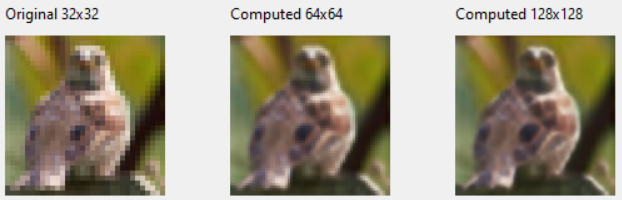
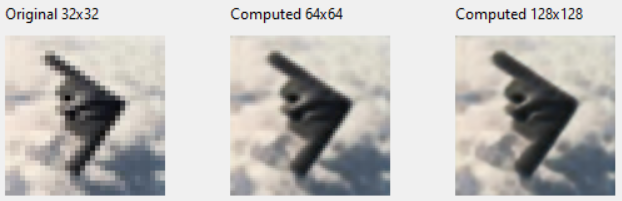

# Super Resolution Example is Under Construction
</img>
## Introduction
The image at the right side shows an example. The smaller image is the original image while the bigger image is the image processed twice by a neural network trained to increase the resolution.
This example has been created via the **SuperResolution.lpi** command line tool with:

```
#SuperResolution -i street.png -o street2.png
Loading input file: street.png
Input image size: 79x107x3
Creating Neural Network...
Resizing...
Neural network file found at ../../../examples/SuperResolution : super-resolution-7-64-sep.nn
Saving output file: street2.png

#SuperResolution -i street2.png -o street3.png
Loading input file: street2.png
Input image size: 158x214x3
Creating Neural Network...
Resizing with tiles...
Neural network file found at ../../../examples/SuperResolution : super-resolution-7-64-sep.nn
Padding input image.
Resizing with tiles to: 288x416x3
Saving output file: street3.png
```
Besides the command line tool above, the **SuperResolution** folder has these main components:
* **SuperResolutionTrain.lpi**: trains a neural network for increasing image resolution with the CIFAR-10 dataset.
* **Cifar10ImageClassifierSuperResolution.lpi**: can we better classify 32x32 images if we first upscale to 64x64? This experiment shows it!
* **super-resolution-7-64-sep.nn**: ready to use already trained neural network.
* **SuperResolutionApp.lpi**: visually tests the trained neural network with CIFAR-10 images upscaling 32x32 images up 256x256 images.

## SuperResolutionTrain
There is an already trained neural network (NN) available for use: **super-resolution-7-64-sep.nn**. In the case that you intend to train it by yourself, here we go.
CIFAR-10 dataset is used for training. Firstly, we'll create a NN to downscale CIFAR-10 32x32 images into 16x16 images with the following:
```
    // Small Neural Network to resize 32x32 images into 16x16 images.
    NNMaxPool := TNNet.Create();
    NNMaxPool.AddLayer( TNNetInput.Create(32, 32, 3) );
    NNMaxPool.AddLayer( TNNetMaxPool.Create(2) );
```
We load the CIFAR-10 dataset with:
```
    CreateCifar10Volumes(ImgTrainingVolumes, ImgValidationVolumes, ImgTestVolumes);
```
For each image in CIFAR-10 dataset, we’ll run our downscaling NN with:
```
    NNMaxPool.Compute(ImgTrainingVolumes, ImgTrainingSmall);
    NNMaxPool.Compute(ImgValidationVolumes, ImgValidationSmall);
    NNMaxPool.Compute(ImgTestVolumes, ImgTestSmall); 
```
The **Compute** method above will compute the NN for each element in the first parameter (inputs) and will place the output in the second parameter. Therefore, **ImgTrainingSmall**, **ImgValidationSmall**, **ImgTestSmall** will contain lists of 16x16 images.
We are now ready to train our upscaling NN from 16x16 images to 32x32 images with:
```
    NeuralFit.FitLoading(NN,
      ImgTrainingVolumes.Count, ImgValidationVolumes.Count, ImgTestVolumes.Count,
      {batchsize=}64, {epochs=}50,
      @GetTrainingPair, @GetValidationPair, @GetTestPair); 
```
The **FitLoading** method above needs to load pairs of images (16x16, 32x32) to be able to train the NN. This is done with the following:
```
  procedure TTestCNNAlgo.GetTrainingPair(Idx: integer; ThreadId: integer;
    pInput, pOutput: TNNetVolume);
  var
    LocalIdx: integer;
  begin
    LocalIdx := Random(ImgTrainingSmall.Count);
    pInput.Copy(ImgTrainingSmall[LocalIdx]);
    pOutput.Copy(ImgTrainingVolumes[LocalIdx]);
    // insert data augmentation
    if Random(1000)>500 then
    begin
      pInput.FlipX();
      pOutput.FlipX();
    end;
    if Random(1000)>500 then
    begin
      pInput.FlipY();
      pOutput.FlipY();
    end;
  end;
```
## Cifar10ImageClassifierSuperResolution
As noted in other experiments, by upscaling the image resolution we can get higher classification accuracy. This is exactly what this example does. Firstly, CIFAR-10 dataset is loaded. Then, its images are upscaled to 64x64 from 32x32 so we can run the image classification with 64x64 Images:
```
    CreateCifar10Volumes(ImgTrainingVolumes, ImgValidationVolumes, ImgTestVolumes);
    WriteLn('Upscaling test data.');
    NN.Compute(ImgTestVolumes, ImgTestVolumes64);
    ImgTestVolumes.Clear;
    WriteLn('Upscaling validation data.');
    NN.Compute(ImgValidationVolumes, ImgValidationVolumes64);
    ImgValidationVolumes.Clear;
    WriteLn('Upscaling training data.');
    NN.Compute(ImgTrainingVolumes, ImgTrainingVolumes64);
    ImgTrainingVolumes.Clear;
```
Then, the training is run with:
```
    NeuralFit.Fit(NN, ImgTrainingVolumes64, ImgValidationVolumes64, ImgTestVolumes64, {NumClasses=}10, {batchsize=}64, {epochs=}50);
```
Raw results files have been stored in the [results](https://github.com/joaopauloschuler/neural-api/tree/master/examples/SuperResolution/results) folder.
## SuperResolution Command Line Tool
Under construction.
## SuperResolutionApp
<p>
   </img>
</p>
Under construction.
<p>
   </img>
</p>
