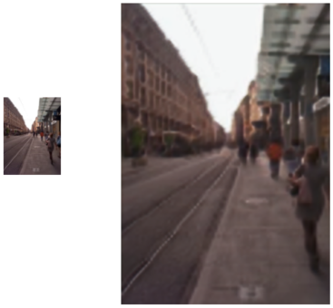

# Super Resolution Example is Under Construction
</img>
## Introduction
At the right, you can find an example. The small image is the original image while the big image is the image processed twice by a neural network trained to increase the resolution.
This example has been created via the **SuperResolution.lpi** command line tool with:

```
#SuperResolution -i street.png -o street2.png
Loading input file: street.png
Input image size: 79x107x3
Creating Neural Network...
Resizing...
Neural network file found at ../../../examples/SuperResolution : super-resolution-7-64-sep.nn
Saving output file: street2.png

#SuperResolution -i street2.png -o street3.png
Loading input file: street2.png
Input image size: 158x214x3
Creating Neural Network...
Resizing with tiles...
Neural network file found at ../../../examples/SuperResolution : super-resolution-7-64-sep.nn
Padding input image.
Resizing with tiles to: 288x416x3
Saving output file: street3.png
```

